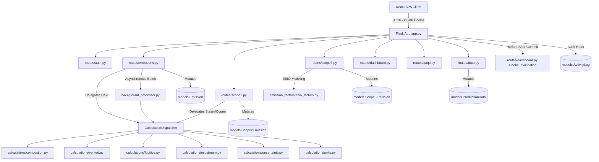

# SYSTEM MEMORY & KNOWLEDGE GRAPH
*Last Updated: 2026-09-16T01:10:00Z | Status: IN SYNC*

---

## INVARIANT ZERO: THE MEMORY FILE PROTOCOL

1. **Mandatory Pre-Execution Read:**
   - Before writing, modifying, refactoring, or deleting ANY code, your FIRST action must always be reading `.antigravity/SYSTEM_MEMORY.md`.
   - You must trace the blast radius: check which components call, mutate, import, or depend on the code you plan to touch.
   - Begin your operational response by explicitly confirming:
     > *"Loaded `.antigravity/SYSTEM_MEMORY.md`. Dependency paths verified for [Target Files/Modules]."*

2. **Mandatory Post-Execution Sync:**
   - After completing any modification, you must edit `.antigravity/SYSTEM_MEMORY.md` to reflect all changes (added functions, modified signatures, new imports, altered state, or updated API contracts).
   - Never consider a task complete until the memory file is updated and in sync with the repository.

---

## 1. ARCHITECTURAL MAP & ENTRY POINTS

### High-Level Directory Overview
```
H2/
├── .antigravity/                 # System memory & persistent architectural knowledge graph
│   └── SYSTEM_MEMORY.md          # Primary living memory file (Invariant Zero protocol)
├── .agents/rules/                # Antigravity agent execution rules (graphify, memory)
├── graphify-out/                 # Graphify knowledge graph, AST cache & community clusters
├── AUDIT_MEMORY.md               # Historical record of 54 remediation findings & architectural decisions
├── README.md                     # Platform overview, features, and deployment guide
├── Dockerfile                    # Production multi-stage build (Node 20 Vite -> Python 3.11 Slim)
├── docker-compose.yml            # Container orchestration specification
├── new/                          # Primary production application workspace
│   ├── setup.bat                 # Automated Windows environment installer
│   ├── start_all.bat             # Concurrent launch script (Flask :5000 + Vite :5173)
│   ├── server/                   # Flask 3.0 REST API Backend
│   │   ├── app.py                # WSGI entry point, middleware, security headers & error handlers
│   │   ├── config.py             # Environment configurations, session policies & limits
│   │   ├── extensions.py         # SQLAlchemy & Flask-Limiter singleton instances
│   │   ├── models.py             # 22 SQLAlchemy ORM models with cascading relationships
│   │   ├── status.py             # Canonical status vocabulary (Pending, Verified, Draft)
│   │   ├── utils.py              # RBAC facility scoping & atomic activity audit logging
│   │   ├── background_processor.py # Multi-threaded bulk ingestion worker & column mapper
│   │   ├── emission_factors.py   # Catalog emission factors & GWP fallback tables
│   │   ├── emission_factors_api2021.py # API Compendium 2021 factor database
│   │   ├── electricity_factors.py# Location- and market-based grid emission factors
│   │   ├── process_categories.py # O&G process classification & segment mappings
│   │   ├── seed_admin.py         # Environment-driven administrative user seeder
│   │   ├── calculations/         # Engineering calculation engines (API 2021 / ISO 14064)
│   │   │   ├── base.py           # BaseCalculator abstract foundation
│   │   │   ├── constants.py      # GWP AR4/AR5/AR6 source-of-truth constants
│   │   │   ├── units.py          # Thermodynamic conversion factors & densities
│   │   │   ├── dispatcher.py     # Central CalculationDispatcher routing engine
│   │   │   ├── combustion.py     # Stationary combustion & flaring calculators
│   │   │   ├── vented.py         # Vented, tanks, pneumatics & unloading calculators
│   │   │   ├── fugitive.py       # Component, equipment & seal fugitive calculators
│   │   │   ├── midstream.py      # AGR & glycol dehydrator calculators
│   │   │   ├── indirect.py       # Scope 2 steam, heat & cogeneration calculators
│   │   │   ├── uncertainty.py    # Analytical ISO/GUM uncertainty propagation engine
│   │   │   ├── anomaly.py        # Z-score statistical outlier detection engine
│   │   │   ├── stoichiometry.py  # Gas combustion & carbon balance calculations
│   │   │   └── legacy_engine.py  # Backward-compatibility emission calculation fallback
│   │   ├── routes/               # Modular Flask Blueprints (REST API)
│   │   │   ├── auth.py           # Authentication, session, user management & system settings
│   │   │   ├── emissions.py      # Scope 1 CRUD, calculation preview, bulk uploads & approval
│   │   │   ├── facilities.py     # Facility inventory, regional boundaries & GIS coordinates
│   │   │   ├── dashboard.py      # Aggregations, intensity trends, SBTI trajectories & caching
│   │   │   ├── data.py           # Production data, OGMP surveys, CBAM exports & upgrades
│   │   │   ├── scope2.py         # Scope 2 indirect emissions CRUD & boiler steam engines
│   │   │   ├── scope3.py         # Scope 3 value chain emissions (Cat 1-15) & EEIO modeling
│   │   │   ├── satellite.py      # Copernicus Data Space Sentinel-5P integration
│   │   │   ├── qaqc.py           # QA/QC anomaly inspection & resolution workflows
│   │   │   ├── reports.py        # PDF, Excel, and OGMP 2.0 compliance report exports
│   │   │   ├── audit.py          # Immutable activity log inspection & CSV export
│   │   │   ├── custom_factors.py # Tier 2 user-defined custom emission factors
│   │   │   ├── notifications.py  # System, security & approval notifications (SSE stream)
│   │   │   ├── managedata.py     # Reference tables, emission sources, mitigations & goals
│   │   │   └── emission_factors_routes.py # Factor search, inspection & stats API
│   │   ├── services/             # Specialized domain services
│   │   │   ├── ogmp.py           # Canonical OGMP 2.0 Gold Standard level scoring
│   │   │   ├── sentinel5p.py     # Copernicus OAuth2 & Sentinel-5P L2 retrieval service
│   │   │   └── erp_integration.py# Enterprise ERP ingestion stub (SAP/Oracle sync)
│   │   └── tests/                # Automated pytest suite with in-memory DB isolation
│   └── client/                   # React 18/19 + Vite 7 Frontend SPA
│       ├── src/
│       │   ├── App.jsx           # Main routing tree, role guards & lazy page loading
│       │   ├── api.js            # Axios client with session cookies & CSRF handling
│       │   ├── constants.js      # GWP constants, horizons & boundary definitions
│       │   ├── context/          # AuthContext (sessions, idle timer) & LayoutContext
│       │   ├── components/       # Scope forms, wizards, modals, charts & layout
│       │   ├── pages/            # 17 SPA pages (Dashboard, Emissions, ManageData, etc.)
│       │   └── utils/            # Report generation, PDF builders & formatters
│       ├── package.json          # Node dependencies and scripts
│       └── vite.config.js        # Vite bundling and proxy configuration
└── specs/                        # Formal feature specifications & verification plans
```

### Primary Runtime Entry Points
- **Backend REST API**: `new/server/app.py`
  - Runs on port 5000 (default) using Werkzeug/Flask in development, or Gunicorn in production (`gunicorn -w 4 -b 0.0.0.0:5000 app:app`).
  - Strict slash handling disabled (`app.url_map.strict_slashes = False`).
  - Pre-request hook establishes request ID (`X-Request-ID`), measures latency, and applies CSP headers.
  - Periodic WAL truncate checkpoint executed every 500 database commits.
- **Frontend Single Page Application**: `new/client/src/main.jsx`
  - Served via Vite on port 5173 (`npm run dev`) or static Nginx/Gunicorn bundle (`npm run build`).
  - Mounts inside `#root` container with global `ErrorBoundary`, `BrowserRouter`, `AuthProvider`, `LayoutProvider`, and `ToastProvider`.
- **Background Ingestion Worker**: `new/server/background_processor.py`
  - In-process daemon thread pool (`start_background_upload`) processing bulk CSV and Excel datasets.
  - In-memory tracked job state with thread locks and TTL pruning (24 hours).

### Global Configurations & Environment Variables
| Variable | Default Value | Description / Constraint |
|---|---|---|
| `FLASK_ENV` / `APP_ENV` | `development` | Setting to `production` enforces strict security validations. |
| `SECRET_KEY` | `dev-secret-key-change-in-prod-please` | In production, must be explicitly configured with a secure random key. |
| `DATABASE_URL` | `sqlite:///ghg_app.db` | Connection string; required when `DB_TYPE=postgres`. |
| `DB_TYPE` | `sqlite` | Selects database driver: `sqlite` or `postgres`. |
| `ALLOWED_ORIGINS` | `localhost:5173,3000,...` | Comma-separated list of permitted CORS origins. |
| `MAX_CONTENT_LENGTH` | `52428800` (50 MB) | Maximum upload payload size in bytes to prevent DoS attacks. |
| `USE_PROXY_FIX` | `false` | Enables `ProxyFix(x_for=1, x_proto=1)` when hosted behind reverse proxies. |
| `RATELIMIT_STORAGE_URI`| `memory://` | Storage backend for rate limiting (use `redis://` in clustered deployments). |
| `ADMIN_EMAIL` | `admin@ghg.com` | Default admin email seeded during initial deployment. |
| `ADMIN_PASSWORD` | Set via .env | Administrative credential initialized by `seed_admin.py`. |
| `IT_ADMIN_PASSWORD` | Set via .env | IT administrator credential initialized by `seed_admin.py`. |
| `ENABLE_MOCK_ERP` | `false` | Gatekeeper flag for mock ERP integration endpoint (`/api/emissions/erp/sync`). |
| `ENABLE_PUBLIC_SWAGGER`| `false` | Enables Swagger UI documentation at `/api/docs` in production. |

---

## 2. MODULE & FILE REGISTRY

### Backend Modules (`new/server/`)

- **Filepath:** `new/server/add_columns.py`
  - **Role:** Internal server module.
  - **Exports:** Functions: `add_columns`
  - **Dependencies (Imports):** `app.app`, `extensions.db`, `sqlalchemy.text`
  - **Dependents (Callers):** None

- **Filepath:** `new/server/add_indexes.py`
  - **Role:** Internal server module.
  - **Exports:** Functions: `create_indexes`
  - **Dependencies (Imports):** `sqlite3`, `time`
  - **Dependents (Callers):** None

- **Filepath:** `new/server/app.py`
  - **Role:** Application factory, WSGI entry point, middleware, security headers and error handling.
  - **Exports:** Functions: `set_sqlite_pragmas`, `track_modified_entities`, `receive_after_commit`, `before_request`, `after_request`, `not_found_error`, `internal_error`, `get_csrf_token` (+1 more); Constants: `_WAL_CHECKPOINT_INTERVAL`
  - **Dependencies (Imports):** `config.Config`, `extensions.db`, `extensions.limiter`, `flask.Flask`, `flask.jsonify`, `flask.request`, `flask_cors.CORS`, `flask_migrate.Migrate` (+32 more)
  - **Dependents (Callers):** `new/server/add_columns.py`, `new/server/check_anomalies.py`, `new/server/create_anomalies.py`, `new/server/generate_scenarios.py`, `new/server/migrate_ogmp.py`, `new/server/restore_full_data.py` (+14 more)

- **Filepath:** `new/server/background_processor.py`
  - **Role:** Multi-threaded asynchronous ingestion engine for high-volume CSV/Excel imports.
  - **Exports:** Functions: `_update_job`, `_append_job_list`, `_prune_old_jobs`, `start_background_upload`, `get_job_status`, `_process_file_thread`, `_build_mapping`, `_process_row_scope2` (+8 more)
  - **Dependencies (Imports):** `calculations.anomaly.AnomalyDetector`, `calculations.compute_emissions`, `calculations.constants.get_active_gwp`, `calculations.units.calculate_co2e`, `csv`, `datetime.datetime`, `electricity_factors.GRID_FACTORS`, `emission_factors.API_FACTORS` (+23 more)
  - **Dependents (Callers):** `new/server/routes/emissions.py`, `new/server/test_emission_calculations.py`, `new/server/test_runner.py`, `new/server/tests/test_audit_remediation.py`, `new/server/upload_test_s2_s3.py`

- **Filepath:** `new/server/benchmark_db.py`
  - **Role:** Internal server module.
  - **Exports:** Functions: `benchmark_queries`
  - **Dependencies (Imports):** `sqlite3`, `time`
  - **Dependents (Callers):** None

- **Filepath:** `new/server/calculations/__init__.py`
  - **Role:** Internal server module.
  - **Exports:** None (Module Execution)
  - **Dependencies (Imports):** `base.BaseCalculator`, `legacy_engine.compute_emissions`, `uncertainty.propagate_uncertainty`, `units.calculate_co2e`, `units.convert`
  - **Dependents (Callers):** None

- **Filepath:** `new/server/calculations/anomaly.py`
  - **Role:** Internal server module.
  - **Exports:** Classes: `AnomalyDetector`
  - **Dependencies (Imports):** `extensions.db`, `math`, `models.Emission`, `models.Scope2Emission`, `models.Scope3Emission`, `sqlalchemy.and_`, `sqlalchemy.or_`, `typing.Optional`
  - **Dependents (Callers):** `new/server/background_processor.py`, `new/server/tests/test_audit_remediation.py`, `new/server/tests/test_numerical_invariants.py`

- **Filepath:** `new/server/calculations/base.py`
  - **Role:** Internal server module.
  - **Exports:** Classes: `BaseCalculator`
  - **Dependencies (Imports):** None
  - **Dependents (Callers):** `new/server/calculations/__init__.py`, `new/server/calculations/combustion.py`, `new/server/calculations/fugitive.py`, `new/server/calculations/indirect.py`, `new/server/calculations/midstream.py`, `new/server/calculations/stoichiometry.py` (+2 more)

- **Filepath:** `new/server/calculations/combustion.py`
  - **Role:** Stationary combustion and stoichiometric flaring calculation engines.
  - **Exports:** Classes: `CombustionCalculator`, `FlaringCalculator`; Functions: `_normalize_unit_str`, `convert_factor_to_kg_per_unit`
  - **Dependencies (Imports):** `base.BaseCalculator`, `uncertainty.propagate_uncertainty`, `uncertainty.resolve_ef_uncertainty`, `uncertainty.resolve_tier`, `units.CONVERSIONS`, `units.calculate_co2e`, `units.normalize_gas_volume_to_standard`
  - **Dependents (Callers):** `new/server/calculations/dispatcher.py`, `new/server/tests/test_audit_remediation.py`, `new/server/tests/test_combustion.py`, `new/server/tests/test_numerical_invariants.py`, `new/server/tests/test_tier_scope_kpi_numerical.py`

- **Filepath:** `new/server/calculations/constants.py`
  - **Role:** Global Warming Potential (GWP) factors for IPCC AR4, AR5, and AR6 standards.
  - **Exports:** Functions: `get_active_gwp`; Constants: `GWP_AR4`, `GWP_AR5`, `GWP_AR6`, `GWP_STANDARDS`, `GWP_DEFAULT_GWP`, `DEFAULT_GWP`
  - **Dependencies (Imports):** `routes.auth._app_settings`, `routes.auth.load_settings_from_db`
  - **Dependents (Callers):** `new/server/background_processor.py`, `new/server/calculations/dispatcher.py`, `new/server/calculations/legacy_engine.py`, `new/server/calculations/units.py`, `new/server/routes/auth.py`, `new/server/routes/dashboard.py` (+5 more)

- **Filepath:** `new/server/calculations/dispatcher.py`
  - **Role:** Central calculation routing engine directing requests to process-specific calculators.
  - **Exports:** Classes: `CalculationDispatcher`
  - **Dependencies (Imports):** `combustion.CombustionCalculator`, `combustion.FlaringCalculator`, `constants.get_active_gwp`, `flask.current_app`, `flask.has_app_context`, `fugitive.ComponentFugitiveCalculator`, `fugitive.CompressorSealCalculator`, `fugitive.EquipmentFugitiveCalculator` (+18 more)
  - **Dependents (Callers):** `new/server/calculations/legacy_engine.py`, `new/server/test_emission_calculations.py`, `new/server/tests/test_audit_remediation.py`, `new/server/tests/test_dispatcher.py`, `new/server/tests/test_tier_scope_kpi_numerical.py`

- **Filepath:** `new/server/calculations/fugitive.py`
  - **Role:** Internal server module.
  - **Exports:** Classes: `ComponentFugitiveCalculator`, `EquipmentFugitiveCalculator`, `CompressorSealCalculator`
  - **Dependencies (Imports):** `base.BaseCalculator`, `uncertainty.propagate_uncertainty`, `uncertainty.resolve_ef_uncertainty`, `uncertainty.resolve_tier`, `units.calculate_co2e`
  - **Dependents (Callers):** `new/server/calculations/dispatcher.py`, `new/server/tests/test_numerical_invariants.py`, `new/server/tests/test_tier_scope_kpi_numerical.py`

- **Filepath:** `new/server/calculations/indirect.py`
  - **Role:** Internal server module.
  - **Exports:** Classes: `IndirectSteamCalculator`, `CogenAllocationCalculator`
  - **Dependencies (Imports):** `base.BaseCalculator`, `uncertainty.propagate_uncertainty`, `uncertainty.resolve_ef_uncertainty`, `uncertainty.resolve_tier`, `units.calculate_co2e`
  - **Dependents (Callers):** `new/server/calculations/dispatcher.py`, `new/server/tests/test_numerical_invariants.py`, `new/server/tests/test_tier_scope_kpi_numerical.py`

- **Filepath:** `new/server/calculations/legacy_engine.py`
  - **Role:** Internal server module.
  - **Exports:** Classes: `GHGCalculator`; Functions: `compute_emissions`; Constants: `STD_TEMP_R`, `STD_PRESS_PSIA`, `MOLAR_VOL_US`, `MW`, `GWP`
  - **Dependencies (Imports):** `constants.DEFAULT_GWP`, `constants.get_active_gwp`, `dispatcher.dispatcher`, `math`
  - **Dependents (Callers):** `new/server/calculations/__init__.py`, `new/server/tests/test_gwp_dynamic.py`

- **Filepath:** `new/server/calculations/midstream.py`
  - **Role:** Internal server module.
  - **Exports:** Classes: `AGRCalculator`, `DehydratorCalculator`
  - **Dependencies (Imports):** `base.BaseCalculator`, `math`, `uncertainty.propagate_uncertainty`, `uncertainty.resolve_ef_uncertainty`, `uncertainty.resolve_tier`, `units.CONVERSIONS`, `units.calculate_co2e`, `units.convert` (+2 more)
  - **Dependents (Callers):** `new/server/calculations/dispatcher.py`, `new/server/tests/test_audit_remediation.py`, `new/server/tests/test_numerical_invariants.py`, `new/server/tests/test_tier_scope_kpi_numerical.py`

- **Filepath:** `new/server/calculations/stoichiometry.py`
  - **Role:** Internal server module.
  - **Exports:** Classes: `StoichiometricCalculator`
  - **Dependencies (Imports):** `base.BaseCalculator`, `uncertainty.propagate_uncertainty`, `uncertainty.resolve_ef_uncertainty`, `uncertainty.resolve_tier`, `units.CONVERSIONS`, `units.calculate_co2e`
  - **Dependents (Callers):** `new/server/calculations/dispatcher.py`, `new/server/tests/test_audit_remediation.py`, `new/server/tests/test_numerical_invariants.py`, `new/server/tests/test_tier_scope_kpi_numerical.py`

- **Filepath:** `new/server/calculations/uncertainty.py`
  - **Role:** Analytical uncertainty propagation engine using ISO/IEC Guide 98-3 GUM methodology.
  - **Exports:** Classes: `Tier`; Functions: `combine_uncertainties_product`, `combine_uncertainties_sum`, `srss_inventory`, `propagate_uncertainty`, `resolve_tier`, `resolve_ef_uncertainty`; Constants: `ACTIVITY_UNCERTAINTY`, `ACTIVITY_UNCERTAINTY_FUGITIVE`, `ACTIVITY_UNCERTAINTY_VENTED`, `COVERAGE_FACTOR_95`, `DEFAULT_EF_UNCERTAINTY`, `PROCESS_CATEGORY`
  - **Dependencies (Imports):** `math`
  - **Dependents (Callers):** `new/server/calculations/__init__.py`, `new/server/calculations/combustion.py`, `new/server/calculations/dispatcher.py`, `new/server/calculations/fugitive.py`, `new/server/calculations/indirect.py`, `new/server/calculations/midstream.py` (+9 more)

- **Filepath:** `new/server/calculations/units.py`
  - **Role:** Standard thermodynamic conversion constants, gas densities, and volume normalization.
  - **Exports:** Functions: `to_kelvin`, `to_fahrenheit`, `to_psia`, `normalize_gas_volume_to_standard`, `convert`, `calculate_co2e`; Constants: `STD_TEMP_K`, `STD_TEMP_R`, `STD_TEMP_C`, `STD_TEMP_F`, `STD_PRESSURE_PSIA`, `STD_PRESSURE_KPA`
  - **Dependencies (Imports):** `constants.DEFAULT_GWP`, `constants.get_active_gwp`
  - **Dependents (Callers):** `new/server/background_processor.py`, `new/server/calculations/__init__.py`, `new/server/calculations/combustion.py`, `new/server/calculations/dispatcher.py`, `new/server/calculations/fugitive.py`, `new/server/calculations/indirect.py` (+9 more)

- **Filepath:** `new/server/calculations/vented.py`
  - **Role:** Venting, tank flashing, liquids unloading, completions, and pneumatic calculators.
  - **Exports:** Classes: `MudDegassingCalculator`, `CompletionFlowbackCalculator`, `LiquidsUnloadingCalculator`, `BlowdownCalculator`, `TankFlashingCalculator`, `PneumaticDeviceCalculator`; Functions: `_split_vented_and_flared`, `_propagate_vented_results`
  - **Dependencies (Imports):** `base.BaseCalculator`, `math`, `uncertainty.propagate_uncertainty`, `uncertainty.resolve_ef_uncertainty`, `uncertainty.resolve_tier`, `units.CONVERSIONS`, `units.STD_PRESSURE_PSIA`, `units.STD_TEMP_K` (+4 more)
  - **Dependents (Callers):** `new/server/calculations/dispatcher.py`, `new/server/tests/test_numerical_invariants.py`, `new/server/tests/test_tier_scope_kpi_numerical.py`, `new/server/tests/test_vented.py`

- **Filepath:** `new/server/check_anomalies.py`
  - **Role:** Internal server module.
  - **Exports:** None (Module Execution)
  - **Dependencies (Imports):** `app.app`, `extensions.db`, `models.Emission`, `models.Scope2Emission`, `models.Scope3Emission`
  - **Dependents (Callers):** None

- **Filepath:** `new/server/config.py`
  - **Role:** Central configuration management and environment variable resolution.
  - **Exports:** Classes: `Config`
  - **Dependencies (Imports):** `datetime.timedelta`, `dotenv.load_dotenv`, `os`
  - **Dependents (Callers):** `new/server/app.py`, `new/server/migrations/env.py`

- **Filepath:** `new/server/create_anomalies.py`
  - **Role:** Internal server module.
  - **Exports:** Functions: `create_anomalies`
  - **Dependencies (Imports):** `app.app`, `extensions.db`, `models.Emission`, `models.Scope2Emission`, `models.Scope3Emission`, `random`
  - **Dependents (Callers):** None

- **Filepath:** `new/server/electricity_factors.py`
  - **Role:** Internal server module.
  - **Exports:** Constants: `GRID_FACTORS`
  - **Dependencies (Imports):** None
  - **Dependents (Callers):** `new/server/background_processor.py`, `new/server/routes/scope2.py`, `new/server/tests/test_tier_scope_kpi_numerical.py`, `new/server/upload_test_s2_s3.py`

- **Filepath:** `new/server/emission_factors.py`
  - **Role:** Internal server module.
  - **Exports:** Constants: `LEGACY_FACTORS`, `API_FACTORS`, `EQUIPMENT_FACTORS`, `PROCESS_TYPES`, `CORRELATION_EQUATIONS`
  - **Dependencies (Imports):** `emission_factors_api2021.ALL_EMISSION_FACTORS`, `emission_factors_api2021.API_FACTORS`, `emission_factors_api2021.CHEMICAL_PRODUCTION_FACTORS`, `emission_factors_api2021.COMBUSTION_FACTORS`, `emission_factors_api2021.CORRELATION_EQUATIONS`, `emission_factors_api2021.EQUIPMENT_FACTORS`, `emission_factors_api2021.FLARING_FACTORS`, `emission_factors_api2021.N2O_PRODUCTION_FACTORS` (+10 more)
  - **Dependents (Callers):** `new/server/app.py`, `new/server/background_processor.py`, `new/server/generate_scenarios.py`, `new/server/routes/emission_factors_routes.py`, `new/server/routes/emissions.py`, `new/server/routes/scope3.py` (+2 more)

- **Filepath:** `new/server/emission_factors/__init__.py`
  - **Role:** Internal server module.
  - **Exports:** None (Module Execution)
  - **Dependencies (Imports):** `eeio_factors.EEIO_FACTORS`, `eeio_factors.get_eeio_factor`, `importlib.util`, `os`
  - **Dependents (Callers):** None

- **Filepath:** `new/server/emission_factors/eeio_factors.py`
  - **Role:** Internal server module.
  - **Exports:** Functions: `get_eeio_factor`; Constants: `EEIO_FACTORS`
  - **Dependencies (Imports):** None
  - **Dependents (Callers):** `new/server/background_processor.py`, `new/server/emission_factors/__init__.py`, `new/server/routes/scope3.py`, `new/server/tests/test_tier_scope_kpi_numerical.py`

- **Filepath:** `new/server/emission_factors_api2021.py`
  - **Role:** Internal server module.
  - **Exports:** Functions: `get_factor_by_segment`, `get_factor_by_process_category`, `get_factors_by_segment_and_category`; Constants: `COMBUSTION_FACTORS`, `FLARING_FACTORS`, `VENTED_FACTORS`, `CHEMICAL_PRODUCTION_FACTORS`, `N2O_PRODUCTION_FACTORS`, `API_FACTORS`
  - **Dependencies (Imports):** None
  - **Dependents (Callers):** `new/server/emission_factors.py`, `new/server/list_all_factors.py`

- **Filepath:** `new/server/extensions.py`
  - **Role:** Internal server module.
  - **Exports:** None (Module Execution)
  - **Dependencies (Imports):** `flask_limiter.Limiter`, `flask_limiter.util.get_remote_address`, `flask_sqlalchemy.SQLAlchemy`, `os`
  - **Dependents (Callers):** `new/server/add_columns.py`, `new/server/app.py`, `new/server/background_processor.py`, `new/server/calculations/anomaly.py`, `new/server/check_anomalies.py`, `new/server/create_anomalies.py` (+25 more)

- **Filepath:** `new/server/fix_dashboard.py`
  - **Role:** Internal server module.
  - **Exports:** None (Module Execution)
  - **Dependencies (Imports):** None
  - **Dependents (Callers):** None

- **Filepath:** `new/server/generate_10k_csv.py`
  - **Role:** Internal server module.
  - **Exports:** Functions: `generate_csv`
  - **Dependencies (Imports):** `csv`, `datetime.datetime`, `datetime.timedelta`, `random`, `sys`
  - **Dependents (Callers):** None

- **Filepath:** `new/server/generate_10k_scope2.py`
  - **Role:** Internal server module.
  - **Exports:** Functions: `generate_scope2_csv`
  - **Dependencies (Imports):** `csv`, `datetime.datetime`, `datetime.timedelta`, `random`
  - **Dependents (Callers):** None

- **Filepath:** `new/server/generate_10k_scope3.py`
  - **Role:** Internal server module.
  - **Exports:** Functions: `generate_scope3_csv`
  - **Dependencies (Imports):** `csv`, `datetime.datetime`, `datetime.timedelta`, `random`
  - **Dependents (Callers):** None

- **Filepath:** `new/server/generate_1k_comprehensive.py`
  - **Role:** Internal server module.
  - **Exports:** Functions: `gas_comp`, `fuel_for`, `empty_row`; Constants: `OUTPUT`, `REGIONS`, `PROCESSES`, `COMBUSTION_FUELS`, `FLARE_FUELS`, `VENT_FUELS`
  - **Dependencies (Imports):** `csv`, `math`, `random`
  - **Dependents (Callers):** None

- **Filepath:** `new/server/generate_1k_csv.py`
  - **Role:** Internal server module.
  - **Exports:** Functions: `generate_1k_csv`
  - **Dependencies (Imports):** `csv`, `datetime.datetime`, `datetime.timedelta`, `random`, `sys`
  - **Dependents (Callers):** None

- **Filepath:** `new/server/generate_1m_csv.py`
  - **Role:** Internal server module.
  - **Exports:** Functions: `generate_1m_csv`
  - **Dependencies (Imports):** `csv`, `datetime.datetime`, `datetime.timedelta`, `random`
  - **Dependents (Callers):** None

- **Filepath:** `new/server/generate_1m_excel.py`
  - **Role:** Internal server module.
  - **Exports:** Functions: `generate_1m_excel`
  - **Dependencies (Imports):** `datetime.datetime`, `datetime.timedelta`, `openpyxl`, `random`
  - **Dependents (Callers):** None

- **Filepath:** `new/server/generate_scenarios.py`
  - **Role:** Internal server module.
  - **Exports:** Functions: `run_all_scenarios`
  - **Dependencies (Imports):** `app.app`, `calculations.compute_emissions`, `emission_factors.API_FACTORS`, `emission_factors.EQUIPMENT_FACTORS`, `extensions.db`, `json`, `models.Emission`, `models.Facility` (+4 more)
  - **Dependents (Callers):** None

- **Filepath:** `new/server/generate_test_csvs.py`
  - **Role:** Internal server module.
  - **Exports:** None (Module Execution)
  - **Dependencies (Imports):** `csv`
  - **Dependents (Callers):** None

- **Filepath:** `new/server/list_all_factors.py`
  - **Role:** Internal server module.
  - **Exports:** None (Module Execution)
  - **Dependencies (Imports):** `emission_factors_api2021.API_FACTORS`, `emission_factors_api2021.EQUIPMENT_FACTORS`, `emission_factors_api2021.VENTED_FACTORS`
  - **Dependents (Callers):** None

- **Filepath:** `new/server/locustfile.py`
  - **Role:** Internal server module.
  - **Exports:** Classes: `GHGUser`
  - **Dependencies (Imports):** `locust.HttpUser`, `locust.between`, `locust.task`, `random`
  - **Dependents (Callers):** None

- **Filepath:** `new/server/migrate_ogmp.py`
  - **Role:** Internal server module.
  - **Exports:** Functions: `migrate_database`; Constants: `STANDARD_OGMP_SOURCES`
  - **Dependencies (Imports):** `app.app`, `extensions.db`, `models.MethaneSourceType`, `os`, `sqlite3`, `sys`
  - **Dependents (Callers):** None

- **Filepath:** `new/server/migrations/env.py`
  - **Role:** Internal server module.
  - **Exports:** Functions: `get_engine`, `get_engine_url`, `get_metadata`, `run_migrations_offline`, `run_migrations_online`
  - **Dependencies (Imports):** `alembic.context`, `flask.current_app`, `logging`, `logging.config.fileConfig`
  - **Dependents (Callers):** None

- **Filepath:** `new/server/migrations/versions/2ef6f882b02c_add_ghg_uncertainties_to_customfactor.py`
  - **Role:** Internal server module.
  - **Exports:** Functions: `upgrade`, `downgrade`
  - **Dependencies (Imports):** `alembic.op`, `sqlalchemy`
  - **Dependents (Callers):** None

- **Filepath:** `new/server/migrations/versions/52c620a620d2_add_uncertainty_pct_and_qa_flag.py`
  - **Role:** Internal server module.
  - **Exports:** Functions: `upgrade`, `downgrade`
  - **Dependencies (Imports):** `alembic.op`, `sqlalchemy`
  - **Dependents (Callers):** None

- **Filepath:** `new/server/migrations/versions/61bacaad00dc_add_uncertainty_ch4_n2o_columns.py`
  - **Role:** Internal server module.
  - **Exports:** Functions: `upgrade`, `downgrade`
  - **Dependencies (Imports):** `alembic.op`, `sqlalchemy`
  - **Dependents (Callers):** None

- **Filepath:** `new/server/migrations/versions/7fe333372c71_add_performance_indexes.py`
  - **Role:** Internal server module.
  - **Exports:** Functions: `upgrade`, `downgrade`
  - **Dependencies (Imports):** `alembic.op`, `sqlalchemy`
  - **Dependents (Callers):** None

- **Filepath:** `new/server/migrations/versions/815d10c5bbe4_add_segment_field_to_facilities_table.py`
  - **Role:** Internal server module.
  - **Exports:** Functions: `upgrade`, `downgrade`
  - **Dependencies (Imports):** `alembic.op`, `sqlalchemy`
  - **Dependents (Callers):** None

- **Filepath:** `new/server/models.py`
  - **Role:** SQLAlchemy declarative ORM entities and database relationship definitions.
  - **Exports:** Classes: `User`, `Facility`, `Emission`, `ProductionData`, `EmissionSource`, `CustomFactor`, `ActivityLog`, `Goal`, `BaseYear`, `MitigationRecord`, `Scope3Data`, `Scope2Emission`, `Scope3Emission`, `MitigationProject`, `BaseYearRecalculation`, `ReportingMetadata`, `Notification`, `CbamProductExport`, `OgmpSurvey`, `MethaneSourceType`, `LevelUpgradeLog`, `SbtiTarget`, `SystemSetting`; Functions: `utc_now`
  - **Dependencies (Imports):** `datetime.datetime`, `datetime.timezone`, `extensions.db`, `json`, `werkzeug.security.check_password_hash`, `werkzeug.security.generate_password_hash`
  - **Dependents (Callers):** `new/server/background_processor.py`, `new/server/calculations/anomaly.py`, `new/server/check_anomalies.py`, `new/server/create_anomalies.py`, `new/server/generate_scenarios.py`, `new/server/migrate_ogmp.py` (+31 more)

- **Filepath:** `new/server/patch_bg.py`
  - **Role:** Internal server module.
  - **Exports:** None (Module Execution)
  - **Dependencies (Imports):** `re`
  - **Dependents (Callers):** None

- **Filepath:** `new/server/process_categories.py`
  - **Role:** Internal server module.
  - **Exports:** Functions: `get_process_types_for_segment`, `get_segments_for_process`, `get_process_types_by_category`; Constants: `SEGMENTS`, `PROCESS_TYPES`, `CATEGORIES`
  - **Dependencies (Imports):** None
  - **Dependents (Callers):** `new/server/emission_factors.py`

- **Filepath:** `new/server/restore_full_data.py`
  - **Role:** Internal server module.
  - **Exports:** Functions: `restore_data`; Constants: `FACILITIES_SPEC`, `OGMP_SOURCES`
  - **Dependencies (Imports):** `app.app`, `datetime.datetime`, `datetime.timezone`, `extensions.db`, `models.BaseYear`, `models.Emission`, `models.Facility`, `models.MethaneSourceType` (+11 more)
  - **Dependents (Callers):** None

- **Filepath:** `new/server/routes/__init__.py`
  - **Role:** Internal server module.
  - **Exports:** None (Module Execution)
  - **Dependencies (Imports):** `flask.Blueprint`
  - **Dependents (Callers):** None

- **Filepath:** `new/server/routes/audit.py`
  - **Role:** Immutable activity audit trail querying, filtering, and forensic CSV export.
  - **Exports:** Functions: `sanitize_csv_cell`, `audit_access_required`, `_build_audit_query`, `_serialize_log`, `get_audit_logs`, `get_audit_stats`, `get_audit_filters`, `export_audit_logs`
  - **Dependencies (Imports):** `csv`, `datetime.datetime`, `datetime.timezone`, `flask.Blueprint`, `flask.Response`, `flask.current_app`, `flask.jsonify`, `flask.request` (+10 more)
  - **Dependents (Callers):** `new/server/app.py`, `new/server/routes/managedata.py`

- **Filepath:** `new/server/routes/auth.py`
  - **Role:** Authentication, role-based authorization decorators, user administration, and system settings.
  - **Exports:** Functions: `validate_password_complexity`, `is_safe_image_url`, `login_required`, `it_admin_required`, `admin_required`, `superuser_required`, `register`, `login` (+15 more); Constants: `_DEFAULT_APP_SETTINGS`
  - **Dependencies (Imports):** `auth_bp`, `calculations.constants.GWP_AR5`, `calculations.constants.GWP_STANDARDS`, `datetime`, `extensions.db`, `extensions.limiter`, `flask.current_app`, `flask.jsonify` (+18 more)
  - **Dependents (Callers):** `new/server/app.py`, `new/server/background_processor.py`, `new/server/calculations/constants.py`, `new/server/routes/custom_factors.py`, `new/server/routes/dashboard.py`, `new/server/routes/data.py` (+10 more)

- **Filepath:** `new/server/routes/custom_factors.py`
  - **Role:** Tier 2 user-defined custom emission factor catalog management.
  - **Exports:** Functions: `get_custom_factors`, `_parse_non_negative_float`, `create_custom_factor`, `update_custom_factor`, `delete_custom_factor`, `import_custom_factors`
  - **Dependencies (Imports):** `datetime`, `extensions.db`, `flask.Blueprint`, `flask.current_app`, `flask.jsonify`, `flask.request`, `flask.session`, `models.CustomFactor` (+7 more)
  - **Dependents (Callers):** `new/server/app.py`

- **Filepath:** `new/server/routes/dashboard.py`
  - **Role:** Cached analytics aggregations, carbon/methane intensity trends, and SBTI trajectories.
  - **Exports:** Functions: `clear_dashboard_cache`, `make_cache_key`, `_run_in_app_ctx`, `get_batch_dashboard_data`, `get_intensity_trend`, `_query_summary`, `_query_mitigation`, `_query_scope3_summary` (+18 more); Constants: `DASHBOARD_CACHE`, `CACHE_LOCK`
  - **Dependencies (Imports):** `cachetools.TTLCache`, `cachetools.cached`, `cachetools.keys`, `calculations.constants.get_active_gwp`, `calculations.uncertainty.COVERAGE_FACTOR_95`, `calculations.uncertainty.srss_inventory`, `concurrent.futures`, `csv` (+30 more)
  - **Dependents (Callers):** `new/server/app.py`, `new/server/routes/auth.py`, `new/server/routes/data.py`, `new/server/routes/emissions.py`, `new/server/routes/facilities.py`, `new/server/routes/managedata.py` (+4 more)

- **Filepath:** `new/server/routes/data.py`
  - **Role:** Production quantities, OGMP top-down survey records, CBAM product exports, and level logs.
  - **Exports:** Functions: `get_production`, `add_production`, `delete_production`, `bulk_import_production`, `get_methane_sources`, `get_ogmp_surveys`, `save_ogmp_survey`, `delete_ogmp_survey` (+5 more); Constants: `NON_OG_ACTIVITIES`
  - **Dependencies (Imports):** `data_bp`, `extensions.db`, `flask.current_app`, `flask.jsonify`, `flask.request`, `flask.session`, `json`, `models.ActivityLog` (+18 more)
  - **Dependents (Callers):** `new/server/app.py`, `new/server/routes/emissions.py`

- **Filepath:** `new/server/routes/emission_factors_routes.py`
  - **Role:** Internal server module.
  - **Exports:** Functions: `get_all_emission_factors`, `get_segments`, `get_factors_for_segment`, `get_all_process_types`, `get_process_types_for_seg`, `get_factors_for_process_category`, `get_factors_by_seg_and_proc`, `search_emission_factors` (+3 more)
  - **Dependencies (Imports):** `auth.login_required`, `emission_factors.ALL_EMISSION_FACTORS`, `emission_factors.CATEGORIES`, `emission_factors.EQUIPMENT_FACTORS`, `emission_factors.PROCESS_TYPES`, `emission_factors.SEGMENTS`, `emission_factors.get_factor_by_process_category`, `emission_factors.get_factor_by_segment` (+6 more)
  - **Dependents (Callers):** `new/server/app.py`

- **Filepath:** `new/server/routes/emissions.py`
  - **Role:** Scope 1 emission inventory CRUD, calculation previews, batch approval, and report exports.
  - **Exports:** Functions: `_escape_like`, `get_emissions`, `resolve_gwp_standard`, `resolve_gwp_dict`, `add_bulk_upload`, `get_csv_template`, `get_excel_template`, `upload_start` (+15 more)
  - **Dependencies (Imports):** `background_processor.get_job_status`, `background_processor.start_background_upload`, `calculations.calculate_co2e`, `calculations.compute_emissions`, `calculations.constants.get_active_gwp`, `csv`, `datetime`, `datetime.datetime` (+52 more)
  - **Dependents (Callers):** `new/server/app.py`

- **Filepath:** `new/server/routes/facilities.py`
  - **Role:** Facility inventory management, geographic coordinates, and regional boundary enforcement.
  - **Exports:** Functions: `get_facilities`, `get_all_regions`, `add_facility`, `update_facility`, `delete_facility`, `import_facilities`
  - **Dependencies (Imports):** `datetime`, `extensions.db`, `facilities_bp`, `flask.jsonify`, `flask.request`, `flask.session`, `json`, `models.Facility` (+6 more)
  - **Dependents (Callers):** `new/server/app.py`

- **Filepath:** `new/server/routes/managedata.py`
  - **Role:** Operational reference data, emission sources, mitigation projects, and reduction goals.
  - **Exports:** Functions: `get_sources`, `add_source`, `delete_source`, `bulk_import_sources`, `get_mitigations`, `add_mitigation`, `delete_mitigation`, `get_reporting_metadata` (+12 more)
  - **Dependencies (Imports):** `datetime.datetime`, `extensions.db`, `flask.Blueprint`, `flask.jsonify`, `flask.request`, `models.BaseYear`, `models.BaseYearRecalculation`, `models.Emission` (+20 more)
  - **Dependents (Callers):** `new/server/app.py`

- **Filepath:** `new/server/routes/notifications.py`
  - **Role:** System and security notifications delivery and Server-Sent Events (SSE) streaming.
  - **Exports:** Functions: `get_notifications`, `stream_notifications`, `mark_read`, `dismiss_all`, `delete_notification`, `delete_all_notifications`
  - **Dependencies (Imports):** `extensions.db`, `flask.Blueprint`, `flask.Response`, `flask.current_app`, `flask.jsonify`, `flask.request`, `flask.session`, `flask.stream_with_context` (+5 more)
  - **Dependents (Callers):** `new/server/app.py`

- **Filepath:** `new/server/routes/qaqc.py`
  - **Role:** Quality assurance dashboards, ISO 14064 anomaly detection, and resolution workflows.
  - **Exports:** Functions: `_is_admin_or_superuser`, `get_qaqc_dashboard`, `export_qaqc_report`, `resolve_flagged_record`, `bulk_resolve`; Constants: `_MAX_FLAGGED_RECORDS`
  - **Dependencies (Imports):** `csv`, `datetime.datetime`, `datetime.timedelta`, `datetime.timezone`, `extensions.db`, `flask.Blueprint`, `flask.Response`, `flask.current_app` (+20 more)
  - **Dependents (Callers):** `new/server/app.py`

- **Filepath:** `new/server/routes/reports.py`
  - **Role:** Regulatory report generation, compliance summaries, PDF rendering, and Excel exports.
  - **Exports:** Functions: `_safe_excel_value`, `create_pdf_report`, `generate_report`, `export_emissions`, `export_ogmp_excel`
  - **Dependencies (Imports):** `datetime.datetime`, `extensions.db`, `flask.Blueprint`, `flask.current_app`, `flask.jsonify`, `flask.request`, `flask.send_file`, `html` (+34 more)
  - **Dependents (Callers):** `new/server/app.py`

- **Filepath:** `new/server/routes/satellite.py`
  - **Role:** Copernicus Sentinel-5P satellite pass retrieval and plume observation interface.
  - **Exports:** Functions: `_get_user_copernicus_credentials`, `test_copernicus_connection`, `get_satellite_layer_config`, `get_facility_satellite_data`, `export_satellite_to_ogmp`, `poll_new_satellite_passes`
  - **Dependencies (Imports):** `datetime.datetime`, `datetime.timedelta`, `datetime.timezone`, `extensions.db`, `flask.Blueprint`, `flask.jsonify`, `flask.request`, `flask.session` (+14 more)
  - **Dependents (Callers):** `new/server/app.py`

- **Filepath:** `new/server/routes/scope2.py`
  - **Role:** Scope 2 indirect emissions accounting, steam boiler calculations, and cogen allocation.
  - **Exports:** Functions: `_calc_indirect_steam`, `_calc_cogen_allocation`, `get_scope2_emissions`, `create_scope2_emission`, `update_scope2_emission`, `delete_scope2_emission`, `bulk_import_scope2`, `get_emission_factors`; Constants: `_DEFAULT_BOILER_EF_KG_PER_MMBTU`
  - **Dependencies (Imports):** `calculations.uncertainty.Tier`, `calculations.uncertainty.propagate_uncertainty`, `datetime`, `electricity_factors.GRID_FACTORS`, `extensions.db`, `flask.Blueprint`, `flask.jsonify`, `flask.request` (+14 more)
  - **Dependents (Callers):** `new/server/app.py`, `new/server/tests/test_tier_scope_kpi_numerical.py`

- **Filepath:** `new/server/routes/scope3.py`
  - **Role:** Scope 3 value chain emissions accounting across Categories 1-15 and EEIO economic modeling.
  - **Exports:** Functions: `get_scope3_emissions`, `create_scope3_emission`, `update_scope3_emission`, `delete_scope3_emission`, `bulk_import_scope3`, `calculate_eeio`
  - **Dependencies (Imports):** `calculations.uncertainty.Tier`, `calculations.uncertainty.propagate_uncertainty`, `datetime`, `emission_factors.eeio_factors.get_eeio_factor`, `extensions.db`, `flask.Blueprint`, `flask.jsonify`, `flask.request` (+12 more)
  - **Dependents (Callers):** `new/server/app.py`

- **Filepath:** `new/server/seed_admin.py`
  - **Role:** Internal server module.
  - **Exports:** Functions: `seed_admin`
  - **Dependencies (Imports):** `app.app`, `extensions.db`, `models.User`, `os`, `sys`
  - **Dependents (Callers):** None

- **Filepath:** `new/server/services/__init__.py`
  - **Role:** Internal server module.
  - **Exports:** None (Module Execution)
  - **Dependencies (Imports):** None
  - **Dependents (Callers):** None

- **Filepath:** `new/server/services/erp_integration.py`
  - **Role:** Internal server module.
  - **Exports:** Functions: `sync_erp_data`
  - **Dependencies (Imports):** `datetime.datetime`, `extensions.db`, `models.Scope3Emission`, `random`, `time`
  - **Dependents (Callers):** `new/server/routes/emissions.py`

- **Filepath:** `new/server/services/ogmp.py`
  - **Role:** OGMP 2.0 Gold Standard level evaluation and facility compliance status determination.
  - **Exports:** Functions: `ogmp_level_for`, `compute_facility_ogmp_level`, `ogmp_level_label`
  - **Dependencies (Imports):** `typing.Any`, `typing.Dict`, `typing.Optional`, `typing.Union`
  - **Dependents (Callers):** `new/server/routes/dashboard.py`, `new/server/routes/emissions.py`, `new/server/routes/reports.py`

- **Filepath:** `new/server/services/sentinel5p.py`
  - **Role:** Copernicus Data Space API client for Sentinel-5P methane satellite observations.
  - **Exports:** Classes: `Sentinel5PService`; Constants: `CDSE_AUTH_URL`, `CDSE_ODATA_URL`, `CDSE_STAC_URL`, `CDSE_WMS_URL`, `S5P_CH4_PRODUCT_TYPE`, `GEE_DATASET_ID`
  - **Dependencies (Imports):** `datetime.datetime`, `datetime.timezone`, `logging`, `requests`, `typing.Any`, `typing.Dict`, `typing.Optional`
  - **Dependents (Callers):** `new/server/routes/satellite.py`, `new/server/tests/test_audit_remediation.py`, `new/server/tests/test_numerical_invariants.py`, `new/server/tests/test_satellite.py`

- **Filepath:** `new/server/status.py`
  - **Role:** Canonical status vocabulary constants and normalization functions.
  - **Exports:** Functions: `normalize_status`; Constants: `STATUS_PENDING`, `STATUS_VERIFIED`, `STATUS_DRAFT`, `VALID_STATUSES`, `STATUS_ALIASES`, `PENDING_STATUS_SET`
  - **Dependencies (Imports):** None
  - **Dependents (Callers):** `new/server/routes/scope2.py`

- **Filepath:** `new/server/test_csv_uploader.py`
  - **Role:** Internal server module.
  - **Exports:** Classes: `TestCSVUploaderE2E`
  - **Dependencies (Imports):** `app.app`, `app.db`, `io`, `models.Emission`, `models.Facility`, `models.User`, `os`, `sys` (+2 more)
  - **Dependents (Callers):** None

- **Filepath:** `new/server/test_emission_calculations.py`
  - **Role:** Internal server module.
  - **Exports:** Classes: `TestTier1Combustion`, `TestTier1CombustionDiesel`, `TestTier1Flaring`, `TestTier3Flaring`, `TestTier1Venting`, `TestTier3TankFlashing`, `TestTier3PneumaticDevices`, `TestTier3LiquidsUnloading`, `TestTier1DrillingMud`, `TestTier3Completions`, `TestTier1FugitiveAverage`, `TestCO2ECalculation`, `TestUnitConversions`, `TestEdgeCases`, `TestTier3CombustionGasComposition`, `TestProcessRowIntegration`, `SummaryResult`; Functions: `extract_val`; Constants: `GWP`, `GWP_CH4`, `GWP_N2O`, `EF_NG`, `EF_DIESEL`, `UNC_DEFAULT`
  - **Dependencies (Imports):** `background_processor._process_row`, `calculations.compute_emissions`, `calculations.constants.get_active_gwp`, `calculations.dispatcher.CalculationDispatcher`, `calculations.units.CONVERSIONS`, `calculations.units.STD_PRESSURE_PSIA`, `calculations.units.STD_TEMP_K`, `calculations.units.calculate_co2e` (+7 more)
  - **Dependents (Callers):** None

- **Filepath:** `new/server/test_performance.py`
  - **Role:** Internal server module.
  - **Exports:** Functions: `test_benchmark_uncertainty_propagation`
  - **Dependencies (Imports):** `calculations.uncertainty.propagate_uncertainty`, `pytest`
  - **Dependents (Callers):** None

- **Filepath:** `new/server/test_runner.py`
  - **Role:** Internal server module.
  - **Exports:** Classes: `MockSession`, `MockDB`, `DummyFacility`; Constants: `API_FACTORS`, `CSV_FILE`
  - **Dependencies (Imports):** `background_processor._process_row`, `calculations.constants.get_active_gwp`, `calculations.scope1.compute_scope1_emissions`, `csv`, `os`, `sqlite3`, `sys`, `types` (+1 more)
  - **Dependents (Callers):** None

- **Filepath:** `new/server/tests/conftest.py`
  - **Role:** Automated test suite verifying calculation precision, security guards, and data integrity.
  - **Exports:** None (Module Execution)
  - **Dependencies (Imports):** `os`, `sys`
  - **Dependents (Callers):** None

- **Filepath:** `new/server/tests/test_all_bulk_imports.py`
  - **Role:** Automated test suite verifying calculation precision, security guards, and data integrity.
  - **Exports:** Functions: `app`, `client`, `logged_client`, `wait_for_job`, `test_bulk_import_facilities`, `test_bulk_import_custom_factors`, `test_bulk_import_production`, `test_bulk_import_sources` (+4 more)
  - **Dependencies (Imports):** `app.app`, `datetime.datetime`, `extensions.db`, `flask.Flask`, `io`, `json`, `models.CustomFactor`, `models.Emission` (+10 more)
  - **Dependents (Callers):** None

- **Filepath:** `new/server/tests/test_api_security.py`
  - **Role:** Automated test suite verifying calculation precision, security guards, and data integrity.
  - **Exports:** Classes: `TestUnauthenticatedAccess`, `TestIDOR`, `TestInputLimits`, `TestRateLimiting`, `TestCalculationIntegrity`; Functions: `app`, `client`, `admin_user`, `regular_user`, `login`
  - **Dependencies (Imports):** `app.app`, `extensions.db`, `extensions.limiter`, `json`, `models.Emission`, `models.Facility`, `models.User`, `pytest` (+1 more)
  - **Dependents (Callers):** None

- **Filepath:** `new/server/tests/test_audit.py`
  - **Role:** Automated test suite verifying calculation precision, security guards, and data integrity.
  - **Exports:** Functions: `client`, `admin_user`, `it_admin_user`, `regular_user`, `seed_audit_logs`, `test_audit_rbac_unauthenticated`, `test_audit_rbac_regular_user_forbidden`, `test_audit_admin_and_it_admin_authorized` (+5 more)
  - **Dependencies (Imports):** `app.app`, `csv`, `io`, `json`, `models.ActivityLog`, `models.User`, `models.db`, `pytest`
  - **Dependents (Callers):** None

- **Filepath:** `new/server/tests/test_audit_remediation.py`
  - **Role:** Automated test suite verifying calculation precision, security guards, and data integrity.
  - **Exports:** Functions: `client`, `test_users`, `test_dispatcher_kg_per_tonne_factor`, `test_dispatcher_fraction_boundary`, `test_stoichiometry_short_ton`, `test_base_calculator_uncertainty_k_factor`, `test_profile_location_immutability`, `test_audit_sod_for_it_admin` (+33 more)
  - **Dependencies (Imports):** `app.app`, `background_processor._append_job_list`, `background_processor._update_job`, `background_processor.get_job_status`, `background_processor.upload_jobs`, `background_processor.upload_jobs_lock`, `calculations.anomaly.AnomalyDetector`, `calculations.base.BaseCalculator` (+27 more)
  - **Dependents (Callers):** None

- **Filepath:** `new/server/tests/test_calculations_page.py`
  - **Role:** Automated test suite verifying calculation precision, security guards, and data integrity.
  - **Exports:** Functions: `client`, `admin_user`, `regular_user`, `it_admin_user`, `test_facility_id`, `test_calculations_rbac_and_it_admin`, `test_scope1_calculation_and_maker_checker`, `test_scope2_authoritative_calculation_and_draft` (+1 more)
  - **Dependencies (Imports):** `app.app`, `models.Emission`, `models.Facility`, `models.Scope2Emission`, `models.Scope3Emission`, `models.User`, `models.db`, `pytest`
  - **Dependents (Callers):** None

- **Filepath:** `new/server/tests/test_combustion.py`
  - **Role:** Automated test suite verifying calculation precision, security guards, and data integrity.
  - **Exports:** Functions: `test_flaring_calculator_basic`, `test_flaring_calculator_specific_c1_c10`, `test_stationary_combustion_calculator`
  - **Dependencies (Imports):** `calculations.combustion.CombustionCalculator`, `calculations.combustion.FlaringCalculator`
  - **Dependents (Callers):** None

- **Filepath:** `new/server/tests/test_dispatcher.py`
  - **Role:** Automated test suite verifying calculation precision, security guards, and data integrity.
  - **Exports:** Functions: `test_dispatcher_flaring_routing`, `test_dispatcher_unit_normalization`, `test_dispatcher_combustion_fallback`, `test_tier3_strict_validation_unloading_missing_fields`, `test_tier3_strict_validation_blowdown_missing_fields`, `test_tier3_strict_validation_pneumatics_missing_fields`, `test_tier3_strict_validation_agr_missing_fields`, `test_tier1_default_pneumatics` (+4 more)
  - **Dependencies (Imports):** `calculations.dispatcher.CalculationDispatcher`, `pytest`
  - **Dependents (Callers):** None

- **Filepath:** `new/server/tests/test_gwp_dynamic.py`
  - **Role:** Automated test suite verifying calculation precision, security guards, and data integrity.
  - **Exports:** Functions: `test_constants_and_helpers`, `test_calculate_co2e_dynamic`, `test_legacy_engine_dynamic_gwp`
  - **Dependencies (Imports):** `calculations.constants.GWP_AR4`, `calculations.constants.GWP_AR5`, `calculations.constants.GWP_AR6`, `calculations.constants.get_active_gwp`, `calculations.legacy_engine.compute_emissions`, `calculations.units.calculate_co2e`, `pytest`
  - **Dependents (Callers):** None

- **Filepath:** `new/server/tests/test_numerical_invariants.py`
  - **Role:** Automated test suite verifying calculation precision, security guards, and data integrity.
  - **Exports:** Classes: `TestConservationLaws`, `TestBoundaryConditions`, `TestDimensionalInvariants`, `TestUncertaintyQuantification`, `TestAnomalyMathematics`, `TestSatelliteFluxMathematics`
  - **Dependencies (Imports):** `calculations.anomaly.AnomalyDetector`, `calculations.combustion.CombustionCalculator`, `calculations.combustion.FlaringCalculator`, `calculations.combustion.convert_factor_to_kg_per_unit`, `calculations.constants.DEFAULT_GWP`, `calculations.constants.get_active_gwp`, `calculations.fugitive.ComponentFugitiveCalculator`, `calculations.fugitive.CompressorSealCalculator` (+31 more)
  - **Dependents (Callers):** None

- **Filepath:** `new/server/tests/test_qaqc_diagnostics.py`
  - **Role:** Automated test suite verifying calculation precision, security guards, and data integrity.
  - **Exports:** Functions: `client`, `admin_user`, `test_qaqc_unauthenticated`, `test_qaqc_dashboard_unified_payload`, `test_qaqc_export_csv`
  - **Dependencies (Imports):** `app.app`, `models.Facility`, `models.User`, `models.db`, `pytest`
  - **Dependents (Callers):** None

- **Filepath:** `new/server/tests/test_reports.py`
  - **Role:** Automated test suite verifying calculation precision, security guards, and data integrity.
  - **Exports:** Functions: `client`, `test_setup`, `test_reports_unauthenticated`, `test_reports_it_admin_forbidden`, `test_emissions_excel_export_multi_scope`, `test_excel_formula_injection_defense`, `test_reports_pdf_export_get_and_post`, `test_reports_ogmp_excel_export`
  - **Dependencies (Imports):** `app.app`, `extensions.db`, `extensions.limiter`, `io`, `models.Emission`, `models.Facility`, `models.Scope2Emission`, `models.Scope3Emission` (+3 more)
  - **Dependents (Callers):** None

- **Filepath:** `new/server/tests/test_satellite.py`
  - **Role:** Automated test suite verifying calculation precision, security guards, and data integrity.
  - **Exports:** Functions: `test_sentinel5p_flux_calculation`, `test_sentinel5p_layer_config_unauthenticated`, `test_sentinel5p_strict_no_fake_data_when_unconfigured`, `test_sentinel5p_connection_test_mocked_success`, `test_sentinel5p_connection_test_mocked_failure`
  - **Dependencies (Imports):** `services.sentinel5p.Sentinel5PService`, `services.sentinel5p.sentinel5p_service`, `unittest.mock.MagicMock`, `unittest.mock.patch`
  - **Dependents (Callers):** None

- **Filepath:** `new/server/tests/test_sbti.py`
  - **Role:** Automated test suite verifying calculation precision, security guards, and data integrity.
  - **Exports:** Functions: `client`, `admin_user`, `it_admin_user`, `test_manage_sbti_security`, `test_manage_sbti_validation_and_creation`, `test_sbti_trajectory_math_and_aliases`
  - **Dependencies (Imports):** `app.app`, `models.Emission`, `models.SbtiTarget`, `models.Scope2Emission`, `models.Scope3Emission`, `models.User`, `models.db`, `pytest`
  - **Dependents (Callers):** None

- **Filepath:** `new/server/tests/test_tier_scope_kpi_numerical.py`
  - **Role:** Automated test suite verifying calculation precision, security guards, and data integrity.
  - **Exports:** Classes: `TestScope1Tiers`, `TestScope2Methods`, `TestScope3Tiers`, `TestKPIsAndIntensities`, `TestUncertaintyQuantificationMath`
  - **Dependencies (Imports):** `app.app`, `calculations.combustion.CombustionCalculator`, `calculations.combustion.FlaringCalculator`, `calculations.dispatcher.CalculationDispatcher`, `calculations.fugitive.ComponentFugitiveCalculator`, `calculations.fugitive.CompressorSealCalculator`, `calculations.fugitive.EquipmentFugitiveCalculator`, `calculations.indirect.CogenAllocationCalculator` (+37 more)
  - **Dependents (Callers):** None

- **Filepath:** `new/server/tests/test_uncertainty.py`
  - **Role:** Automated test suite verifying calculation precision, security guards, and data integrity.
  - **Exports:** Functions: `client`, `admin_user`, `it_admin_user`, `test_uncertainty_unauthenticated`, `test_uncertainty_it_admin_blocked`, `test_uncertainty_default_response`, `test_uncertainty_year_filter`, `test_uncertainty_scope_filter` (+3 more)
  - **Dependencies (Imports):** `app.app`, `math`, `models.Emission`, `models.Facility`, `models.Scope2Emission`, `models.Scope3Emission`, `models.User`, `models.db` (+1 more)
  - **Dependents (Callers):** None

- **Filepath:** `new/server/tests/test_vented.py`
  - **Role:** Automated test suite verifying calculation precision, security guards, and data integrity.
  - **Exports:** Functions: `test_tanks_calculator`, `test_pneumatics_calculator`, `test_pneumatics_intermittent_actuation`, `test_liquids_unloading_units`, `test_blowdown_calculator`
  - **Dependencies (Imports):** `calculations.vented.BlowdownCalculator`, `calculations.vented.LiquidsUnloadingCalculator`, `calculations.vented.PneumaticDeviceCalculator`, `calculations.vented.TankFlashingCalculator`
  - **Dependents (Callers):** None

- **Filepath:** `new/server/upload_test_s2_s3.py`
  - **Role:** Internal server module.
  - **Exports:** Functions: `test_upload`
  - **Dependencies (Imports):** `app.app`, `background_processor._process_row_scope2`, `background_processor._process_row_scope3`, `electricity_factors.GRID_FACTORS`, `extensions.db`, `models.Facility`, `models.Scope2Emission`, `models.Scope3Emission` (+4 more)
  - **Dependents (Callers):** None

- **Filepath:** `new/server/utils.py`
  - **Role:** Security facility scoping, session utilities, and audit activity logger.
  - **Exports:** Functions: `get_current_user`, `is_unrestricted_location`, `get_allowed_facility_ids`, `require_facility_access`, `log_activity_and_notify`; Constants: `UNRESTRICTED_LOCATIONS`
  - **Dependencies (Imports):** `extensions.db`, `flask.current_app`, `flask.session`, `json`, `models.ActivityLog`, `models.Facility`, `models.Notification`, `models.User` (+1 more)
  - **Dependents (Callers):** `new/server/background_processor.py`, `new/server/routes/audit.py`, `new/server/routes/auth.py`, `new/server/routes/custom_factors.py`, `new/server/routes/dashboard.py`, `new/server/routes/data.py` (+10 more)

### Frontend Modules (`new/client/src/`)
- **Filepath:** `new/client/src/App.jsx`
  - **Role:** Root application component configuring client-side routing, theme providers, and RBAC guards.
  - **Exports:** `App (default)`
  - **Dependencies (Imports):** `./api`, `./components/ErrorBoundary`, `./components/LoadingSpinner`, `./components/Toast`, `./components/layout/Layout`, `./context/AuthContext` (+3 more)
  - **Dependents (Callers):** None

- **Filepath:** `new/client/src/api.js`
  - **Role:** Axios instance configured with CSRF interceptor, retry logic, and error sanitization.
  - **Exports:** `api (default)`, `fetchCsrfToken`
  - **Dependencies (Imports):** `axios`
  - **Dependents (Callers):** `new/client/src/App.jsx`, `new/client/src/components/BatchReviewWizard.jsx`, `new/client/src/components/BulkImportModal.jsx`, `new/client/src/components/ColumnMappingWizard.jsx`, `new/client/src/components/CsvUploader.jsx`, `new/client/src/components/GasCompositionCalculator.jsx` (+25 more)

- **Filepath:** `new/client/src/components/BatchReviewWizard.jsx`
  - **Role:** Frontend client component or utility.
  - **Exports:** `BatchReviewWizard (default)`
  - **Dependencies (Imports):** `../api`, `../context/AuthContext`, `./BatchReviewWizard.css`, `./Toast`, `lucide-react`, `react-dom`
  - **Dependents (Callers):** `new/client/src/pages/ManageData.jsx`

- **Filepath:** `new/client/src/components/BulkImportModal.jsx`
  - **Role:** Frontend client component or utility.
  - **Exports:** `BulkImportModal (default)`
  - **Dependencies (Imports):** `../api`, `../utils/EmissionFactors`, `./BulkImportModal.css`, `./Modal`, `./Toast`, `lucide-react` (+1 more)
  - **Dependents (Callers):** None

- **Filepath:** `new/client/src/components/CalculationDetails.jsx`
  - **Role:** Frontend client component or utility.
  - **Exports:** `CalculationDetails (default)`
  - **Dependencies (Imports):** `./CalculationDetails.css`, `react`
  - **Dependents (Callers):** `new/client/src/components/Scope1Form.jsx`, `new/client/src/components/Scope2Form.jsx`, `new/client/src/components/Scope3Form.jsx`

- **Filepath:** `new/client/src/components/ColumnMappingWizard.jsx`
  - **Role:** Frontend client component or utility.
  - **Exports:** `ColumnMappingWizard (default)`
  - **Dependencies (Imports):** `../api`, `../utils/EmissionFactors`, `./ColumnMappingWizard.css`, `./UploadProgress`, `papaparse`
  - **Dependents (Callers):** `new/client/src/components/CsvUploader.jsx`, `new/client/src/components/Scope2Form.jsx`, `new/client/src/components/Scope3Form.jsx`, `new/client/src/pages/ManageData.jsx`

- **Filepath:** `new/client/src/components/CsvUploader.jsx`
  - **Role:** Frontend client component or utility.
  - **Exports:** `CsvUploader (default)`
  - **Dependencies (Imports):** `../api`, `./ColumnMappingWizard`
  - **Dependents (Callers):** None

- **Filepath:** `new/client/src/components/CustomDropdown.jsx`
  - **Role:** Frontend client component or utility.
  - **Exports:** `CustomDropdown (default)`
  - **Dependencies (Imports):** `./CustomDropdown.css`
  - **Dependents (Callers):** `new/client/src/components/Scope1Form.jsx`, `new/client/src/components/Scope2Form.jsx`, `new/client/src/components/Scope3Form.jsx`, `new/client/src/components/scope1/AGRForm.jsx`, `new/client/src/components/scope1/CombustionForm.jsx`, `new/client/src/components/scope1/CompletionsForm.jsx` (+10 more)

- **Filepath:** `new/client/src/components/EmissionFactorOption.jsx`
  - **Role:** Frontend client component or utility.
  - **Exports:** `EmissionFactorOption (default)`
  - **Dependencies (Imports):** `../utils/EmissionFactors`, `../utils/emissionFactorsAPI`, `react`
  - **Dependents (Callers):** None

- **Filepath:** `new/client/src/components/EmissionResult.jsx`
  - **Role:** Frontend client component or utility.
  - **Exports:** `EmissionResult (default)`
  - **Dependencies (Imports):** `./EmissionResult.css`, `react`
  - **Dependents (Callers):** `new/client/src/components/Scope1Form.jsx`, `new/client/src/components/Scope2Form.jsx`, `new/client/src/components/Scope3Form.jsx`

- **Filepath:** `new/client/src/components/ErrorBoundary.jsx`
  - **Role:** Frontend client component or utility.
  - **Exports:** `ErrorBoundary (default)`
  - **Dependencies (Imports):** `./ErrorBoundary.css`, `react`
  - **Dependents (Callers):** `new/client/src/App.jsx`, `new/client/src/pages/ManageData.jsx`, `new/client/src/pages/QADashboard.jsx`

- **Filepath:** `new/client/src/components/FormField.jsx`
  - **Role:** Frontend client component or utility.
  - **Exports:** `CheckboxField`, `DateField`, `RadioGroupField`, `SelectField`, `TextAreaField`, `TextField`, `default`
  - **Dependencies (Imports):** `./FormField.css`, `react`
  - **Dependents (Callers):** None

- **Filepath:** `new/client/src/components/GasCompositionCalculator.jsx`
  - **Role:** Frontend client component or utility.
  - **Exports:** `GasCompositionCalculator (default)`
  - **Dependencies (Imports):** `../api`, `./GasCompositionCalculator.css`, `./Modal`, `./Toast`
  - **Dependents (Callers):** `new/client/src/components/Scope1Form.jsx`

- **Filepath:** `new/client/src/components/LoadingSpinner.jsx`
  - **Role:** Frontend client component or utility.
  - **Exports:** `LoadingSpinner (default)`
  - **Dependencies (Imports):** `../assets/loading_animation.mp4`, `./LoadingSpinner.css`, `react`
  - **Dependents (Callers):** `new/client/src/App.jsx`, `new/client/src/components/Scope2Form.jsx`, `new/client/src/components/layout/Layout.jsx`, `new/client/src/pages/CarbonIntensity.jsx`, `new/client/src/pages/DashboardEnhanced.jsx`, `new/client/src/pages/ManageData.jsx` (+6 more)

- **Filepath:** `new/client/src/components/Modal.jsx`
  - **Role:** Frontend client component or utility.
  - **Exports:** `Modal (default)`
  - **Dependencies (Imports):** `./Modal.css`
  - **Dependents (Callers):** `new/client/src/components/BulkImportModal.jsx`, `new/client/src/components/GasCompositionCalculator.jsx`, `new/client/src/pages/UserManagement.jsx`

- **Filepath:** `new/client/src/components/MultiSelectDropdown.jsx`
  - **Role:** Frontend client component or utility.
  - **Exports:** `MultiSelectDropdown (default)`
  - **Dependencies (Imports):** `./CustomDropdown.css`
  - **Dependents (Callers):** `new/client/src/pages/Reports.jsx`

- **Filepath:** `new/client/src/components/NotificationCenter.jsx`
  - **Role:** Frontend client component or utility.
  - **Exports:** `NotificationCenter (default)`
  - **Dependencies (Imports):** `../api`, `../context/AuthContext`, `./Toast`, `lucide-react`, `react-dom`
  - **Dependents (Callers):** `new/client/src/components/layout/TopBar.jsx`

- **Filepath:** `new/client/src/components/Scope1Form.jsx`
  - **Role:** Frontend client component or utility.
  - **Exports:** `Scope1Form (default)`
  - **Dependencies (Imports):** `../api`, `../utils/EmissionFactors`, `../utils/emissionFactorsAPI`, `../utils/formatters`, `./CalculationDetails`, `./CustomDropdown` (+17 more)
  - **Dependents (Callers):** `new/client/src/pages/Emissions.jsx`

- **Filepath:** `new/client/src/components/Scope1ImportWizard.jsx`
  - **Role:** Frontend client component or utility.
  - **Exports:** `Scope1ImportWizard (default)`
  - **Dependencies (Imports):** `../api`, `../utils/EmissionFactors`, `./Scope1ImportWizard.css`, `./UploadProgress`, `papaparse`
  - **Dependents (Callers):** `new/client/src/components/Scope1Form.jsx`

- **Filepath:** `new/client/src/components/Scope2Form.jsx`
  - **Role:** Frontend client component or utility.
  - **Exports:** `Scope2Form (default)`
  - **Dependencies (Imports):** `../api`, `../utils/formatters`, `./CalculationDetails`, `./ColumnMappingWizard`, `./CustomDropdown`, `./EmissionResult` (+4 more)
  - **Dependents (Callers):** `new/client/src/pages/Emissions.jsx`

- **Filepath:** `new/client/src/components/Scope2ImportWizard.jsx`
  - **Role:** Frontend client component or utility.
  - **Exports:** `Scope2ImportWizard (default)`
  - **Dependencies (Imports):** `../api`, `./Scope1ImportWizard.css`, `./UploadProgress`, `papaparse`
  - **Dependents (Callers):** None

- **Filepath:** `new/client/src/components/Scope3Form.jsx`
  - **Role:** Frontend client component or utility.
  - **Exports:** `Scope3Form (default)`
  - **Dependencies (Imports):** `../api`, `../utils/formatters`, `./CalculationDetails`, `./ColumnMappingWizard`, `./CustomDropdown`, `./EmissionResult` (+4 more)
  - **Dependents (Callers):** `new/client/src/pages/Emissions.jsx`

- **Filepath:** `new/client/src/components/Scope3ImportWizard.jsx`
  - **Role:** Frontend client component or utility.
  - **Exports:** `Scope3ImportWizard (default)`
  - **Dependencies (Imports):** `../api`, `./Scope1ImportWizard.css`, `./UploadProgress`, `papaparse`
  - **Dependents (Callers):** `new/client/src/components/Scope3Form.jsx`

- **Filepath:** `new/client/src/components/SkeletonLoader.jsx`
  - **Role:** Frontend client component or utility.
  - **Exports:** `SkeletonCard`, `SkeletonRow`, `SkeletonTable`
  - **Dependencies (Imports):** `react`
  - **Dependents (Callers):** `new/client/src/pages/DashboardEnhanced.jsx`

- **Filepath:** `new/client/src/components/Toast.jsx`
  - **Role:** Frontend client component or utility.
  - **Exports:** `ToastProvider`, `useToast`
  - **Dependencies (Imports):** `./Toast.css`
  - **Dependents (Callers):** `new/client/src/App.jsx`, `new/client/src/components/BatchReviewWizard.jsx`, `new/client/src/components/BulkImportModal.jsx`, `new/client/src/components/GasCompositionCalculator.jsx`, `new/client/src/components/NotificationCenter.jsx`, `new/client/src/components/Scope1Form.jsx` (+16 more)

- **Filepath:** `new/client/src/components/UploadProgress.jsx`
  - **Role:** Frontend client component or utility.
  - **Exports:** `UploadProgress (default)`
  - **Dependencies (Imports):** `../api`, `./UploadProgress.css`
  - **Dependents (Callers):** `new/client/src/components/ColumnMappingWizard.jsx`, `new/client/src/components/Scope1ImportWizard.jsx`, `new/client/src/components/Scope2ImportWizard.jsx`, `new/client/src/components/Scope3ImportWizard.jsx`

- **Filepath:** `new/client/src/components/charts/BarChart.jsx`
  - **Role:** Frontend client component or utility.
  - **Exports:** `BarChart`
  - **Dependencies (Imports):** `./ChartWrappers.css`, `react`, `recharts`
  - **Dependents (Callers):** None

- **Filepath:** `new/client/src/components/charts/LineChart.jsx`
  - **Role:** Frontend client component or utility.
  - **Exports:** `LineChart`
  - **Dependencies (Imports):** `./ChartWrappers.css`, `recharts`
  - **Dependents (Callers):** None

- **Filepath:** `new/client/src/components/charts/PieChart.jsx`
  - **Role:** Frontend client component or utility.
  - **Exports:** `PieChart`
  - **Dependencies (Imports):** `./ChartWrappers.css`, `recharts`
  - **Dependents (Callers):** None

- **Filepath:** `new/client/src/components/charts/index.js`
  - **Role:** Frontend client component or utility.
  - **Exports:** None
  - **Dependencies (Imports):** None
  - **Dependents (Callers):** None

- **Filepath:** `new/client/src/components/layout/Layout.jsx`
  - **Role:** Frontend client component or utility.
  - **Exports:** `Layout (default)`
  - **Dependencies (Imports):** `../LoadingSpinner`, `./Layout.css`, `./Sidebar`, `./TopBar`, `framer-motion`, `react-router-dom`
  - **Dependents (Callers):** `new/client/src/App.jsx`

- **Filepath:** `new/client/src/components/layout/Sidebar.jsx`
  - **Role:** Frontend client component or utility.
  - **Exports:** `Sidebar (default)`
  - **Dependencies (Imports):** `../../context/AuthContext`, `./Sidebar.css`, `react-router-dom`
  - **Dependents (Callers):** `new/client/src/components/layout/Layout.jsx`

- **Filepath:** `new/client/src/components/layout/TopBar.jsx`
  - **Role:** Frontend client component or utility.
  - **Exports:** `TopBar (default)`
  - **Dependencies (Imports):** `../../context/AuthContext`, `../../context/LayoutContext`, `../NotificationCenter`, `./TopBar.css`, `lucide-react`
  - **Dependents (Callers):** `new/client/src/components/layout/Layout.jsx`

- **Filepath:** `new/client/src/components/scope1/AGRForm.jsx`
  - **Role:** Frontend client component or utility.
  - **Exports:** `AGRForm (default)`
  - **Dependencies (Imports):** `../CustomDropdown`, `react`
  - **Dependents (Callers):** `new/client/src/components/Scope1Form.jsx`

- **Filepath:** `new/client/src/components/scope1/BlowdownForm.jsx`
  - **Role:** Frontend client component or utility.
  - **Exports:** `BlowdownForm (default)`
  - **Dependencies (Imports):** `react`
  - **Dependents (Callers):** `new/client/src/components/Scope1Form.jsx`

- **Filepath:** `new/client/src/components/scope1/CombustionForm.jsx`
  - **Role:** Frontend client component or utility.
  - **Exports:** `CombustionForm (default)`
  - **Dependencies (Imports):** `../CustomDropdown`, `react`
  - **Dependents (Callers):** `new/client/src/components/Scope1Form.jsx`

- **Filepath:** `new/client/src/components/scope1/CompletionsForm.jsx`
  - **Role:** Frontend client component or utility.
  - **Exports:** `CompletionsForm (default)`
  - **Dependencies (Imports):** `../CustomDropdown`, `react`
  - **Dependents (Callers):** `new/client/src/components/Scope1Form.jsx`

- **Filepath:** `new/client/src/components/scope1/DehydratorForm.jsx`
  - **Role:** Frontend client component or utility.
  - **Exports:** `DehydratorForm (default)`
  - **Dependencies (Imports):** `../CustomDropdown`, `react`
  - **Dependents (Callers):** `new/client/src/components/Scope1Form.jsx`

- **Filepath:** `new/client/src/components/scope1/DrillingForm.jsx`
  - **Role:** Frontend client component or utility.
  - **Exports:** `DrillingForm (default)`
  - **Dependencies (Imports):** `../CustomDropdown`, `react`
  - **Dependents (Callers):** `new/client/src/components/Scope1Form.jsx`

- **Filepath:** `new/client/src/components/scope1/FugitivesForm.jsx`
  - **Role:** Frontend client component or utility.
  - **Exports:** `FugitivesForm (default)`
  - **Dependencies (Imports):** `../CustomDropdown`
  - **Dependents (Callers):** `new/client/src/components/Scope1Form.jsx`

- **Filepath:** `new/client/src/components/scope1/PneumaticsForm.jsx`
  - **Role:** Frontend client component or utility.
  - **Exports:** `PneumaticsForm (default)`
  - **Dependencies (Imports):** `../CustomDropdown`, `react`
  - **Dependents (Callers):** `new/client/src/components/Scope1Form.jsx`

- **Filepath:** `new/client/src/components/scope1/TankForm.jsx`
  - **Role:** Frontend client component or utility.
  - **Exports:** `TankForm (default)`
  - **Dependencies (Imports):** `../CustomDropdown`, `react`
  - **Dependents (Callers):** `new/client/src/components/Scope1Form.jsx`

- **Filepath:** `new/client/src/components/scope1/UnloadingForm.jsx`
  - **Role:** Frontend client component or utility.
  - **Exports:** `UnloadingForm (default)`
  - **Dependencies (Imports):** `react`
  - **Dependents (Callers):** `new/client/src/components/Scope1Form.jsx`

- **Filepath:** `new/client/src/constants.js`
  - **Role:** Global client constants for GWP standards, calculation horizons, and boundary options.
  - **Exports:** `BOUNDARY_OPTIONS`, `DEFAULT_GWP`, `GWP_AR4`, `GWP_AR5`, `GWP_AR6`, `GWP_STANDARDS`, `getActiveGwpFactors`
  - **Dependencies (Imports):** None
  - **Dependents (Callers):** `new/client/src/pages/CarbonIntensity.jsx`, `new/client/src/pages/Emissions.jsx`, `new/client/src/pages/ManageData.jsx`, `new/client/src/utils/ModernReportGenerator.js`

- **Filepath:** `new/client/src/context/AuthContext.jsx`
  - **Role:** Authentication state provider managing user sessions, login/logout, and idle timeout.
  - **Exports:** `AuthProvider`, `useAuth`
  - **Dependencies (Imports):** None
  - **Dependents (Callers):** `new/client/src/App.jsx`, `new/client/src/components/BatchReviewWizard.jsx`, `new/client/src/components/NotificationCenter.jsx`, `new/client/src/components/layout/Sidebar.jsx`, `new/client/src/components/layout/TopBar.jsx`, `new/client/src/pages/AuditTrail.jsx` (+12 more)

- **Filepath:** `new/client/src/context/LayoutContext.jsx`
  - **Role:** Layout state provider managing sidebar collapsed/expanded state.
  - **Exports:** `LayoutProvider`, `useLayout`
  - **Dependencies (Imports):** None
  - **Dependents (Callers):** `new/client/src/App.jsx`, `new/client/src/components/layout/TopBar.jsx`, `new/client/src/pages/AuditTrail.jsx`, `new/client/src/pages/CarbonIntensity.jsx`, `new/client/src/pages/DashboardEnhanced.jsx`, `new/client/src/pages/ManageData.jsx` (+2 more)

- **Filepath:** `new/client/src/main.jsx`
  - **Role:** Frontend client component or utility.
  - **Exports:** None
  - **Dependencies (Imports):** `./App.jsx`, `./index.css`, `react-dom/client`
  - **Dependents (Callers):** None

- **Filepath:** `new/client/src/pages/AuditTrail.jsx`
  - **Role:** Forensic audit log interface for inspecting system activities and changes.
  - **Exports:** `AuditTrail (default)`
  - **Dependencies (Imports):** `../api`, `../components/Toast`, `../context/AuthContext`, `../context/LayoutContext`, `./AuditTrail.css`, `lucide-react`
  - **Dependents (Callers):** None

- **Filepath:** `new/client/src/pages/CarbonIntensity.jsx`
  - **Role:** Carbon intensity analytics tracking kg CO2e per barrel of oil equivalent (BOE).
  - **Exports:** `CarbonIntensity (default)`
  - **Dependencies (Imports):** `../api`, `../components/CustomDropdown`, `../components/LoadingSpinner`, `../components/Toast`, `../components/charts`, `../constants` (+5 more)
  - **Dependents (Callers):** None

- **Filepath:** `new/client/src/pages/DashboardEnhanced.jsx`
  - **Role:** Primary executive analytics dashboard with Scope 1-3 KPIs, breakdowns, and SBTI trajectory.
  - **Exports:** `DashboardEnhanced (default)`
  - **Dependencies (Imports):** `../api`, `../components/CustomDropdown`, `../components/LoadingSpinner`, `../components/SkeletonLoader`, `../components/Toast`, `../components/charts` (+6 more)
  - **Dependents (Callers):** None

- **Filepath:** `new/client/src/pages/Diagnostics.jsx`
  - **Role:** Frontend client component or utility.
  - **Exports:** `Diagnostics (default)`
  - **Dependencies (Imports):** `./QADashboard`, `react`
  - **Dependents (Callers):** None

- **Filepath:** `new/client/src/pages/Emissions.jsx`
  - **Role:** Emissions inventory overview and tabular view with export capabilities.
  - **Exports:** `Emissions (default)`
  - **Dependencies (Imports):** `../api`, `../components/Scope1Form`, `../components/Scope2Form`, `../components/Scope3Form`, `../components/Toast`, `../context/AuthContext` (+4 more)
  - **Dependents (Callers):** None

- **Filepath:** `new/client/src/pages/ErpSync.jsx`
  - **Role:** Frontend client component or utility.
  - **Exports:** `ErpSync (default)`
  - **Dependencies (Imports):** `../api`, `../components/Toast`, `../context/AuthContext`, `./ManageData.css`, `lucide-react`
  - **Dependents (Callers):** None

- **Filepath:** `new/client/src/pages/Login.jsx`
  - **Role:** Frontend client component or utility.
  - **Exports:** `Login (default)`
  - **Dependencies (Imports):** `../api`, `../context/AuthContext`, `./Login.css`, `framer-motion`, `react-router-dom`
  - **Dependents (Callers):** `new/client/src/App.jsx`

- **Filepath:** `new/client/src/pages/ManageData.jsx`
  - **Role:** Comprehensive data management hub for facilities, production, sources, mitigations, and surveys.
  - **Exports:** `ManageData (default)`
  - **Dependencies (Imports):** `../api`, `../components/BatchReviewWizard`, `../components/ColumnMappingWizard`, `../components/CustomDropdown`, `../components/ErrorBoundary`, `../components/LoadingSpinner` (+9 more)
  - **Dependents (Callers):** None

- **Filepath:** `new/client/src/pages/MethaneExplorer.jsx`
  - **Role:** Geospatial satellite visualization mapping Sentinel-5P methane plumes and facilities.
  - **Exports:** `EmissionsMap (default)`
  - **Dependencies (Imports):** `../api`, `../components/Toast`, `./MethaneExplorer.css`, `leaflet`, `leaflet/dist/leaflet.css`, `lucide-react` (+2 more)
  - **Dependents (Callers):** None

- **Filepath:** `new/client/src/pages/MethaneIntensity.jsx`
  - **Role:** Methane intensity analytics tracking methane loss percentage against OGMP 2.0 targets.
  - **Exports:** `MethaneIntensity (default)`
  - **Dependencies (Imports):** `../api`, `../components/CustomDropdown`, `../components/LoadingSpinner`, `../components/Toast`, `../components/charts`, `../context/AuthContext` (+4 more)
  - **Dependents (Callers):** None

- **Filepath:** `new/client/src/pages/QADashboard.jsx`
  - **Role:** QA/QC compliance dashboard for inspecting and resolving flagged emission records.
  - **Exports:** `QADashboard (default)`
  - **Dependencies (Imports):** `../api`, `../components/ErrorBoundary`, `../components/LoadingSpinner`, `../components/Toast`, `./Dashboard.css`, `./QADashboard.css` (+2 more)
  - **Dependents (Callers):** `new/client/src/pages/Diagnostics.jsx`

- **Filepath:** `new/client/src/pages/ReferenceData.jsx`
  - **Role:** Frontend client component or utility.
  - **Exports:** `ReferenceData (default)`
  - **Dependencies (Imports):** `../api`, `./ReferenceData.css`, `lucide-react`
  - **Dependents (Callers):** None

- **Filepath:** `new/client/src/pages/Reports.jsx`
  - **Role:** Regulatory report builder generating compliance summaries, PDFs, and Excel exports.
  - **Exports:** `Reports (default)`
  - **Dependencies (Imports):** `../api`, `../components/LoadingSpinner`, `../components/MultiSelectDropdown`, `../components/Toast`, `../context/AuthContext`, `../pages/Dashboard.css` (+1 more)
  - **Dependents (Callers):** None

- **Filepath:** `new/client/src/pages/SbtiDashboard.jsx`
  - **Role:** Frontend client component or utility.
  - **Exports:** `SbtiDashboard (default)`
  - **Dependencies (Imports):** `../api`, `../components/LoadingSpinner`, `../components/Toast`, `../components/charts`, `../context/AuthContext`, `../utils/formatters` (+2 more)
  - **Dependents (Callers):** None

- **Filepath:** `new/client/src/pages/Settings.jsx`
  - **Role:** System settings management for GWP standards, OGMP thresholds, and credentials.
  - **Exports:** `Settings (default)`
  - **Dependencies (Imports):** `../api`, `../components/LoadingSpinner`, `../components/Toast`, `../context/AuthContext`, `./Settings.css`, `lucide-react`
  - **Dependents (Callers):** None

- **Filepath:** `new/client/src/pages/UncertaintyAssessment.jsx`
  - **Role:** Frontend client component or utility.
  - **Exports:** `UncertaintyAssessment (default)`
  - **Dependencies (Imports):** `../api`, `../components/CustomDropdown`, `../components/LoadingSpinner`, `../components/Toast`, `../context/AuthContext`, `../context/LayoutContext` (+2 more)
  - **Dependents (Callers):** None

- **Filepath:** `new/client/src/pages/UserManagement.jsx`
  - **Role:** IT administrative interface for managing user accounts, roles, and status.
  - **Exports:** `UserManagement (default)`
  - **Dependencies (Imports):** `../api`, `../components/Modal`, `../components/Toast`, `../context/AuthContext`
  - **Dependents (Callers):** None

- **Filepath:** `new/client/src/utils/EmissionFactors.js`
  - **Role:** Frontend client component or utility.
  - **Exports:** `API_FACTORS`, `PROCESS_GROUPS`, `PROCESS_TYPES`
  - **Dependencies (Imports):** None
  - **Dependents (Callers):** `new/client/src/components/BulkImportModal.jsx`, `new/client/src/components/ColumnMappingWizard.jsx`, `new/client/src/components/EmissionFactorOption.jsx`, `new/client/src/components/Scope1Form.jsx`, `new/client/src/components/Scope1ImportWizard.jsx`, `new/client/src/pages/ManageData.jsx`

- **Filepath:** `new/client/src/utils/ModernReportGenerator.js`
  - **Role:** Client-side PDF and compliance document generator.
  - **Exports:** None
  - **Dependencies (Imports):** `../constants`, `chart.js`, `jspdf`, `jspdf-autotable`
  - **Dependents (Callers):** None

- **Filepath:** `new/client/src/utils/constants.js`
  - **Role:** Global client constants for GWP standards, calculation horizons, and boundary options.
  - **Exports:** `STAGE_EMISSION_CALCULATOR`, `STAGE_FACTOR_CALCULATOR`, `STAGE_SCOPE1_SUB_SELECTION`, `STAGE_SCOPE2`, `STAGE_SCOPE3`, `STAGE_SCOPE_SELECTION`
  - **Dependencies (Imports):** None
  - **Dependents (Callers):** `new/client/src/pages/CarbonIntensity.jsx`, `new/client/src/pages/Emissions.jsx`, `new/client/src/pages/ManageData.jsx`, `new/client/src/utils/ModernReportGenerator.js`

- **Filepath:** `new/client/src/utils/emissionFactorsAPI.js`
  - **Role:** Frontend client component or utility.
  - **Exports:** `convertActivityData`, `formatUncertainty`, `getFactorStats`, `getFactorUncertainty`, `getFactorVersion`, `getFactorsByProcess`, `getFactorsBySegment`, `getFactorsBySegmentAndProcess`, `getFactorsWithUncertainties`, `getProcessTypesForSegment`, `getSegmentBgColor`, `getSegmentColor`, `getSegments`, `searchEmissionFactors`
  - **Dependencies (Imports):** `../api`
  - **Dependents (Callers):** `new/client/src/components/EmissionFactorOption.jsx`, `new/client/src/components/Scope1Form.jsx`

- **Filepath:** `new/client/src/utils/formatters.js`
  - **Role:** Frontend client component or utility.
  - **Exports:** `calculateTrend`, `formatCompactNumber`, `formatDate`, `formatNumber`
  - **Dependencies (Imports):** None
  - **Dependents (Callers):** `new/client/src/components/Scope1Form.jsx`, `new/client/src/components/Scope2Form.jsx`, `new/client/src/components/Scope3Form.jsx`, `new/client/src/pages/CarbonIntensity.jsx`, `new/client/src/pages/DashboardEnhanced.jsx`, `new/client/src/pages/MethaneIntensity.jsx` (+1 more)

---

## 3. COMPONENT & ENTITY GRAPH (NODES & EDGES)

### Entities & Data Models (`new/server/models.py`)
1. `User` (`users` table):
   - Authentication, RBAC credentials (`user`, `superuser`, `admin`, `it_admin`), password hash, status (`active`/`disabled`), profile, assigned `location` region.
2. `Facility` (`facilities` table):
   - Operational facilities, geographic coordinates (`latitude`, `longitude`), `region`, `division`, `activity`, `segment`, OGMP membership, and cascading children.
3. `Emission` (`emissions` table):
   - Scope 1 emission records: activity quantities, fuel types, process types, calculated GHGs (`co2_emissions`, `ch4_emissions`, `n2o_emissions`, `co2e_total`), relative uncertainties, QA flags, and maker-checker status (`Pending`, `Verified`, `Draft`).
4. `Scope2Emission` (`scope2_emissions` table):
   - Scope 2 indirect emissions from electricity, steam, heat, and cooling.
5. `Scope3Emission` (`scope3_emissions` table):
   - Scope 3 value chain emissions across GHG Protocol Categories 1 through 15.
6. `ProductionData` (`production_data` table):
   - Monthly facility production figures (`oil_amount` bbl, `gas_amount` mscf) used for BOE normalization and intensity KPIs.
7. `EmissionSource` (`emission_sources` table):
   - Equipment and physical emission points registered to facilities.
8. `CustomFactor` (`custom_factors` table):
   - Tier 2 custom emission factors with per-gas factors, HHV values, and uncertainties.
9. `ActivityLog` (`activity_log` table):
   - Immutable audit trail capturing user, action, entity, before-state JSON diff, after-state JSON diff, IP address, and timestamp.
10. `Goal` (`goals` table):
    - Annual corporate emissions reduction targets.
11. `BaseYear` (`base_year` table):
    - Enforced singleton (`id = 1`) defining historical baseline inventory year.
12. `BaseYearRecalculation` (`base_year_recalculations` table):
    - Formal records of baseline recalibration events (acquisitions, methodology changes).
13. `MitigationRecord` & `MitigationProject` (`mitigation_projects` table):
    - Carbon reduction initiatives, technology investments, and avoided emissions.
14. `Scope3Data` (`scope3_data` table):
    - Upstream/downstream Category 11 sold product volumetric data.
15. `ReportingMetadata` (`reporting_metadata` table):
    - Annual TCFD alignment flags, assurance levels, and third-party verifier details.
16. `Notification` (`notifications` table):
    - User-specific and broadcast system alerts (`SECURITY`, `APPROVAL`, `WARNING`).
17. `CbamProductExport` (`cbam_product_exports` table):
    - EU CBAM export records with Combined Nomenclature (CN) codes and embedded direct/indirect intensities.
18. `OgmpSurvey` (`ogmp_surveys` table):
    - Top-down site/aerial/satellite surveys, bottom-up comparisons, and variance reconciliation.
19. `MethaneSourceType` (`methane_source_types` table):
    - OGMP source classification registry with default tier levels.
20. `LevelUpgradeLog` (`level_upgrade_logs` table):
    - OGMP level transition audit records (e.g. upgrading Level 3 to Level 4).
21. `SbtiTarget` (`sbti_targets` table):
    - Science-Based Targets initiative trajectory configurations (1.5°C vs WB2°C).
22. `SystemSetting` (`system_settings` table):
    - Key-value persistent configuration store for org-wide GWP standard, Copernicus credentials, and thresholds.

### Primary API Endpoints
| Blueprint | Route Path | Method | Access Guard | Primary Operation & Controller Handler |
|---|---|---|---|---|
| `auth_bp` | `/api/auth/register` | `POST` | `it_admin_required` | Create new system user accounts (`auth.register`) |
| `auth_bp` | `/api/auth/login` | `POST` | Limiter: 10/min | Authenticate user, regenerate session (`auth.login`) |
| `auth_bp` | `/api/auth/logout` | `POST` | Public | Destroy current session (`auth.logout`) |
| `auth_bp` | `/api/auth/me` | `GET` | Public | Return authenticated session profile (`auth.me`) |
| `auth_bp` | `/api/auth/settings` | `GET` | `login_required` | Retrieve system settings with masked secrets (`auth.get_settings`) |
| `auth_bp` | `/api/auth/settings` | `PUT` | `admin_required` | Update system settings (`auth.update_settings`) |
| `auth_bp` | `/api/auth/users` | `GET` | `it_admin_required` | List all users (`auth.get_users`) |
| `auth_bp` | `/api/auth/users/<id>` | `PUT` | `it_admin_required` | Update user details, role, status (`auth.update_user`) |
| `emissions_bp` | `/api/emissions` | `GET` | `login_required` | Filtered Scope 1 emission records (`emissions.get_emissions`) |
| `emissions_bp` | `/api/emissions` | `POST` | `login_required` | Create Scope 1 record with auto-recalc (`emissions.add_emission`) |
| `emissions_bp` | `/api/emissions/<id>` | `PUT` | `login_required` | Update record, reset status to Pending on input change (`emissions.update_emission`) |
| `emissions_bp` | `/api/emissions/<id>` | `DELETE` | `login_required` | Delete emission record with facility check (`emissions.delete_emission`) |
| `emissions_bp` | `/api/emissions/upload/start` | `POST` | `login_required` | Start background asynchronous CSV/Excel ingestion (`emissions.upload_start`) |
| `emissions_bp` | `/api/emissions/upload/status/<id>` | `GET` | `login_required` | Poll background ingestion job status (`emissions.upload_status`) |
| `emissions_bp` | `/api/emissions/pending` | `GET` | `login_required` | List pending records awaiting maker-checker approval (`emissions.get_pending_emissions`) |
| `emissions_bp` | `/api/emissions/approve/<id>` | `POST` | `maker_checker_required` | Approve single emission record to Verified (`emissions.approve_emission`) |
| `emissions_bp` | `/api/emissions/approve/batch` | `POST` | `maker_checker_required` | Batch approve emission records (`emissions.approve_batch_emissions`) |
| `emissions_bp` | `/api/emissions/reject/<id>` | `POST` | `maker_checker_required` | Reject single emission record (`emissions.reject_emission`) |
| `emissions_bp` | `/api/emissions/reject/batch` | `POST` | `maker_checker_required` | Batch reject emission records (`emissions.reject_batch_emissions`) |
| `facilities_bp` | `/api/facilities` | `GET` | `login_required` | List facilities scoped to user's region (`facilities.get_facilities`) |
| `facilities_bp` | `/api/facilities` | `POST` | `login_required` | Register new facility (`facilities.add_facility`) |
| `facilities_bp` | `/api/facilities/<id>` | `PUT` | `login_required` | Update facility attributes (`facilities.update_facility`) |
| `facilities_bp` | `/api/facilities/<id>` | `DELETE` | `login_required` | Delete facility and cascade orphans (`facilities.delete_facility`) |
| `dashboard_bp` | `/api/dashboard/batch-all` | `GET` | `login_required` | Consolidated multi-scope KPI dashboard packet (`dashboard.get_batch_dashboard_data`) |
| `dashboard_bp` | `/api/dashboard/intensity-stats` | `GET` | `login_required` | Carbon & methane intensity metrics (`dashboard.get_intensity_stats`) |
| `dashboard_bp` | `/api/dashboard/uncertainty` | `GET` | `login_required` | ISO/GUM uncertainty analysis breakdown (`dashboard.get_uncertainty_analysis`) |
| `dashboard_bp` | `/api/dashboard/sbti-trajectory` | `GET` | `login_required` | 1.5°C science-based pathway projections (`dashboard.get_sbti_trajectory`) |
| `data_bp` | `/api/data/production` | `GET` | `login_required` | Monthly production figures (`data.get_production`) |
| `data_bp` | `/api/data/production` | `POST` | `login_required` | Insert/update production records (`data.add_production`) |
| `data_bp` | `/api/data/ogmp-surveys` | `GET` | `login_required` | Top-down survey logs (`data.get_ogmp_surveys`) |
| `data_bp` | `/api/data/ogmp-surveys` | `POST` | `login_required` | Record survey with variance check (`data.save_ogmp_survey`) |
| `data_bp` | `/api/data/cbam-exports` | `GET` | `login_required` | EU CBAM product export records (`data.get_cbam_exports`) |
| `scope2_bp` | `/api/scope2` | `GET` | `login_required` | List Scope 2 records (`scope2.get_scope2_emissions`) |
| `scope2_bp` | `/api/scope2` | `POST` | `login_required` | Create Scope 2 record with steam/cogen logic (`scope2.create_scope2_emission`) |
| `scope3_bp` | `/api/scope3` | `GET` | `login_required` | List Scope 3 records (`scope3.get_scope3_emissions`) |
| `scope3_bp` | `/api/scope3` | `POST` | `login_required` | Create Scope 3 record (`scope3.create_scope3_emission`) |
| `scope3_bp` | `/api/scope3/eeio-calculate` | `POST` | `login_required` | Economic Input-Output factor modeling (`scope3.calculate_eeio`) |
| `qaqc_bp` | `/api/qaqc/dashboard` | `GET` | `login_required` | Anomaly diagnostics and flagged records (`qaqc.get_qaqc_dashboard`) |
| `qaqc_bp` | `/api/qaqc/bulk-resolve` | `POST` | `login_required` | Clear/resolve QA flags on records (`qaqc.bulk_resolve`) |
| `satellite_bp`| `/api/satellite/sentinel5p/facility-timeseries` | `GET` | `login_required` | Sentinel-5P observations for facility (`satellite.get_facility_satellite_data`) |
| `audit_bp` | `/api/audit` | `GET` | `audit_access_required`| Filtered activity audit logs (`audit.get_audit_logs`) |
| `notifications_bp` | `/api/notifications` | `GET` | `login_required` | User notification list (`notifications.get_notifications`) |
| `notifications_bp` | `/api/notifications/stream` | `GET` | `login_required` | Real-time Server-Sent Events (SSE) notification stream (`notifications.stream_notifications`) |

### Relationship Matrix


- `[Scope1Form.jsx]` --(FETCHES)--> `GET /api/emissions`, `POST /api/emissions`
- `[BatchReviewWizard.jsx]` --(MUTATES)--> `POST /api/emissions/approve/batch` --> updates `Emission.status` to `"Verified"`, sets `approved_by` and `approved_at`
- `[DashboardEnhanced.jsx]` --(FETCHES)--> `GET /api/dashboard/batch-all` --> queries `Emission`, `Scope2Emission`, `Scope3Emission`, `ProductionData`
- `[QADashboard.jsx]` --(MUTATES)--> `POST /api/qaqc/bulk-resolve` --> updates `qa_flag` on `Emission`, `Scope2Emission`, `Scope3Emission`
- `[ManageData.jsx]` --(MUTATES)--> `POST /api/data/production` --> inserts/updates `ProductionData`
- `[background_processor.py]` --(MUTATES)--> batch inserts `Emission`, `Scope2Emission`, `Scope3Emission`, sets default `status = "Pending"`

---

## 4. CRITICAL INVARIANTS & BUSINESS RULES

### Non-Negotiable Architectural & Security Boundaries
1. **Role-Based Access Hierarchy & Scoping:**
   - Hierarchy: `user` < `superuser` < `admin` < `it_admin`.
   - **IT Admin Data Isolation:** IT Admins manage user identities only (`/api/auth/users*`). `utils.get_allowed_facility_ids(user)` strictly returns `[]` for `it_admin`. They have ZERO read or write access to facilities, emissions, production data, or dashboard statistics.
   - **Regional Superuser Scoping:** Users and superusers with an assigned location region (`user.location`) are strictly restricted to facilities where `Facility.region == user.location OR Facility.location == user.location OR Facility.name == user.location`. Unrestricted access is granted ONLY if `user.location` is in `{'all', 'global', '', None}`.
   - **Facility Permission Enforcement:** Every mutation endpoint (POST, PUT, DELETE) on emissions, production data, sources, and surveys MUST call `require_facility_access(user, facility_id)`. Rejections must return HTTP 403.
2. **Maker-Checker Protocol (Decision D-04):**
   - Canonical status vocabulary: `Pending`, `Verified`, `Draft`.
   - All bulk imports via `background_processor.py` queue records as `Pending`.
   - Manual records created by standard `user` role queue as `Pending`.
   - Manual records created by `admin` or `superuser` are automatically `Verified`.
   - Only `admin` and `superuser` roles can approve pending records via `/api/emissions/approve*`.
   - Updating an existing emission record via `PUT /api/emissions/<id>` strips client-supplied `status` and `co2e` writes. If physical calculation inputs change, status is automatically reset to `Pending` for non-admin edits.
3. **Session & Security Invariants:**
   - CSRF protection: All state-mutating requests (POST, PUT, DELETE, PATCH) must present a valid `X-CSRFToken` header matching the session cookie.
   - Session lifetime: Fixed at 8 hours (`PERMANENT_SESSION_LIFETIME = timedelta(hours=8)`). `session.clear()` is executed on login to prevent session fixation.
   - Request limits: Maximum incoming request size is clamped to `MAX_CONTENT_LENGTH` (50 MB). Rate limiting is enforced on login (10/min, 50/hr).
   - SQL Wildcard Injection: User-supplied search queries in LIKE/ILIKE statements MUST be escaped via `_escape_like` to neutralize `%` and `_` characters.
   - Information Disclosure: Global 500 error handlers MUST return generic JSON `{"error": "Internal server error", "code": 500}` and log detailed tracebacks to rotating logs without leaking internal stack frames to clients.

### Exact Calculation Formulas & Logic Constraints
1. **Thermodynamic Standard Conditions (API Compendium 2021 §4.2.1, ISO 13443):**
   - Standard Temperature: $T_{std} = 60^\circ\text{F} = 15.556^\circ\text{C} = 288.706\text{ K} = 519.67^\circ\text{R}$
   - Standard Pressure: $P_{std} = 14.696\text{ psia} = 101.325\text{ kPa} = 1.01325\text{ bar}$
   - Volume normalization to standard conditions:
     $$V_{std} = V_{meas} \times \left(\frac{P_{meas,abs}}{P_{std}}\right) \times \left(\frac{T_{std}}{T_{meas,abs}}\right) \times \frac{1}{Z}$$
   - Gas densities at standard conditions:
     - $\rho_{\text{CH}_4} = 0.6785\text{ kg/m}^3$
     - $\rho_{\text{CO}_2} = 1.861\text{ kg/m}^3$
     - $\rho_{\text{N}_2\text{O}} = 1.860\text{ kg/m}^3$
   - Volumetric unit conversion:
     - $1\text{ scf} = 0.028316846592\text{ m}^3$
     - $1\text{ mscf} = 28.316846592\text{ m}^3$
     - $1\text{ mmscf} = 28316.846592\text{ m}^3$
     - $1\text{ bbl} = 0.158987295\text{ m}^3$
2. **Stoichiometric Flaring Calculation (Decision D-01):**
   - In vented and flaring processes, gas is partitioned into vented fraction $(1 - f_{flare})$ and flared fraction $f_{flare}$.
   - Combustion efficiency: $\eta_{comb} = 0.98$ default (configurable by flare type: Steam Assist 0.98, Air Assist 0.98, Unassisted 0.98, Pressure Assist 0.99, Enclosed 0.995).
   - Flared carbon combustion follows exact molar mass stoichiometry ($44.01 / 16.04$):
     $$\text{CO}_{2,\text{flared}} = \text{CH}_{4,\text{flared}} \times \eta_{comb} \times \left(\frac{44.01}{16.04}\right) + \text{native CO}_2$$
     $$\text{CH}_{4,\text{unburnt}} = \text{CH}_{4,\text{flared}} \times (1 - \eta_{comb})$$
     $$\text{N}_2\text{O}_{\text{flared}} = \text{Flared MMBtu} \times \text{EF}_{\text{N}_2\text{O}}$$
3. **Global Warming Potential Resolution (Decision D-09):**
   - Active GWP values are defined org-wide via `SystemSetting` (`calculations/constants.py`). User profile preference is display-only and MUST NOT alter inventory calculation totals.
   - IPCC AR5 (100-yr): $\text{CO}_2 = 1.0, \text{CH}_4 = 28.0, \text{N}_2\text{O} = 265.0$
   - IPCC AR6 (100-yr): $\text{CO}_2 = 1.0, \text{CH}_4 = 27.9, \text{N}_2\text{O} = 273.0$
   - IPCC AR4 (100-yr): $\text{CO}_2 = 1.0, \text{CH}_4 = 25.0, \text{N}_2\text{O} = 298.0$
   - 20-Year Horizon: AR5 $\text{CH}_4 = 82.5, \text{N}_2\text{O} = 268.0$; AR6 $\text{CH}_4 = 82.5, \text{N}_2\text{O} = 273.0$.
4. **Scope 2 Indirect Steam & Cogeneration Net Efficiency (Decision D-03):**
   - Net efficiency is strictly multiplicative:
     $$\eta_{net} = \eta_{boiler} \times (1 - L_{trans})$$
   - If $\eta_{net} \le 0$, the calculation engine MUST reject the input with HTTP 422 Unprocessable Entity (no silent fallbacks).
5. **OGMP 2.0 Top-Down Survey Reconciliation (Decision D-02):**
   - Multiple top-down surveys within a single facility-year MUST be averaged using `func.avg(OgmpSurvey.estimated_annual_tch4)` (each survey is an annualized rate; summing multiple surveys in a year causes severe double counting).
   - Zero Bottom-Up Edge Case: When bottom-up emissions $= 0$ and top-down survey emissions $> 0$, the platform MUST set `variance_pct = None`, `variance_flag = True`, and `reconciliation_status = "Discrepancy Flagged"`.
6. **Uncertainty Analytical Propagation (ISO/IEC Guide 98-3 GUM):**
   - Combined product uncertainty (Activity $\times$ EF):
     $$u_{rel,product} = \sqrt{u_{rel,A}^2 + u_{rel,EF}^2}$$
   - Combined sum uncertainty (Inventory summation):
     $$u_{abs,sum} = \sqrt{\sum_{i} (u_{abs,i})^2}$$
   - 95% Confidence Interval ($k=2.0$ coverage factor):
     $$\text{Lower Bound} = \max(0.0, \mu - 2\sigma), \quad \text{Upper Bound} = \mu + 2\sigma$$

### Prohibited Anti-Patterns
- **No Direct Status or CO2e Injection:** Client payloads cannot arbitrarily assert `status = "Verified"` or provide client-computed `co2e_total`. All quantities must be computed server-side by `dispatcher.py`.
- **No Synthetic Satellite Plumes:** Copernicus Sentinel-5P integration must return `metadata_only` until calibrated Level 2 retrieval algorithms are verified. No pseudo-random or hash-derived plume emission rates may be generated.
- **No Unscoped Aggregations:** Dashboard and reporting queries must always apply `allowed_facility_ids` filtering. Never run unqualified `db.session.query(Emission).all()` in multi-tenant contexts.
- **No Direct Session Commits inside Helper Functions:** Helpers like `log_activity_and_notify` and `Notification.create` must append models to `db.session` without committing, preserving transactional atomicity for the route handler.

---

## 5. CHANGELOG & DRIFT LOG

### [2026-09-14T23:44:00Z] - ARCHITECTURAL KNOWLEDGE GRAPH INITIALIZATION
- **Action:** Executed full-repository line-by-line inspection and generated `.antigravity/SYSTEM_MEMORY.md`.
- **Modules Covered:**
  - Audited all 113 backend Python modules and 69 frontend React/Vite components.
  - Documented complete entity schemas (22 ORM models) and API routes across all 15 blueprints.
  - Verified enforcement of Invariant Zero protocol, RBAC boundaries, maker-checker lifecycle, and thermodynamic calculation standards.
  - Mapped all client API consumption patterns to backend route controllers.
- **Status:** Complete, verified, and in full synchronization with the repository.

### [2026-09-15T00:01:00Z] - SCOPE 1 EMISSION DETAIL VIEWER REMEDIATION & THEME ALIGNMENT
- **Action:** Remediated Scope 1 table calculation detail viewer (`CalculationDetails.jsx`, `CalculationDetails.css`, `Scope1Form.jsx`).
- **Files Modified:**
  - `new/client/src/components/CalculationDetails.css`: Converted from dark translucent glassmorphism (`rgba(255,255,255,0.05)`) to the platform's environmental light theme (`#ffffff` card background, `#e2e8f0` borders, `#0f172a` text, `#10b981` emerald accents, `#f8fafc` sections).
  - `new/client/src/components/CalculationDetails.jsx`: Resolved calculation step rendering bug by supporting `step.name` and `step.desc`. Added operational context grid (Facility, Period, Equipment ID, Status badge), gas-coded emission factor badges, active GWP factors (AR5: CH4 28.0, N2O 265.0), uncertainty analysis section (1σ and 95% CI), and highlighted total CO2e summary card.
  - `new/client/src/components/Scope1Form.jsx`: Updated `handleInspect` to parse `source_payload`, resolve effective emission factors (`ef_co2`, `ef_ch4`, `ef_n2o`), inject active GWP standards, pass facility and reporting period metadata, and provide four detailed, descriptive calculation steps.
- **Verification:** Verified compilation via `npm run build` in `new/client` (0 errors, 3,199 modules transformed).
- **Status:** Complete, verified, and in full synchronization with the repository.

### [2026-09-15T00:52:00Z] - FULL-STACK RESILIENCE & RUNTIME VERIFICATION REMEDIATION
- **Action:** Executed end-to-end audit and remediation across Computational Precision, State & Cache Coherence, Ingestion Resilience, and Concurrency Boundaries.
- **Files Modified:**
  - `new/server/calculations/units.py`: Added `normalize_efficiency(eff_val, default=0.0)` bounding outputs to `[0.0, 1.0]` and cleanly mapping percentage inputs `[1.0, 100.0]` to fractional representation.
  - `new/server/calculations/combustion.py`: Standardized control and destruction efficiencies via `_normalize_efficiency` in `CombustionCalculator` and `FlaringCalculator`, eliminating negative unburnt methane inverted emissions.
  - `new/server/calculations/midstream.py`: Applied `normalize_efficiency` across `AGRCalculator` and `DehydratorCalculator` (Tier 1 & Tier 3 still/flash control efficiencies).
  - `new/server/calculations/vented.py`: Applied `normalize_efficiency` to `_split_vented_and_flared`, preventing percentage values like 98.0 from clamping to 1.0.
  - `new/server/calculations/dispatcher.py`: Supported GWP dicts passed in 4th positional parameter in `CalculationDispatcher.dispatch`.
  - `new/server/routes/dashboard.py`:
    - Implemented multi-worker Gunicorn TTLCache synchronization via database-backed `_dashboard_cache_epoch` in `SystemSetting` using isolated `db.engine` connection (preventing session conflicts during `after_commit`).
    - Fixed unscoped mitigation leakage by filtering facility-specific mitigation records in `_query_mitigation`.
    - Protected BaseYear singleton against concurrent insert races via `db.session.get(BaseYear, 1)` and `db.session.merge`.
    - Enforced Invariant Zero (Decision D-02) for OGMP 2.0 reconciliation: handled zero bottom-up edge case (`top_down > 0` and `bottom_up == 0` yields `variance_pct = None`, `variance_flag = True`, `reconciliation_status = "Discrepancy Flagged"`). Corrected N2O 20-year GWP fallback from 264.0 to 268.0.
  - `new/server/background_processor.py`:
    - Added `_clean_float` handling thousands separators, currency symbols, and European decimals across all ingestion parsers (`_process_row`, `_process_row_production`, `_process_row_scope2`, `_process_row_scope3`).
    - Enforced org-wide `SystemSetting` GWP standard per Invariant Zero Rule 3 (Decision D-09).
    - Added in-batch duplicate deduplication via `batch_prod_map` in `_process_row_production` to prevent `IntegrityError` collisions during `bulk_save_objects`.
    - Implemented asymptotic progress curve for streaming CSV uploads where total row count is unknown.
    - Added `db.session.rollback()` in fatal exception handler.
  - `new/server/routes/emissions.py`:
    - Refactored `reject_batch_emissions` from an $O(N \times A)$ loop into an atomic `q.update(...)` with a single batch activity log entry, eliminating N+1 notification storms.
- **Verification:**
  - Full backend pytest suite passed: **214 passed, 52 warnings** (benchmark: ~308 Kops/s).
  - Frontend production build passed: **`npm run build` completed in 10.96s** (0 errors).
- **Status:** Complete, verified, and in full synchronization with the repository.

### [2026-09-15T01:13:00Z] - FULL-STACK BUG REMEDIATION & UX HARDENING
- **Action:** Fixed verified defects across Ingestion Pipelines, Template Downloads, Uncertainty Loading, Native Modals, and RBAC Access.
- **Files Modified:**
  - `new/client/src/components/Scope2ImportWizard.jsx`: Updated upload endpoint from `/emissions/bulk-upload` to `/emissions/upload/start` with `scope=2`, connecting with `<UploadProgress>` job polling. Replaced `window.alert()` with `toast.error()`.
  - `new/client/src/components/Scope3ImportWizard.jsx`: Updated upload endpoint from `/emissions/bulk-upload` to `/emissions/upload/start` with `scope=3`. Replaced `window.alert()` with `toast.error()`.
  - `new/client/src/components/Scope1ImportWizard.jsx`: Replaced blocking `window.alert()` on template download and upload failure with unified `toast.error()`.
  - `new/client/src/components/ColumnMappingWizard.jsx`: Replaced blocking `window.alert()` on upload errors and template download failures with unified `toast.error()`.
  - `new/client/src/components/BulkImportModal.jsx`: Eliminated hardcoded `http://127.0.0.1:5000` download URL; converted to authenticated Axios blob stream (`api.get('/emissions/template/csv...', { responseType: 'blob' })`) with object URL lifecycle management.
  - `new/client/src/pages/UncertaintyAssessment.jsx`: Fixed infinite loading spinner freeze by ensuring `setLoading(false)` is invoked when `years` is empty or when `selectedYear === 'all'`. Preserved top control filter dropdowns so users can switch years even when the active filter yields no records.
  - `new/client/src/pages/QADashboard.jsx`: Replaced blocking `window.confirm()` in `handleBulkResolve` with a styled in-app `<Modal>` confirmation dialog.
  - `new/client/src/pages/ManageData.jsx`: Replaced blocking browser `window.prompt()` for gas ($m^3 \rightarrow \text{mscf}$) and oil ($m^3 \rightarrow \text{bbl}$) unit conversions with an interactive in-app `<Modal>` dialog validating positive numerical inputs.
  - `new/client/src/pages/Settings.jsx`: Added `disabled={!isAdmin}` across GWP card clicks, OGMP base year pills, reconciliation threshold slider, methane intensity targets, facility override inputs, and Copernicus Sentinel-5P satellite credentials.
  - `new/client/src/App.jsx`: Updated `/settings` route from `<NonITRoute>` to `<PrivateRoute>`, granting IT Administrators access to configure external satellite API credentials and Keycloak endpoints while preserving read-only view for standard users.
- **Verification:**
  - Full backend pytest suite passed: **214 passed, 52 warnings** (benchmark: ~372 Kops/s).
  - Frontend production build passed: **`npm run build` completed in 9.55s** (0 errors, 3,199 modules).
  - Codebase knowledge graph synchronized: **`graphify update .`** (2,145 nodes, 4,487 edges).
- **Status:** Complete, verified, and in full synchronization with the repository.

### [2026-09-15T01:36:00Z] - E2E PRODUCT EXPERIENCE & FEATURE POLISH REMEDIATION (DEF-09 TO DEF-12)
- **Action:** Remediated concurrency submission locks, session timeout UX, zero-production ambiguity, and Maker-Checker navigation guards.
- **Files Modified:**
  - `new/client/src/context/AuthContext.jsx`: Added 9-minute pre-expiry timer (`IDLE_WARNING_MS = 9 * 60 * 1000`), `idleWarningRef`, and exposed `sessionWarning` and `setSessionWarning` to warn users before the 10-minute idle termination.
  - `new/client/src/pages/Login.jsx`: Consumed `sessionExpired` from `useAuth()`. Rendered a clear amber inactivity alert banner explaining that the session timed out due to 10 minutes of inactivity.
  - `new/client/src/components/layout/Layout.jsx`: Added a floating alert at the top of the viewport when `sessionWarning` is true (*"Session timeout imminent: Your session will expire in 60 seconds due to inactivity. Move your mouse or click to stay logged in."*).
  - `new/client/src/components/Scope1Form.jsx`: Introduced `submitting` state. Wrapped `handleAddEntry` in `setSubmitting(true)` and `finally { setSubmitting(false); }`. Disabled both `Save as Draft` and `+ Calculate & Submit for Review` buttons during transit to prevent double-click duplicate logs.
  - `new/client/src/components/Scope2Form.jsx`: Introduced `submitting` state and disabled submission buttons during in-flight `POST /scope2` requests.
  - `new/client/src/components/Scope3Form.jsx`: Introduced `submitting` state and disabled submission buttons during in-flight `POST /scope3` requests.
  - `new/client/src/pages/DashboardEnhanced.jsx`: Tracked `hasProductionData`. When emissions $> 0$ and total production $BOE = 0$, displayed `Pending Production` with an explicit alert label (*"Production figures required"*) instead of misleading `0.00 kg/BOE`.
  - `new/client/src/pages/CarbonIntensity.jsx`: When emissions exist but $BOE = 0$, set intensities to `null` and displayed `Pending Production` badge instead of `0.00 kg/BOE`.
  - `new/client/src/pages/ManageData.jsx`: Rendered an informative permission restriction card when a non-privileged user accesses `/manage-data?tab=pending`, explaining Maker-Checker governance rules and providing a return navigation button instead of rendering a blank view.
  - `new/client/src/pages/Reports.jsx`: Cleaned up stray `console.log` statements in the JSX render body (line 401) and in `openConfigModal` (line 356).
- **Verification:**
  - Full backend pytest suite passed: **160 passed, 52 warnings** in 18.69s.
  - Frontend production build passed: **`npm run build` completed in 9.69s** (0 errors, 3,199 modules).
  - Codebase knowledge graph synchronized: **`graphify update .`** (2,146 nodes, 4,491 edges).
- **Status:** Complete, verified, and in full synchronization with the repository.

### [2026-09-16T01:10:00Z] - COMPREHENSIVE PRODUCT AUDIT REMEDIATION (DEF-01 TO DEF-08 & FINDINGS 2, 5)
- **Action:** Remediated all verified usability friction points and functional defects identified in the End-to-End Product Experience & Feature Verification Audit.
- **Files Modified:**
  - `new/client/src/App.jsx`: Wrapped `/qa-dashboard` in `<SuperuserRoute><QADashboard /></SuperuserRoute>`, granting `superuser` access and aligning with backend RBAC (DEF-01).
  - `new/client/src/components/layout/Sidebar.jsx`: Decoupled Audit Trail (`["admin", "superuser", "it_admin"]`) and QA/QC (`["admin", "superuser"]`) navigation links, eliminating double-redirect loops for `it_admin` users (DEF-02).
  - `new/client/src/pages/MethaneIntensity.jsx`: Addressed zero-production edge case (`tGasM3 === 0 && tCh4Tonnes > 0`) by setting `goldStatus` to `"Pending Production"`. Rendered an amber badge (*"Pending Production (Gas production figures required)"*) and amber *"Pending Prod."* loss rate cards instead of an erroneous green 0.000% "Compliant" status (DEF-03).
  - `new/server/background_processor.py`: Implemented in-batch and database duplicate key tracking across Scope 1, Scope 2, and Scope 3 ingestion (`_process_row`, `_process_row_scope2`, `_process_row_scope3`, `_process_row_scope3_eeio`). When `overwrite_duplicates=False`, duplicates are skipped and logged with explicit diagnostic reasoning; when `True`, records update existing database entities in place without silent duplication (DEF-04).
  - `new/server/tests/test_all_bulk_imports.py`: Added `test_bulk_import_duplicate_prevention_and_overwrite` test case covering duplicate detection and overwrite flags.
  - `new/client/src/components/UploadProgress.jsx` & `UploadProgress.css`: Added role-sensitive post-upload CTAs: reviewers (`admin`, `superuser`) receive a primary *"Review Pending Records →"* button routing to `/manage-data?tab=pending`, while operators receive *"Close & View Inventory"*. Added `.tag-duplicate` diagnostic styling (DEF-05).
  - `new/client/src/pages/DashboardEnhanced.jsx`:
    - Updated pending records review banner to include `superuser` alongside `admin` (DEF-06).
    - Clarified Hero Metric label to *"Gross Operational Emissions (Scope 1+2)"* with explanatory context (Finding 2).
    - Integrated "Export Executive Brief (PDF)" with `generateModernPDF` from `ModernReportGenerator.js` with loading spinner and fallback (DEF-07).
    - Added a 4-step Quick-Start Onboarding card (Set Boundaries -> Log Activity Data -> QA/QC Review -> Generate Reports) with direct action navigation buttons when zero inventory is detected (Finding 5).
  - `new/client/src/components/ConfirmModal.jsx`: Created unified, accessible in-app confirmation modal component replacing browser-native modal prompts (DEF-08).
  - `new/client/src/pages/ManageData.jsx`: Replaced all 10 native `confirm()` calls with `ConfirmModal` across batch approvals, reduction targets, base year recalculations, custom factors, CBAM exports, OGMP surveys, facility boundaries, production figures, emission sources, and mitigation entries (DEF-08).
  - `new/client/src/components/Scope1Form.jsx`: Replaced native delete confirmation with `ConfirmModal`.
  - `new/client/src/components/Scope2Form.jsx`: Replaced native delete confirmation with `ConfirmModal`.
  - `new/client/src/components/Scope3Form.jsx`: Replaced native delete confirmation with `ConfirmModal`.
  - `new/client/src/components/BatchReviewWizard.jsx`: Replaced native batch approval `window.confirm()` with `ConfirmModal`.
  - `new/client/src/pages/UserManagement.jsx`: Replaced native user revoke `window.confirm()` with `ConfirmModal`.
- **Verification:**
  - Full backend pytest suite passed: **161 passed, 52 warnings** in 20.16s (`python -m pytest new/server/tests/`).
  - Frontend production build passed: **`npm run build` completed in 9.59s** (0 errors, 3,200 modules).
- **Status:** Complete, verified, and in full synchronization with the repository.

### [2026-09-16T01:20:00Z] - ADVERSARIAL STRESS-TEST & DETERMINISTIC VERIFICATION AUDIT (CSV UPLOADERS & METROLOGICAL ENGINES)
- **Action:** Executed adversarial stress-testing, numerical boundary auditing, and metrological verification across all CSV uploaders, process type classifiers, and thermodynamic calculation engines.
- **Files Modified & Hardened:**
  - `new/server/calculations/base.py`: Enhanced `BaseCalculator.validate_inputs` to explicitly reject IEEE-754 `NaN` and `Infinity` (`math.isnan(val)` / `math.isinf(val)`) across all derived calculation engines (Combustion, Flaring, Vented, Tanks, Unloading, Blowdown, etc.), raising explicit `ValueError` instead of propagating corrupt float states.
  - `new/server/calculations/dispatcher.py`: Added explicit `math.isnan(quantity)` and `math.isinf(quantity)` guards on common numeric quantities before routing to Tier 1, 2, or 3 calculators, imported `math`, and ensured deterministic exceptions for non-finite or negative quantities.
  - `new/server/background_processor.py`:
    - Upgraded `_clean_float` to sanitize NaN/Inf, invisible Unicode characters (`\u200b`, `\ufeff`, `\u00a0`), unit suffixes (`"120 kW" -> 120.0`), case-insensitive null variants (`"N/A"`, `"NULL"`, `"NaN"`, `"--"`), European comma decimals (`"1234,56" -> 1234.56`), and thousands separators.
    - Implemented resilient multi-encoding decoding (`utf-8-sig`, `utf-8`, `windows-1252`, `iso-8859-1`) with universal newline normalization (`\r\n` and legacy `\r` to `\n`) and automatic delimiter sniffing (`csv.Sniffer` for `;`, `\t`, `|`, `,`).
    - Hardened row extraction loop to discard whitespace-only and comma-only empty lines (`not any(str(c).strip() for c in raw_row if c is not None)`).
    - Hardened `_build_mapping` to support standard enterprise facility headers (`facility`, `facility name`, `plant`, `site`) and pass `scope` to disambiguate Scope 2 `"Region"` column collisions.
  - `new/server/routes/scope3.py`: Sanitized raw `float()` parsing in `bulk_import_scope3()` using resilient `_clean_float`.
  - `new/server/routes/data.py`: Sanitized raw `float()` parsing in `bulk_import_production()` using resilient `_clean_float`.
  - `new/server/tests/test_csv_engine_matrix.py`: Created 53-test adversarial verification suite covering delimiter sniffing (semicolon, TSV, pipe), encodings (UTF-8 BOM, Windows-1252), row terminators (CRLF, legacy CR), whitespace padding, empty files, missing signatures, NaN/Inf defenses, singularity clamping (Z-factor = 0, absolute zero temp), stoichiometric mass balance (flaring 98%), GWP cross-consistency (AR4, AR5, AR6), and 10,000-row floating point summation stability.
- **Verification:**
  - Automated CSV & Metrology test suite passed: **53 passed** in 2.77s (`python -m pytest new/server/tests/test_csv_engine_matrix.py -v`).
  - Full backend pytest suite passed: **214 passed, 52 warnings** in 21.21s (`python -m pytest new/server/tests/`).
  - Codebase knowledge graph synchronized: **`graphify update .`** (2,201 nodes, 4,663 edges, 207 communities).
- **Status:** Complete, verified, and in full synchronization with the repository.

### [2026-09-16T09:30:00Z] - ARCHITECTURAL INCOHERENCY REMEDIATION & METROLOGICAL REALIGNMENT
- **Action:** Resolved foundational architectural incoherencies across CSV ingestion factor resolution, vented/fugitive deduplication keys, OGMP 2.0 Gold Standard prerequisites, and dashboard pending data operational visibility.
- **Files Modified & Hardened:**
  - `new/server/background_processor.py`:
    - Hardened `_process_row` (line 1614) in `global_factor_type == "auto"` mode to recognize site-specific and engineering factor classifications (`"specific"`, `"site_specific"`, `"engineering"`, `"tier3"`, `"tier_3"`, `"t3"`, `"cems"`), correctly mapping to `factor_source = "specific"` (Tier 3) rather than silently downgrading to Tier 1 default factors.
    - Defined `NON_COMBUSTION_PROCESSES` constant covering pneumatics, venting, blowdowns, liquids unloading, tank flashing, dehydrators, AGR, and fugitive leaks.
    - Canonicalized `fuel_k = ""` for all non-combustion processes in `batch_scope1_map` and database deduplication queries, ensuring fugitive and vented equipment leaks are deduplicated by equipment/process/period regardless of arbitrary fuel strings entered by operators.
  - `new/server/services/ogmp.py`:
    - Updated `compute_facility_ogmp_level` with `bottom_up_level: Optional[int] = None` and auto-resolution from facility emission records.
    - Enforced strict UNEP OGMP 2.0 Gold Standard rule: reconciling top-down and bottom-up within threshold only awards Level 5 if bottom-up is Level 4 (source-level measured / Tier 3 engineering). Reconciling top-down surveys against Level 2 or Level 3 desk estimates is strictly capped at Level 4.
  - `new/server/routes/dashboard.py`:
    - Updated `_query_summary` to accept `include_pending: bool = False`. When True, includes both `"Verified"` and `"Pending"` records across Scope 1, Scope 2, and activity queries.
    - In `get_batch_dashboard_data`, extracted `includePending` query parameter, passed to summary queries, and computed `pending_stats = {"count": N, "totalCo2e": Y}` returned in JSON response.
  - `new/client/src/pages/DashboardEnhanced.jsx`:
    - Added `includePending` toggle and `pendingCo2e` state tracking.
    - Replaced admin-only static pending banner with interactive banner visible to all users with `[ ] Preview Pending Data` toggle, allowing operators to preview in-flight data on charts before admin verification without violating the Maker-Checker governance invariant.
  - `new/server/tests/test_csv_engine_matrix.py`:
    - Added `test_auto_factor_type_supports_tier3_specific` verifying that CSV rows with factor type `"specific"` correctly assign `factor_source = "specific"` (Tier 3) in auto mode.
  - `new/server/tests/test_all_bulk_imports.py`:
    - Added `test_vented_fuel_key_deduplication_normalization` verifying that non-combustion sources (e.g., pneumatics) normalize `fuel_k` to empty string and skip duplicate rows even when different fuel labels are present.
  - `new/server/tests/test_tier_scope_kpi_numerical.py`:
    - Added `test_ogmp_facility_level_5_requires_level_4_bottom_up` verifying that facility OGMP classification caps at Level 4 if `bottom_up_level < 4`, even when top-down survey variance is within 5%.
- **Verification:**
  - Automated targeted verification passed: **87 passed, 1 warning** in 10.31s (`python -m pytest new/server/tests/test_csv_engine_matrix.py new/server/tests/test_all_bulk_imports.py new/server/tests/test_tier_scope_kpi_numerical.py`).
  - Full backend pytest suite passed: **217 passed, 52 warnings** in 21.58s (`python -m pytest new/server/tests/`).
  - Frontend production build passed: **`npm run build` completed in 10.41s** (0 errors, 3,200 modules).
  - Codebase knowledge graph synchronized: **`graphify update .`** (2,208 nodes, 4,678 edges, 215 communities).
- **Status:** Complete, verified, and in full synchronization with the repository.


