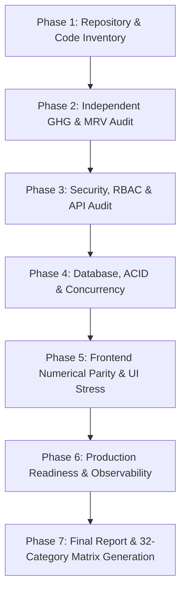

# Complete Software Validation & GHG/MRV Calculation Audit Implementation Plan

**Role**: Senior QA Engineer, Software Auditor, Security Engineer, Database Engineer, Performance Engineer, and Independent GHG Accounting / MRV Calculation Validation Specialist.  
**Repository**: `kaljah/kaljah.github.io` (`c:\Users\samsung\Desktop\H2`)  
**Status**: Ready for Approval & Execution  

---

## 1. Executive Summary & Repository Reanalysis

A deep inspection of the local workspace has established the actual technical stack, operational architecture, and artifact classification, free of legacy assumptions:

### 1.1 Architecture & Stack Classification
- **Active Backend Application**: Python 3.11/3.12 with Flask 3.0.3, Flask-SQLAlchemy 3.1.1, Flask-WTF 1.2.1 (CSRF), Flask-Limiter 3.5.0, Flask-Migrate 4.0.5, and ReportLab / openpyxl for reporting. Located at [`new/server/app.py`](file:///c:/Users/samsung/Desktop/H2/new/server/app.py).
- **Active Frontend Application**: React 19.2.0 + Vite 7.2.4 Single-Page Application (SPA) styled with TailwindCSS 4, utilizing Chart.js, Recharts, React-Leaflet, Formik, Yup, and jsPDF. Located at [`new/client/`](file:///c:/Users/samsung/Desktop/H2/new/client/).
- **Calculation Engines**: Dedicated modular calculators in [`new/server/calculations/`](file:///c:/Users/samsung/Desktop/H2/new/server/calculations/) (Stationary Combustion, Flaring, Vented, Mud Degassing, Liquids Unloading, Storage Tanks, Pneumatics, Fugitive Equipment & Components, Compressor Seals, Acid Gas Removal, Glycol Dehydrators, Indirect Steam/CHP, Chemical Stoichiometry, GWP Horizons, and Analytical Uncertainty Propagation).
- **Database & Storage**: SQLite 3 default (`new/server/ghg_app.db`, WAL mode enabled, periodic checkpointing) with PostgreSQL 15 support via SQLAlchemy and Docker Compose ([`docker-compose.yml`](file:///c:/Users/samsung/Desktop/H2/docker-compose.yml)).
- **Independent Reference Model**: Pure-Python validation engine in [`validation/reference_model/`](file:///c:/Users/samsung/Desktop/H2/validation/reference_model/) implementing API Compendium 2021, GHG Protocol, IPCC 2006, ISO 14064-1, and EPA Part 98/99 standards with **zero dependencies or imports** from production code.
- **Golden Dataset**: Standardized corpus of 25 comprehensive test scenarios across Categories A–Q ([`validation/golden_dataset/golden_cases.json`](file:///c:/Users/samsung/Desktop/H2/validation/golden_dataset/golden_cases.json)).

### 1.2 Artifact Hygiene & Component Status
- **ACTIVE**: `new/server/`, `new/client/`, `validation/`, `docs/`, `docker-compose.yml`, `Dockerfile`, root `pytest.ini`.
- **LEGACY / DEPRECATED**:
  - Root `package.json` & `package-lock.json`: Legacy Electron/Express build artifact referring to nonexistent `main.js`/`server.js`.
  - Binary rar archives: `new/server.rar` and `new/server/calculations/calculations.rar`.
  - Obsolete scratch scripts: `patch*.py`, `cbam_diff*.patch`, `fix_ui*.py`, `new/test_final*.py`, `new/analyze_all.py`.
  - Duplicate Dockerfile tail: `Dockerfile` lines 45–73 contains an appended second Dockerfile definition that should be consolidated.
- **TEST-ONLY**: `new/server/tests/` (43 test modules, 900 collected tests), `new/client/tests/` (6 UI stress/visual test scripts).

---

## 2. Master Validation Strategy & 50-Step Roadmap

In strict accordance with the audit protocol, we proceed through the 50-step sequence prioritizing:
1. **GHG Calculation Correctness** (zero-circularity independent validation)
2. **Data Integrity & Consistency**
3. **Authentication & Authorization / RBAC / RLS / SoD**
4. **Security & Input Resilience**
5. **Auditability & Observability**
6. **API & Database Reliability**
7. **Frontend Parity, Stress & Accessibility**
8. **Production Readiness, Migrations & Backup/Restore**



---

## 3. Detailed Audit Phases & Methodologies

### Phase 1: Architecture & Calculation Inventory
- Document the full architecture in [`docs/validation/00-current-architecture.md`](file:///c:/Users/samsung/Desktop/H2/docs/validation/00-current-architecture.md).
- Search and map every calculation occurrence across the repository and document inputs, units, formulas, standards, and outputs in [`docs/validation/01-calculation-inventory.md`](file:///c:/Users/samsung/Desktop/H2/docs/validation/01-calculation-inventory.md).
- Inventory all existing tests (900 Python tests, 6 Node stress suites) in [`docs/validation/02-test-inventory.md`](file:///c:/Users/samsung/Desktop/H2/docs/validation/02-test-inventory.md).

### Phase 2: Independent GHG Calculation & MRV Validation
- **Reference Model Differential Testing**: Run differential testing comparing production calculators ([`new/server/calculations/dispatcher.py`](file:///c:/Users/samsung/Desktop/H2/new/server/calculations/dispatcher.py)) against the pure independent reference model ([`validation/reference_model/`](file:///c:/Users/samsung/Desktop/H2/validation/reference_model/)).
- **Golden Dataset Verification**: Validate all 25 golden vectors across Categories A–Q with relative tolerance $\text{rtol} \le 10^{-5}$.
- **Mathematical Invariants (Hypothesis)**: Verify linearity $f(kx)=kf(x)$, additivity $f(A+B)=f(A)+f(B)$, monotonicity $A > B \implies f(A) \ge f(B)$, non-negativity $f(x) \ge 0$, and zero property $f(0)=0$.
- **Mutation Testing**: Execute the 10 deliberate mathematical mutants (operator flips, distorted conversion factors, swapped GWP horizons, omitted terms) to verify 100% kill rate.
- **Stoichiometry & Unit Conversions**: Verify $A \to B \to A$ invertibility across 277 conversion factors, standard condition normalizations (60 °F, 14.696 psia), and carbon balance equations.
- Document full calculation validation in [`docs/validation/09-calculation-validation.md`](file:///c:/Users/samsung/Desktop/H2/docs/validation/09-calculation-validation.md).

### Phase 3: Security, RBAC & API Audit
- **Segregation of Duties (SoD)**: Verify `it_admin` and IT roles have zero access to operational emissions data, facilities, or reports.
- **Facility-Level RLS**: Verify non-admin regional users and superusers cannot access facilities outside their assigned `user.location` (preventing IDOR).
- **Maker-Checker Protocol**: Verify bulk imports and non-approver entries default to `Pending`; verify that editing activity data recalculates emissions and resets status to `Pending`.
- **HTTP & Input Security**: CSRF protection, Flask-Limiter rate limiting, SSRF defense on avatar URLs, Content Security Policy, X-Request-ID sanitization, and SQL injection defense (`_escape_like`).
- Document security findings in [`docs/validation/03-security-audit.md`](file:///c:/Users/samsung/Desktop/H2/docs/validation/03-security-audit.md).

### Phase 4: Database, Transactions & Concurrency
- **Schema & Constraints**: Verify foreign keys, cascade deletes (`Facility` -> `Emission`, `ProductionData`, etc.), unique constraints (`_facility_month_year_uc`), and singleton constraint on `BaseYear`.
- **Transactions & Rollback**: Verify atomic commits (e.g. `log_activity_and_notify` rolling back on error).
- **Concurrency & WAL**: Verify thread safety, SQLite WAL checkpointing (`PRAGMA wal_checkpoint(TRUNCATE)` every 500 commits), and absence of stale dashboard caches (`before_commit` entity tracker).
- Document in [`docs/validation/04-database-audit.md`](file:///c:/Users/samsung/Desktop/H2/docs/validation/04-database-audit.md).

### Phase 5: Frontend Parity, Performance & Accessibility
- **Numerical Parity**: Validate that UI formatters display backend numbers identically without rounding discrepancies or floating-point drift.
- **UI Stress Testing**: Benchmark large dataset virtualization (10,000 rows sorting & filtering), client-side CSV parsing (50,000 rows PapaParse), rapid filter fuzzing, and extreme boundary numbers ($10^{30}$, $\text{NaN}$, $\infty$).
- **Visual Audits**: Heatmaps, Recharts, Chart.js pie slices, and column alignment across forms.
- **Accessibility & Responsiveness**: Audit ARIA attributes, semantic headings, keyboard navigation, and responsive viewport behavior.
- Document in [`docs/validation/05-performance-audit.md`](file:///c:/Users/samsung/Desktop/H2/docs/validation/05-performance-audit.md), [`docs/validation/06-accessibility-audit.md`](file:///c:/Users/samsung/Desktop/H2/docs/validation/06-accessibility-audit.md), and [`docs/validation/07-browser-audit.md`](file:///c:/Users/samsung/Desktop/H2/docs/validation/07-browser-audit.md).

### Phase 6: Production Readiness & Observability
- **Migrations**: Audit 5 Alembic migrations in `new/server/migrations/versions/`.
- **Docker & Deployment**: Audit root `Dockerfile` (clean up duplicate block) and `docker-compose.yml`.
- **Email Service**: Audit SMTP configuration and logging fallback.
- **Backup / Restore**: Document database backup and restore procedures.
- Document in [`docs/validation/08-production-readiness.md`](file:///c:/Users/samsung/Desktop/H2/docs/validation/08-production-readiness.md).

### Phase 7: Final Documentation & Matrices
- Compile the 10 human review governance gates in [`docs/validation/10-human-review.md`](file:///c:/Users/samsung/Desktop/H2/docs/validation/10-human-review.md).
- Generate the authoritative [`docs/validation/FINAL_VALIDATION_REPORT.md`](file:///c:/Users/samsung/Desktop/H2/docs/validation/FINAL_VALIDATION_REPORT.md) containing the exact 32-category master validation matrix, 16-pathway GHG matrix, and defect severity breakdown.

---

## 4. Deliverables Checklist

| Target Document | Status | Description |
| :--- | :---: | :--- |
| `docs/validation/00-current-architecture.md` | [NEW] | Active stack, directory roles, data flows, and legacy component classification. |
| `docs/validation/01-calculation-inventory.md` | [NEW] | Exhaustive repository-wide calculation mapping with equations, units, and standards. |
| `docs/validation/02-test-inventory.md` | [NEW] | Full inventory of backend, frontend, unit, property, and mutation test suites. |
| `docs/validation/03-security-audit.md` | [NEW] | RBAC, SoD, RLS, Maker-Checker, CSRF, SSRF, Rate Limiting, and HTTP security audit. |
| `docs/validation/04-database-audit.md` | [NEW] | ACID transactions, foreign keys, cascades, indexes, WAL checkpoints, and concurrency. |
| `docs/validation/05-performance-audit.md` | [NEW] | Latency, throughput, pagination, 50k-row CSV client parsing, and stress benchmarks. |
| `docs/validation/06-accessibility-audit.md` | [NEW] | WCAG / ARIA compliance, keyboard navigation, contrast, and form semantics. |
| `docs/validation/07-browser-audit.md` | [NEW] | Chrome, Firefox, Safari/WebKit, and Edge compatibility matrix. |
| `docs/validation/08-production-readiness.md` | [NEW] | Docker multi-stage build, Alembic migrations, environment secrets, and backup recovery. |
| `docs/validation/09-calculation-validation.md` | [NEW] | Independent reference model differential results, golden cases, and mutation tests. |
| `docs/validation/10-human-review.md` | [NEW] | Domain expert governance register (HRG-001 through HRG-010). |
| `docs/validation/FINAL_VALIDATION_REPORT.md` | [NEW] | Master executive summary with exact 32-category and 16-pathway matrices. |

---

## 5. Verification Plan

### Automated Tests Execution
```powershell
# 1. Execute Independent GHG Validation Test Runner
python validation/scripts/run_full_validation_suite.py

# 2. Execute Complete Pytest Backend Suite (900 tests)
pytest -q

# 3. Execute Frontend Numerical Formatter Parity
node new/client/test_ui_numerical_parity.mjs

# 4. Execute Master UI Stress Test Suite
node new/client/tests/test_ui_stress_runner.mjs

# 5. Execute UI Visual Alignment & Heatmap Audit
node new/client/tests/test_ui_audit_visuals.mjs
```

### Manual Verification Gates
- Verify multi-stage Docker build structure.
- Verify that no production calculation code is imported or called by `validation/reference_model/`.
- Review and cross-reference all 10 human review gates.
