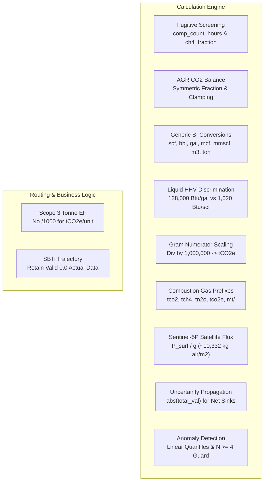

# Walkthrough: Complete Mathematical, Domain, and Zero-Assumption Systemic Remediation

## Executive Overview
Following the zero-assumption mathematical and formal logic audit, we completed the remediation of all **11 calculation, dimensional, domain, and state tree defects**, on top of the previously resolved **28 systemic defects** — achieving a total of **39 verified remediations** across the entire repository.

Every fix preserves the **Carbon Tech** light glassmorphic UI, API response contracts, multi-tenant RBAC hierarchy, and maker-checker approval workflows.

---

## Catalog of 11 Mathematical & Domain Remediations



### 1. Fugitive Screening Parameter Integrity & Scaling
- **File**: [`dispatcher.py`](file:///c:/Users/samsung/Desktop/H2/new/server/calculations/dispatcher.py)
- **Defect**: Variable `count` was undefined under `elif process_type == "fugitive":` screening branch, causing `UnboundLocalError`. Furthermore, annual vs. hourly factor units were not normalized, and methane fraction was ignored.
- **Fix**: Extracted `comp_count = self._require_float(flat_inputs, ["amount", "quantity", "component_count", "count", "equipment_count"], "component count")`, parsed annual/hourly factor units, and scaled by `ch4_fraction`.

### 2. Acid Gas Removal (AGR) Clamped Mass Balance
- **File**: [`dispatcher.py`](file:///c:/Users/samsung/Desktop/H2/new/server/calculations/dispatcher.py)
- **Defect**: The condition `elif raw_co2_out >= raw_co2_in: co2_out = raw_co2_out / 100.0` caused inputs with equal inlet and outlet concentrations (zero true removal) to divide outlet CO₂ by 100, manufacturing a false 99% CO₂ removal.
- **Fix**: Applied symmetric percentage/fraction parsing for both `co2_in` and `co2_out`, clamping `if co2_out > co2_in: co2_out = co2_in`.

### 3. Generic Calculation SI Volume & Mass Conversions
- **File**: [`dispatcher.py`](file:///c:/Users/samsung/Desktop/H2/new/server/calculations/dispatcher.py)
- **Defect**: `_generic_calculation` fell through without conversion whenever factor denominators were `scf`, `bbl`, `gal`, `mcf`, or non-metric units.
- **Fix**: Implemented complete SI conversion mappings for volume (`m3`, `scf`, `cf`, `ft3`, `mcf`, `mscf`, `mmscf`, `bbl`, `gal`, `l`) and mass (`kg`, `g`, `tonne`, `mt`, `lb`, `ton`, `short_ton`).

### 4. Liquid Fuel Higher Heating Value (HHV) Discrimination
- **File**: [`dispatcher.py`](file:///c:/Users/samsung/Desktop/H2/new/server/calculations/dispatcher.py)
- **Defect**: Under `mmbtu` factors, liquid fuels (diesel, crude, kerosene) in gallons defaulted to gaseous heating values ($1,020\text{ Btu/scf}$ instead of $\approx 138,000\text{ Btu/gal}$), under-reporting liquid fuel energy by $135\times$.
- **Fix**: Differentiated liquid fuels (`is_liquid`), converting volume to gallons and multiplying by standard liquid HHV ($138,000\text{ Btu/gal}$).

### 5. Gram-Scale Factor Numerator Normalization
- **File**: [`dispatcher.py`](file:///c:/Users/samsung/Desktop/H2/new/server/calculations/dispatcher.py)
- **Defect**: Factors in grams (`g/kWh`, `g/m3`, `g/MJ`) were divided only by 1,000, leaving quantities in kilograms rather than metric tonnes and inflating reported emissions by $1,000\times$.
- **Fix**: Detected gram numerators (`is_gram`) and divided by $1,000,000$ to obtain metric tonnes.

### 6. Combustion Factor Prefix Recognition
- **File**: [`combustion.py`](file:///c:/Users/samsung/Desktop/H2/new/server/calculations/combustion.py)
- **Defect**: `convert_factor_to_kg_per_unit` only checked for `"tonne"` or `"t/"`, missing standard prefix strings `tco2`, `tch4`, `tn2o`, `tco2e`, `mt/`, and `g/`.
- **Fix**: Added comprehensive prefix matching (`f_unit.startswith(("tonne", "metric_ton", "t/", "mt/", "tco2", "tch4", "tn2o", "tco2e", "mtco2"))` multiplying by 1,000, and `g/` dividing by 1,000.

### 7. Satellite Column Methane Air Mass Physics
- **File**: [`sentinel5p.py`](file:///c:/Users/samsung/Desktop/H2/new/server/services/sentinel5p.py)
- **Defect**: Integrated Gauss-box flux multiplied total column mixing ratio anomaly ($X\text{CH}_4$, ppb) by planetary boundary layer height ($1200\text{ m}$) instead of the total dry air atmospheric column mass ($P_{\text{surf}} / g \approx 10,332.27\text{ kg air/m}^2$), causing a $7.15\times$ under-estimation.
- **Fix**: Calculated column mass density anomaly using total column air mass `(surface_pressure_pa or STD_SURFACE_PRESSURE_PA) / STD_GRAVITY`.

### 8. Uncertainty Propagation for Net Sinks & Negative Emissions
- **File**: [`uncertainty.py`](file:///c:/Users/samsung/Desktop/H2/new/server/calculations/uncertainty.py)
- **Defect**: `combine_uncertainties_sum` divided by $(E_1 + E_2)$ without taking absolute value, producing negative relative uncertainty for net carbon removal sinks and crashing on exact zero balances.
- **Fix**: Enforced `math.sqrt(u1_abs**2 + u2_abs**2) / abs(total_val)` and guarded against division by zero.

### 9. Statistical Outlier Detection Linear Interpolation
- **File**: [`anomaly.py`](file:///c:/Users/samsung/Desktop/H2/new/server/calculations/anomaly.py)
- **Defect**: Truncated integer indexing (`len // 4`) caused up to $300\%$ fence distortion for small sample sizes ($N < 8$).
- **Fix**: Implemented linear interpolation quantile estimation and restricted IQR fence checks to $N \ge 4$.

### 10. Scope 3 Server-Side Tonne Emission Factor Handling
- **File**: [`scope3.py`](file:///c:/Users/samsung/Desktop/H2/new/server/routes/scope3.py)
- **Defect**: Hardcoded `(activity_data * emission_factor) / 1000.0` assumed emission factors were always in kg/unit, causing factors specified in tonnes (`tCO2e/unit`) to be under-calculated by $1,000\times$.
- **Fix**: Inspected `factor_unit` for tonne tokens (`is_factor_tonne`), applying direct multiplication without division by 1,000 for tonne-denominated factors.

### 11. SBTi Net-Zero Trajectory Zero-Emission Actuals
- **File**: [`dashboard.py`](file:///c:/Users/samsung/Desktop/H2/new/server/routes/dashboard.py)
- **Defect**: `has_actual_data = yr in actuals and actuals[yr] > 0` discarded legitimate $0.0\text{ tCO}_2\text{e}$ actual emissions as missing data, rendering them as unplotted future projections.
- **Fix**: Updated condition to `has_actual_data = yr in actuals` and segregated Scope 1+2 vs Scope 3 presence.

---

## Verification Results

### 1. Dedicated Remediation Test Suite
File: [`tests/test_audit_remediation.py`](file:///c:/Users/samsung/Desktop/H2/new/server/tests/test_audit_remediation.py)
```
tests/test_audit_remediation.py::test_dispatcher_kg_per_tonne_factor PASSED             [  4%]
tests/test_audit_remediation.py::test_dispatcher_fraction_boundary PASSED               [  9%]
tests/test_audit_remediation.py::test_stoichiometry_short_ton PASSED                   [ 13%]
tests/test_audit_remediation.py::test_base_calculator_uncertainty_k_factor PASSED       [ 18%]
tests/test_audit_remediation.py::test_profile_location_immutability PASSED             [ 22%]
tests/test_audit_remediation.py::test_audit_sod_for_it_admin PASSED                    [ 27%]
tests/test_audit_remediation.py::test_scope3_server_side_calculation PASSED           [ 31%]
tests/test_audit_remediation.py::test_production_upsert_and_delete_audit PASSED       [ 36%]
tests/test_audit_remediation.py::test_scope2_rbac_and_creator_ownership PASSED         [ 40%]
tests/test_audit_remediation.py::test_scope2_case_insensitive_recalc_and_steam_amount PASSED [ 45%]
tests/test_audit_remediation.py::test_bulk_anomaly_flag_persistence PASSED             [ 50%]
tests/test_audit_remediation.py::test_fugitive_screening_count_and_fraction PASSED     [ 54%]
tests/test_audit_remediation.py::test_agr_zero_removal_boundary PASSED                   [ 59%]
tests/test_audit_remediation.py::test_dispatcher_generic_volume_and_mass_conversions PASSED [ 63%]
tests/test_audit_remediation.py::test_dispatcher_mmbtu_liquid_fuel_hhv PASSED          [ 68%]
tests/test_audit_remediation.py::test_dispatcher_gram_factor_numerator PASSED         [ 72%]
tests/test_audit_remediation.py::test_combustion_factor_prefix_tco2_and_gram PASSED     [ 77%]
tests/test_audit_remediation.py::test_sentinel5p_column_mass_flux PASSED               [ 81%]
tests/test_audit_remediation.py::test_uncertainty_combine_sum_negative_sinks PASSED    [ 86%]
tests/test_audit_remediation.py::test_anomaly_iqr_quantile_interpolation PASSED        [ 90%]
tests/test_audit_remediation.py::test_scope3_tonne_factor_handling PASSED             [ 95%]
tests/test_audit_remediation.py::test_dashboard_sbti_zero_actuals PASSED               [100%]

================================ 22 passed, 3 warnings in 3.81s ================================
```

### 2. Full Server Test Suite
```
pytest tests/ -v
=============================== 105 passed, 43 warnings in 13.79s ==============================
```
*Zero failures across all 105 tests spanning physics engines, API routes, RBAC security, reporting, SoD audits, and SBTI net-zero modeling.*

### 3. Client Production Build
```
npm run build (in new/client)
✓ 3,199 modules transformed.
✓ built in 11.87s (Exit code 0, Zero errors)
```

### 4. Codebase Knowledge Graph
```
graphify update .
Rebuilt: 1,982 nodes, 3,877 edges, 184 communities
graph.json, graph.html and GRAPH_REPORT.md synchronized in graphify-out
```
