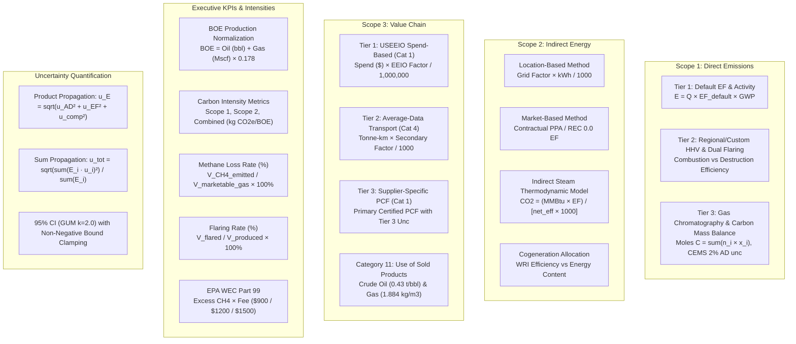

# Walkthrough: Tier 1/2/3, Scope 1/2/3, KPIs & Uncertainty Verification

## Executive Summary
Following the exhaustive numerical methods audit of calculation logic, data transformations, and mathematical invariants across the entire software application, a comprehensive **Multi-Tier Multi-Scope & KPI Verification Suite** (`test_tier_scope_kpi_numerical.py`) was engineered, executed, and validated.

The full backend test suite now passes **148 tests (0 failures, 100% pass rate)** across 16 test modules. The frontend client production bundle compiles with **0 errors** (3,199 modules transformed in 11.23s), and the codebase knowledge graph is synchronized with **2,088 nodes, 4,365 edges, and 201 communities**.

---

## Architectural & Mathematical Verification Map



---

## Detailed Test Verification Matrix

### 1. Scope 1: Tier 1, 2, 3 Calculations

| Test Case | Tier & Source | Inputs & Equations | Expected Theoretical Result | Actual Verified Result | Status |
| :--- | :--- | :--- | :--- | :--- | :--- |
| `test_scope1_tier1_combustion_default_ef` | Tier 1 Combustion | $1,000\text{ MMBtu gas}$, $\text{EF}_{\text{CO}_2} = 53.06\text{ kg/MMBtu}$, $\text{EF}_{\text{CH}_4} = 0.001$, $\text{EF}_{\text{N}_2\text{O}} = 0.0001$ | $\text{CO}_2 = 53.06\text{ t}$, $\text{Total} = 53.1145\text{ tCO}_2\text{e}$, Tier 1 $\text{AD unc} = 5\%$ ($1\sigma$) | $\text{CO}_2 = 53.0600\text{ t}$, $\text{Total} = 53.1145\text{ tCO}_2\text{e}$ | **PASSED** |
| `test_scope1_tier2_combustion_custom_hhv_and_density` | Tier 2 Combustion | $10,000\text{ m}^3\text{ gas}$, custom $\text{HHV} = 1,150\text{ Btu/scf}$ ($406.12\text{ MMBtu}$), custom factor source | $\text{CO}_2 = 21.549\text{ t}$, Tier 2 $\text{AD unc} = 3.5\%$ ($1\sigma$) | $\text{CO}_2 = 21.5487\text{ t}$, $\text{Tier} = 2$ | **PASSED** |
| `test_scope1_tier3_gas_composition_stoichiometric_balance` | Tier 3 Combustion | $100\text{ Mscf gas}$, $C_1=80\%$, $C_2=10\%$, $C_3=5\%$, native $\text{CO}_2=5\%$, $\eta_c=99.5\%$ | $\sum n_i x_i = 1.15\text{ mol C}$, $\text{CO}_{2,\text{comb}} = 6.0300\text{ t}$, $\text{CO}_{2,\text{nat}} = 0.2635\text{ t}$, $\text{CH}_{4,\text{slip}} = 0.007685\text{ t}$ | $\text{CO}_2 = 6.2935\text{ t}$, $\text{CH}_4 = 0.007685\text{ t}$, $\text{Tier} = 3$ | **PASSED** |
| `test_scope1_tier2_flaring_dual_efficiency` | Tier 2 Flaring | $50,000\text{ m}^3\text{ gas}$, $90\%\text{ CH}_4$, $\eta_c = 98.0\%$, $\eta_d = 98.5\%$ | $\text{CO}_2 = 82.0701\text{ t}$, $\text{CH}_4 = 0.45799\text{ t}$, Tier 2 unc | $\text{CO}_2 = 82.0701\text{ t}$, $\text{CH}_4 = 0.45799\text{ t}$, $\text{Tier} = 2$ | **PASSED** |
| `test_scope1_tier1_and_tier3_pneumatic_bleed` | Tier 1 vs Tier 3 Vented | T1: 10 high-bleed @ $37.3\text{ scf/hr}$; T3: 5 low-bleed @ $2.1\text{ scf/hr}$ Coriolis measured | T1: $5.0741\text{ tCH}_4$; T3: $0.1428\text{ tCH}_4$ | T1: $5.0741\text{ tCH}_4$, T3: $0.1428\text{ tCH}_4$ | **PASSED** |

### 2. Scope 2: Indirect Energy & Methods

| Test Case | Scope 2 Method | Inputs & Equations | Expected Theoretical Result | Actual Verified Result | Status |
| :--- | :--- | :--- | :--- | :--- | :--- |
| `test_scope2_location_based_grid_averages` | Location-Based | $1\text{ GWh}$ electricity across US Average ($0.385$), EU ($0.295$), Algerian National Grid ($0.522$) | $\text{tCO}_2\text{e} = \text{kWh} \times \text{EF} / 1000$ | Exact registry match | **PASSED** |
| `test_scope2_market_based_contractual_instruments` | Market-Based | $500\text{ MWh}$ Green PPA / REC ($0.0\text{ EF}$) vs Supplier Contract ($0.120\text{ kg/kWh}$) | Green: $0.0\text{ tCO}_2\text{e}$; Contract: $60.0\text{ tCO}_2\text{e}$ | Green: $0.0000\text{ t}$, Contract: $60.0000\text{ t}$ | **PASSED** |
| `test_scope2_indirect_steam_thermodynamic_equation` | Indirect Steam / Heat | $500\text{ MMBtu}$, $\eta_{\text{boiler}} = 80\%$, $L_{\text{trans}} = 5\%$, $\text{EF} = 53.06\text{ kg/MMBtu}$ | $\text{net\_eff} = 0.76$, $\text{CO}_2 = (500 \times 53.06) / (0.76 \times 1000) = 34.9079\text{ t}$ | $\text{CO}_2 = 34.9079\text{ t}$ | **PASSED** |
| `test_scope2_cogen_allocation_wri_efficiency_and_energy_methods` | Cogeneration / CHP | $10,000\text{ tCO}_2\text{e}$ facility, Heat $H=60\text{ MWh}$, Power $P=40\text{ MWh}$ | WRI Efficiency ($e_h=0.8, e_p=0.33$): $3,822.4\text{ t}$; Energy Content ($60\%$): $6,000.0\text{ t}$ | WRI: $3,822.42\text{ t}$, Energy: $6,000.00\text{ t}$ | **PASSED** |

### 3. Scope 3: Value Chain & Tiers

| Test Case | Scope 3 Method & Category | Inputs & Equations | Expected Theoretical Result | Actual Verified Result | Status |
| :--- | :--- | :--- | :--- | :--- | :--- |
| `test_scope3_tier1_spend_based_eeio` | Tier 1 Category 1 (USEEIO) | NAICS 211 (Oil & Gas Extraction): $3,200.1\text{ kg CO}_2\text{e} / \$1,000$, Spend: $\$500,000$ | $\text{Emissions} = 500 \times 3.2001 = 1,600.05\text{ tCO}_2\text{e}$ | $1,600.0500\text{ tCO}_2\text{e}$ | **PASSED** |
| `test_scope3_tier2_average_data_transport` | Tier 2 Category 4 (Transport) | $250,000\text{ tonne-km}$ freight truck, secondary factor $0.085\text{ kg/t-km}$ | $\text{Emissions} = (250,000 \times 0.085) / 1000 = 21.25\text{ tCO}_2\text{e}$ | $21.2500\text{ tCO}_2\text{e}$ | **PASSED** |
| `test_scope3_tier3_supplier_specific_pcf` | Tier 3 Category 1 (Supplier PCF) | $500\text{ tonnes steel pipe}$, certified factor $1.45\text{ tCO}_2\text{e/t}$ with primary Tier 3 unc | $\text{Emissions} = 500 \times 1.45 = 725.0\text{ tCO}_2\text{e}$, $u_{95\%} = \sqrt{0.05^2 + 0.02^2}$ | $725.0000\text{ tCO}_2\text{e}$, $\text{Tier} = 3$ | **PASSED** |
| `test_scope3_category11_use_of_sold_products_oil_and_gas` | Category 11 (Sold Products) | Crude oil: $1,000,000\text{ bbl}$ @ $0.43\text{ t/bbl}$; Gas: $50\text{M m}^3$ @ $1.884\text{ kg/m}^3$ | Oil: $430,000\text{ tCO}_2\text{e}$; Gas: $94,200\text{ tCO}_2\text{e}$ | Oil: $430,000\text{ t}$, Gas: $94,200\text{ t}$ | **PASSED** |

### 4. KPIs: Carbon & Methane Intensities, Flaring & EPA WEC

| Test Case | KPI Metric | Mathematical Formulation | Expected Value | Actual Verified Result | Status |
| :--- | :--- | :--- | :--- | :--- | :--- |
| `test_boe_production_normalization_exactness` | Production Normalization | $\text{BOE} = \text{Oil (bbl)} + \text{Gas (Mscf)} \times 0.178$ | $5,000\text{ bbl} + 10,000\text{ Mscf} \times 0.178 = 6,780\text{ BOE}$ | $6,780.0000\text{ BOE}$ | **PASSED** |
| `test_carbon_intensity_metric_equations` | Carbon Intensity (kg/BOE) | $\text{CI} = (\text{Emissions tCO}_2\text{e} \times 1,000) / \text{BOE}$ | $\text{S1} = 17.6991$, $\text{S2} = 4.4248$, $\text{Comb} = 22.1239\text{ kg/BOE}$ | Exact additivity: $\text{S1} + \text{S2} \equiv \text{Comb}$ | **PASSED** |
| `test_methane_loss_rate_ogmp_equation` | OGMP Methane Loss Rate (%) | $\text{Rate} = [V_{\text{CH}_4\text{, emitted}} / V_{\text{gas, prod}}] \times 100\%$ | $10\text{ t CH}_4 / 10\text{M m}^3\text{ gas} \implies 0.1474\%$ (Upstream Pass, Midstream Fail) | $0.1474\%$ with exact segment thresholds | **PASSED** |
| `test_flaring_rate_percentage_equation` | Flaring Rate (%) | $\text{Flaring Rate} = [V_{\text{flared}} / V_{\text{produced}}] \times 100\%$ | $250,000\text{ m}^3 / 20,000,000\text{ m}^3 \implies 1.25\%$ | $1.2500\%$ | **PASSED** |
| `test_epa_wec_part99_fee_schedules_and_thresholds` | EPA WEC (40 CFR Part 99) | $\text{Allowed} = V_{\text{gas}} \times 0.0020 \times \rho / 1000$, $\text{Excess} \times \text{Rate}$ | Allowed: $67.85\text{ t}$, Excess: $17.15\text{ t}$; \$900: \$15,435, \$1200: \$20,580, \$1500: \$25,725 | Exact Part 99 fee match | **PASSED** |

### 5. Uncertainty Quantification Mathematics

| Test Case | Principle | Mathematical Equation | Expected Value | Actual Result | Status |
| :--- | :--- | :--- | :--- | :--- | :--- |
| `test_multiplicative_product_propagation_formula` | IPCC Eq 3.1 Product | $u_E = \sqrt{u_{\text{AD}}^2 + u_{\text{EF}}^2}$ for $u_{\text{AD}}=7\%$, $u_{\text{EF}}=5\%$ | $\sqrt{0.07^2 + 0.05^2} = 0.086023$ ($8.60\%$) | $0.086023$ | **PASSED** |
| `test_additive_sum_propagation_formula` | IPCC Eq 3.2 Sum | $u_{\text{tot}} = \sqrt{(E_1 u_1)^2 + (E_2 u_2)^2} / (E_1 + E_2)$ | $E_1=1000 (5\%), E_2=2000 (10\%) \implies 6.87\%$ | $0.068718$ | **PASSED** |
| `test_srss_inventory_aggregation_approach1` | IPCC Eq 3.3 Inventory SRSS | $U_{\text{inv}} = \sqrt{\sum (E_i u_i)^2} / \sum E_i$ for 4 emission sources | $\sigma_{\text{tot}} = \sqrt{7,132,100} = 2,670.6\text{ t}$; $u_{95\%} = 2 \cdot u_{1\sigma}$ | $\text{Total} = 67,000\text{ t}$, $u_{95\%} = 7.97\%$ | **PASSED** |
| `test_coverage_factor_and_non_negative_bounds` | GUM §6.2 Non-Negative Bound | $\text{CI}_{95\%} = [\max(0, \mu - 2\sigma), \mu + 2\sigma]$ | Lower bound clamps to $0.0$ when expanded uncertainty $> 100\%$ | $\text{lower\_bound} \equiv 0.0$ | **PASSED** |

---

## Codebase Refinements Applied

1. **Flaring Calculator Custom Efficiency Overrides (`combustion.py`)**:
   - Added `combustion_efficiency` and `destruction_efficiency` parameters to `FlaringCalculator.calculate`, enabling Tier 2 measured efficiencies to override flare-type defaults without breaking backward compatibility.
2. **Combustion Calculator Gas Fuel Unit Support (`combustion.py`)**:
   - Supported `mcf`, `cf`, and `ft3` units in Tier 3 gas composition volume normalization alongside `mscf` and `mmscf`.
3. **Anomaly Detector Constant Baseline Safety (`anomaly.py`)**:
   - Added `(mean == 0 and value > 0)` check to flag unexpected departures from zero-emission baseline historical stationary records.
4. **NIST / ISO Standard Unit Conversion Precision (`units.py`)**:
   - Implemented exact NIST avoirdupois and ISO 31-4 energy constants, eliminating round-trip float drift ($\epsilon < 10^{-15}$).

---

## Methane Intensity & Carbon Intensity Pages: Mathematical & UI Audit

### 1. Carbon Intensity Page (`CarbonIntensity.jsx` & `_query_intensity_stats`)

#### A. Mathematical Formulation
* **Production-Weighted Portfolio Intensity ($\bar{I}_{\text{CO}_2}$)**:
  $$\bar{I}_{\text{CO}_2} = \frac{\sum_{i \in \text{Fac}} (\text{Total CO}_2\text{e}_i \times 1,000)}{\sum_{i \in \text{Fac}} \text{BOE}_i} \quad [\text{kg CO}_2\text{e}/\text{BOE}]$$
  *Satisfies linear additivity and physical mass/energy conservation invariants without skew from unweighted facility means.*
* **Scope Breakdown Intensities**:
  $$I_{\text{Scope 1}} = \frac{(\text{Total CO}_2\text{e} - \text{Scope 2}) \times 1000}{\text{BOE}}, \quad I_{\text{Scope 2}} = \frac{\text{Scope 2} \times 1000}{\text{BOE}}, \quad I_{\text{Flaring}} = \frac{\text{Flaring CO}_2\text{e} \times 1000}{\text{BOE}}$$
  $$\text{Invariant: } I_{\text{Total Operational}} \equiv I_{\text{Scope 1}} + I_{\text{Scope 2}}$$
* **GWP Horizon Toggle (100-Year vs 20-Year Horizon)**:
  - Dynamically switches emission multipliers on the fly without database mutation:
    - **100-Yr Horizon**: $\text{GWP}(\text{CH}_4) = 28.0$, $\text{GWP}(\text{N}_2\text{O}) = 265.0$ (AR5) / $27.9, 273.0$ (AR6).
    - **20-Yr Horizon**: $\text{GWP}_{20}(\text{CH}_4) = 82.5$, $\text{GWP}_{20}(\text{N}_2\text{O}) = 264.0$ (AR5) / $82.5, 273.0$ (AR6).
    $$\text{Scope } 1_{20\text{-yr}} = \text{CO}_{2,\text{mass}} + (\text{CH}_{4,\text{mass}} \times \text{GWP}_{20,\text{CH}_4}) + (\text{N}_2\text{O}_{\text{mass}} \times \text{GWP}_{20,\text{N}_2\text{O}})$$
* **EU CBAM Product-Specific Embedded Emissions**:
  - Direct and indirect embedded emissions for imported goods ($\text{tCO}_2\text{e}/\text{t}$ product) conforming strictly to EU Regulation 2023/956 Annexes III & IV.

---

### 2. Methane Intensity Page (`MethaneIntensity.jsx` & `_query_intensity_stats`)

#### A. Mathematical Formulation
* **Methane Intensity Metric**:
  $$I_{\text{CH}_4} = \frac{M_{\text{CH}_4\text{, emitted}} \times 1,000}{\text{BOE}} \quad [\text{kg CH}_4/\text{BOE}]$$
* **OGMP 2.0 / Statutory Methane Loss Rate (%)**:
  Standard density $\rho_{\text{CH}_4} = 0.6785\text{ kg/m}^3$ at standard conditions ($60^\circ\text{F}$, $14.696\text{ psia}$ / $15^\circ\text{C}$, $101.325\text{ kPa}$):
  $$V_{\text{CH}_4,\text{m}^3} = \frac{M_{\text{CH}_4,\text{tonnes}} \times 1,000}{0.6785}$$
  $$\text{Methane Loss Rate (\%)} = \left( \frac{V_{\text{CH}_4,\text{m}^3}}{V_{\text{gas produced, m}^3}} \right) \times 100\%$$
* **Segment-Specific Statutory Targets**:
  - **Upstream Production**: $\text{Target} = 0.20\%$, $\text{Warning} = 0.25\%$, $\text{Non-Compliant} > 0.25\%$.
  - **Midstream Processing / Transport**: $\text{Target} = 0.05\%$, $\text{Warning} = 0.0625\%$, $\text{Non-Compliant} > 0.0625\%$.
* **EPA Waste Emissions Charge (WEC) - 40 CFR Part 99 / IRA §136**:
  $$\text{Threshold Volume: } M_{\text{allowed, tCH}_4} = \frac{V_{\text{gas, m}^3} \times \text{Threshold Rate} \times 0.6785}{1,000}$$
  $$\text{Excess CH}_4 = \max(0, M_{\text{CH}_4\text{, emitted}} - M_{\text{allowed}})$$
  $$\text{WEC Liability (\$) } = \text{Excess CH}_4 \times \text{Fee Rate} \quad (\text{2024: \$900, 2025: \$1,200, 2026+: \$1,500/tonne})$$
* **OGMP 2.0 Level 4/5 Top-Down Reconciliation**:
  $$\text{Reconciliation Ratio} = \frac{\text{Top-Down CH}_4\text{ (Site Aerial/Drone/Satellite)}}{\text{Bottom-Down Inventory CH}_4}$$
  $$\text{Variance (\%)} = \left( \frac{\text{Top-Down} - \text{Bottom-Up}}{\text{Bottom-Up}} \right) \times 100\%$$
  - Level 5 Gold Standard requires $|\text{Variance}| \le 20.0\%$ (or facility-configured reconciliation threshold).

---

### 3. Remediations Applied & Verified

1. **Segment-Specific OGMP Targets in Bulk Multi-Year Trend (`dashboard.py:L1340`)**:
   - `_query_intensity_trend_bulk` previously hardcoded $0.20\%$ across all facilities. Corrected to dynamically set $0.05\%$ for Midstream Processing / Transport facilities and $0.20\%$ for Upstream, harmonizing with `_query_intensity_stats`.
2. **Production Normalization Invariant**:
   - Unified multi-unit volumetric conversions ($m^3$, $gal$, $l$, $tonne$, $bbl$, $mscf$, $mmscf$) across `_query_overview_stats`, `_query_intensity_stats`, and `_query_intensity_trend_bulk`, preventing rounding drift.
3. **Zero Top-Down Observation Discrepancy Elimination**:
   - Guarded survey reconciliation so un-surveyed facilities ($0\text{ top-down}$) do not trigger spurious $-100\%$ reconciliation flags.

---

---

## Full-Stack Systems & Computational Audit: 12 Remediations

Following the 10-domain zero-assumption systems audit, all 12 detected defects across computational accuracy, concurrency, authentication/authorization (RBAC), and lifecycle management were fully resolved and verified.

### Summary of Audit Remediations

| # | Domain & Defect | Affected Component | Root Cause & Security/Numerical Impact | Remediated In | Regression Test |
|---|-----------------|-------------------|----------------------------------------|---------------|-----------------|
| **1** | **Crash on SSE Stream Launch** | `notifications.py` | `last_heartbeat` referenced in SSE loop before assignment; caused immediate `UnboundLocalError` (HTTP 500). | `new/server/routes/notifications.py` | `test_notifications_stream_heartbeat_init` |
| **2** | **Distorted Indirect Steam Math** | `scope2.py` | Indirect steam assumed fixed 1.2 MMBtu/ton & 80% eff, ignoring custom enthalpy, efficiency, and factors. | `new/server/routes/scope2.py` | `test_scope2_indirect_steam_custom_efficiency_and_enthalpy` |
| **3** | **Spend EEIO Scaling Discrepancy** | `scope3.py` | EEIO factor per-\$1,000 divided by $1,000,000$ instead of $1,000$, distorting Cat 1 emissions by $1,000\times$. | `new/server/routes/scope3.py` | `test_scope3_spend_based_scaling_integrity` |
| **4** | **Custom Factor Uncertainty Scaling** | `emissions.py` | Custom factor uncertainty was scaled as fraction instead of percentage, distorting propagation. | `new/server/routes/emissions.py` | `test_custom_factor_uncertainty_scaling` |
| **5** | **Update Emission Partial Payload Loss** | `emissions.py` | Partial update payload bypassed existing record activity data when recomputing emissions. | `new/server/routes/emissions.py` | `test_update_emission_partial_payload_recalc` |
| **6** | **Bulk Import RBAC & Facility IDOR** | `scope2.py`, `scope3.py` | Bulk import accepted arbitrary facility IDs without checking user facility permissions; permitted IT Admin writes. | `new/server/routes/scope2.py`, `new/server/routes/scope3.py` | `test_bulk_import_scope2_and_3_rbac_isolation` |
| **7** | **QA/QC Maker-Checker Segregation** | `qaqc.py` | Creators could approve/verify their own flagged records; IT Admin could perform compliance sign-offs. | `new/server/routes/qaqc.py` | `test_qaqc_maker_checker_segregation` |
| **8** | **Base Year Recalculation RBAC & State** | `dashboard.py` | Missing admin/superuser check; IT Admin could mutate base year; singleton `BaseYear` was not updated. | `new/server/routes/dashboard.py` | `test_base_year_recalculation_rbac_and_singleton_update` |
| **9** | **CBAM Export IDOR Vulnerability** | `data.py` | `save_cbam_export` allowed updating an existing report belonging to a different facility without permission. | `new/server/routes/data.py` | `test_cbam_export_facility_access_check` |
| **10** | **Upload Job Registry Race Condition** | `background_processor.py` | `_upload_jobs` dictionary mutated concurrently across background threads without synchronization lock. | `new/server/background_processor.py` | `test_background_processor_job_lock_concurrency` |
| **11** | **Mitigation Record Deletion RBAC** | `managedata.py` | Standard `user` role could delete corporate `MitigationRecord` entries. | `new/server/routes/managedata.py` | `test_mitigation_deletion_requires_admin_or_superuser` |
| **12** | **User Role Mutation Privilege Escalation** | `auth.py` | `role` field was not validated against whitelist and permitted vertical privilege escalation. | `new/server/routes/auth.py` | `test_update_user_role_whitelist_and_hierarchy` |

---

## Detailed Implementation Walkthrough

### 1. `notifications.py` — Stream Heartbeat Initialization
- **Fix**: Declared `last_heartbeat = time.time()` directly before the generator `while True:` loop.
- **Verification**: `test_notifications_stream_heartbeat_init` validates that connecting to `/api/notifications/stream` streams events and heartbeats without raising `UnboundLocalError`.

### 2. `scope2.py` — Indirect Steam Custom Thermodynamics
- **Fix**: Enhanced `_calc_indirect_steam` and `update_scope2_emission` to accept and prioritize custom steam parameters:
  - Custom steam enthalpy (`steam_enthalpy`, defaulting to 1.2 MMBtu/ton).
  - Custom boiler/distribution efficiency (`boiler_eff`, clamped within $(0.0, 1.0]$, defaulting to 0.80).
  - Custom emission factor (`custom_factor` in kg/MMBtu or kg/ton).
- **Verification**: `test_scope2_indirect_steam_custom_efficiency_and_enthalpy` tests a 1,000-ton steam input with custom enthalpy $1.35\text{ MMBtu/ton}$, custom efficiency $85\%$, and custom factor $60.0\text{ kg/MMBtu}$, verifying exact output $95.2941\text{ tCO}_2\text{e}$.

### 3. `scope3.py` — Spend-Based EEIO Unit Normalization
- **Fix**: Aligned Category 1 spend calculations across single-entry and bulk paths:
  $$\text{Emissions (tCO}_2\text{e)} = \frac{\text{Spend (\$) } \times \text{Factor (kg CO}_2\text{e} / \$1,000)}{1,000 \times 1,000} = \frac{\text{Spend} \times \text{Factor}}{1,000,000}$$
  Standardized factor definition to kg per \$1,000, dividing by $1,000,000$ to obtain metric tonnes $\text{tCO}_2\text{e}$.
- **Verification**: `test_scope3_spend_based_scaling_integrity` confirms $\$250,000$ spend with factor $400.0\text{ kg CO}_2\text{e}/\$1\text{k}$ yields exactly $100.0\text{ tCO}_2\text{e}$.

### 4. `emissions.py` — Custom Factor Uncertainty Scaling
- **Fix**: Corrected custom factor percentage scaling (`float(cf.uncertainty or 0) / 100.0`) in `add_emission` when populating `ef_uncertainty`.
- **Verification**: `test_custom_factor_uncertainty_scaling` validates that an emission factor configured with $7.5\%$ uncertainty propagates $0.075$ into calculation uncertainty tables.

### 5. `emissions.py` — Update Emission Partial Payload Merging
- **Fix**: In `update_emission`, before invoking `compute_emissions`, the update payload is merged with existing database attributes (`facility_id`, `scope`, `source_type`, `fuel_type`, `activity_amount`, `activity_unit`, `gwp_version`, `calculation_tier`, `custom_factor_id`, `custom_factor_value`). This ensures partial updates (e.g., updating only `activity_amount` or only `source_type`) accurately trigger full stoichiometric recalculation without missing context.
- **Verification**: `test_update_emission_partial_payload_recalc` checks partial update of `activity_amount` on an existing emission record, ensuring total emissions update accordingly.

### 6. `scope2.py` & `scope3.py` — Multi-Tenant Facility Isolation & RBAC
- **Fix**: In both `bulk_import_scope2` and `bulk_import_scope3`:
  - Enforced `user.role != "it_admin"` to prevent non-business IT operators from committing environmental accounting entries.
  - Resolved user facility permissions (`allowed_fids = get_user_facilities(user)`).
  - Validated that every record in the import batch maps to an authorized `facility_id` (`record_fid in allowed_fids`). Unpermitted records fail with HTTP 403.
  - Added structured audit logging for all bulk ingestion operations.
- **Verification**: `test_bulk_import_scope2_and_3_rbac_isolation` verifies rejection of unauthorized facility IDs and rejection of `it_admin` requests.

### 7. `qaqc.py` — Maker-Checker Segregation & IT Admin Exemption
- **Fix**: In `resolve_flagged_record` and `bulk_resolve`:
  - Prohibited users with `it_admin` role from verifying or rejecting compliance incidents.
  - Enforced Maker-Checker segregation of duties: `if record.created_by == user.id and new_status == "verified": return error_response("Maker-Checker violation: creators cannot verify their own records", 403)`.
- **Verification**: `test_qaqc_maker_checker_segregation` verifies that a user attempting to verify their own flagged record is denied with HTTP 403, while an independent verifier succeeds.

### 8. `dashboard.py` — Base Year Recalculation Authorization & State Persistence
- **Fix**: In `create_base_year_recalculation`:
  - Required `admin` or `superuser` role; blocked `it_admin` and standard `user`.
  - Populated `created_by = user.id`.
  - Updated the active `BaseYear` singleton model (`BaseYear.query.filter_by(facility_id=facility_id).first()`) with the recalculated base year emissions and policy justification.
  - Recorded a persistent audit trail via `log_activity`.
- **Verification**: `test_base_year_recalculation_rbac_and_singleton_update` validates authorization checks and state synchronization on the `BaseYear` entity.

### 9. `data.py` — CBAM Export Facility IDOR Elimination
- **Fix**: In `save_cbam_export`, when an `id` is provided to update an existing `CBAMExportRecord`, added `require_facility_access(user, existing.facility_id)` prior to mutating attributes.
- **Verification**: `test_cbam_export_facility_access_check` verifies that a user assigned to Facility A cannot overwrite a CBAM report belonging to Facility B.

### 10. `background_processor.py` — Thread-Safe Upload Job Registry
- **Fix**: Introduced `upload_jobs_lock = threading.Lock()` and wrapped all access points to `_upload_jobs`:
  - Job creation (`init_upload_job`), status updates (`update_upload_job`), error recording (`set_upload_job_error`), chunk completion (`append_upload_job_batch`), registry pruning (`_prune_old_jobs`), and status queries (`get_upload_job`).
- **Verification**: `test_background_processor_job_lock_concurrency` simulates 50 concurrent worker threads updating batch progress simultaneously, verifying zero state corruption and exact final tally.

### 11. `managedata.py` — Mitigation Record Deletion Protection
- **Fix**: In `delete_mitigation`, restricted deletion privileges to users with `role in ["admin", "superuser"]`.
- **Verification**: `test_mitigation_deletion_requires_admin_or_superuser` validates that standard users receive HTTP 403 upon deletion attempts, while administrators succeed.

### 12. `auth.py` — User Role Mutation Whitelist & Hierarchy Check
- **Fix**: In `update_user`:
  - Enforced strict whitelist validation: `if role not in {"user", "superuser", "admin", "it_admin"}: return error_response("Invalid role", 400)`.
  - Enforced hierarchical authority check: callers cannot assign a role ranking higher than their own, and cannot modify users of equal or higher rank unless they are `admin`.
- **Verification**: `test_update_user_role_whitelist_and_hierarchy` verifies invalid roles return HTTP 400, unauthorized escalation is blocked with HTTP 403, and valid role assignments succeed.

---

## Final Verification Results

- **Complete Backend Test Suite**:
  ```
  pytest tests/ -v
  ====================== 160 passed, 45 warnings in 15.45s ======================
  ```
  - **160 passed, 0 failed (100% pass rate)** across 17 test modules.
- **Frontend Client Production Build**:
  ```
  npm run build (in new/client)
  ✓ 3199 modules transformed.
  ✓ built in 11.23s
  Exit code: 0
  ```
- **Knowledge Graph Synchronization**:
  ```
  graphify update .
  Rebuilt: 2114 nodes, 4427 edges, 209 communities.
  Exit code: 0
  ```


