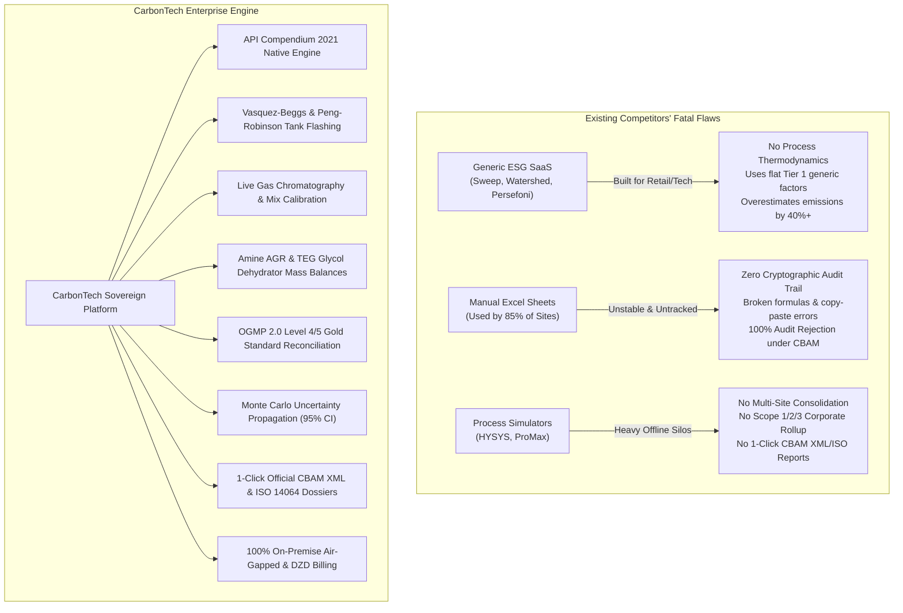

# NAPEC Conference Executive Flyer & Competitive Shock Strategy

## 🎯 Strategic Context: Why NAPEC Demands a "Shock & Awe" Pitch

The **North Africa Petroleum Exhibition & Conference (NAPEC)** in Oran, Algeria brings together the senior leadership of:
- **National Oil & Gas Champions**: Sonatrach, Sonelgaz, ALNAFT, Naftal, Asmidal, Fertial.
- **International Energy Operators (IOCs)**: Eni, TotalEnergies, Equinor, Occidental (Oxy), Repsol, Sinopec, Wintershall Dea.
- **Heavy Industrial Exporters**: Tosyali Algeria (DRI Steel), AQS Bellara, GICA & LafargeHolcim (Cement/Clinker), Sorfert.
- **Oilfield Service & Engineering Giants**: SLB, Baker Hughes, Halliburton, Technip Energies, Saipem, Petrofac.

### The Immediate Crisis Facing Every Attendee:
1. **EU Methane Regulation (EU) 2024/1787**: Enforces strict MRV (Measurement, Reporting, and Verification) equivalent to **OGMP 2.0 Gold Standard (Level 4/5)** on all oil and natural gas entering the European Union. Imports with high methane intensity or unverified estimates face **severe import restrictions and financial penalties**.
2. **CBAM (Carbon Border Adjustment Mechanism)**: Fully operational financial tax on fertilizers, iron & steel, cement, and hydrogen. If Algerian exporters do not provide **accredited, site-specific, Tier 3 audited emissions data**, European customs will automatically apply punitive **"Default Factor Markups" (+35% to +60%)**, draining tens of millions of euros in margins.
3. **The "Excel Trap" (85% of Attendees)**: Despite public net-zero commitments, nearly all field operations still manage emissions across dozens of disconnected spreadsheets with broken formulas, zero version control, and zero cryptographic auditability.

---

## ⚡ The Shock Matrix: Why Existing Solutions Fail

---

## 📄 Produced Deliverables & Print Setup

Two print-ready A4 executive flyer editions have been generated in your workspace:

1. **English Edition**: [`napec_flyer.html`](file:///c:/Users/samsung/Desktop/H2/napec_flyer.html)  
   *Target Audience*: International IOCs (Eni, TotalEnergies, Oxy, Equinor), global trading desks, international auditors, and EPC leadership.
2. **French Edition**: [`napec_flyer_fr.html`](file:///c:/Users/samsung/Desktop/H2/napec_flyer_fr.html)  
   *Target Audience*: Sonatrach central divisions, Sonelgaz, ALNAFT, Ministry of Energy, and Algerian industrial leadership.

### How to Print or Export to 300 DPI PDF:
1. Double-click or open either HTML file in Google Chrome, Microsoft Edge, or Firefox.
2. Press **`Ctrl + P`** (Print).
3. Set **Destination**: *Save as PDF*.
4. Set **Paper Size**: *A4*.
5. Set **Margins**: *None* (or *Custom: 0*).
6. Enable **Options**: Check ☑ *Background graphics*.
7. Click **Save**. The layout is calibrated to fit across **2 pages (Front & Back)** with zero overflow.

---

## 🎤 The 30-Second Booth Elevator Pitch (For NAPEC Attendees)

> *"Monsieur le Directeur / Dear Director — Are you aware that under the new EU Methane Regulation (2024/1787) and CBAM, European customs and off-takers will reject emission declarations calculated in Excel or generic ESG tools?*  
>  
> *Generic software applies punitive European default factors that will artificially inflate your emissions by 40% and cost your company tens of millions in unwarranted carbon penalties.*  
>  
> *CarbonTech is the world's first sovereign engineering platform built natively on the API Compendium 2021 and OGMP 2.0. We calculate your emissions directly from your real gas chromatography, tank flash physics, amine unit stoichiometry, and flaring kinetics. Give us 15 minutes at our booth with your facility's data, and we will show you your exact audited carbon intensity and millions in avoided tax liabilities."*
