# Implementation Plan: Comprehensive Annual GHG & CAP Executive Reporting Platform (Updated)

## Goal Description
Extend the enterprise GHG accounting platform with full capabilities to model, ingest, calculate, analyze, and report at the depth and rigor of the **Groupement Berkine Annual GHG & CAP Emissions Report (HBNS and El Merk)**.

This establishes an enterprise-grade framework integrating all specific operational, calculation, and regulatory requirements:
1. **Criteria Air Pollutants (CAP)**: Dual estimation methodology combining **Algerian Executive Decree 06-138** (measured $\text{mg/Nm}^3 \times \text{flue gas flow}$) with **API Compendium 2021 / AP-42** combustion, flaring, and venting stoichiometry for $\text{NO}_2, \text{CO}, \text{SO}_2, \text{PM}, \text{VOC}$.
2. **Flaring Operational Breakdown & KPI**:
   - Register **Routine Flaring**, **Non-Routine Flaring**, and **Safety Flaring** as first-class process types in the emissions calculator.
   - Upgrade the Flaring KPI card to display each volume separately ($\text{kNm}^3 / \text{MMSm}^3$) alongside the Grand Total Flared Volume.
   - Track field-measured DRE (e.g. VISR camera at $99.74\% - 99.89\%$) and enforce **Algerian Executive Decree 21-330 Article 9** ($1.00\%$ flaring intensity threshold) compliance.
3. **Granular Production Data**: Integrated directly into the existing **Production Data tab** in `ManageData.jsx` (Gross gas, injected gas, gas without injection, crude, condensates, LPG, Total BOE, and Saleable BOE).
4. **Facility Equity Share % Input**: In the Facility/Region creation and editing form, whenever the user selects `"Equity Share"` under consolidation boundary type, dynamically display an input field to enter the **Equity Share Percentage (%)**.
5. **Flexible Hybrid GWP Policy**: Support a dynamic hybrid GWP framework across all years (evaluating each year/record according to its applicable standard without hardcoded year cutoffs).
6. **Unified Master A4 Portrait Executive Report Generator**: Upgrade [`ModernReportGenerator.js`](file:///c:/Users/samsung/Desktop/H2/new/client/src/utils/ModernReportGenerator.js) to dynamically compile an exhaustive, publication-grade corporate report matching the structure, tables, KPI callouts, and appendices of the Groupement Berkine standard.

---

## User Feedback Incorporated

| Item | User Instruction | Implementation Decision in this Plan |
| :--- | :--- | :--- |
| **GWP Transition** | *"Dont fix the years just make it hybrid across all years"* | Dynamic multi-year hybrid GWP: GWP is evaluated per record/year based on historical metadata or a user-selected hybrid rule rather than hardcoded year boundaries. |
| **CAP Calculation** | *"Are these poluants calculated using API or not ?"* | **Dual-Method Architecture**: Algerian Law (**Decree 06-138**) sets statutory limits ($\text{mg/Nm}^3$) and measurement rules ($\text{mass} = C \times Q_N$), but does not define empirical emission factors. Therefore, the platform uses **API Compendium 2021 Section 4/5 & AP-42** to compute mass automatically for unmeasured combustion/flaring/venting/leaks, while supporting direct flue-gas concentration ($\text{mg/Nm}^3$) sampling inputs for statutory compliance. |
| **Equity Share %** | *"In adding regions there is an option to choose equity share when the user select that add an input box to add thr % there"* | In `ManageData.jsx` facility form, selecting `"Equity Share"` reveals a numeric input field for `equity_share_pct` (persisted to `Facility.equity_share_pct`). |
| **Production Tab** | *"These should be added in production data tab"* | Granular production columns (Gross Gas, Injected Gas, Gas without Injection, Crude, Condensates, LPG, Total BOE, Saleable BOE) are added directly into the existing **Production Data** tab form and table. |
| **Flaring Process Types & KPIs** | *"Routine, safety and non routine flaring should be added as process types in the emissions calccalulator, the kpi showing volume flared should show the ammount of each separately and the total of volume flared"* | Added `routine_flaring`, `non_routine_flaring`, and `safety_flaring` into `process_categories.py` and the calculation dispatcher. Flaring KPI components updated to break down volumes individually and sum to the total. |

---

## Architecture & Data Flow

```mermaid
flowchart TD
    subgraph DataEntry ["Data Entry & Ingestion"]
        UI1["ManageData: Facility Modal\n(Equity Share % when selected)"]
        UI2["ManageData: Production Data Tab\n(Gross/Injected Gas, Crude, Condensate, LPG, Saleable)"]
        UI3["Emissions Calculator / Batch Upload\n(Routine, Non-Routine, Safety Flaring)"]
        UI4["ManageData: CAP Tab / Sampling\n(Measured mg/Nm3 or API auto-calc)"]
    end

    subgraph BackendCore ["Backend & Database Layer"]
        DB1["Facility (equity_share_pct)"]
        DB2["ProductionData (granular fields)"]
        DB3["Emission (routine/safety/non-routine flaring)"]
        DB4["CapEmission (mass & mg/Nm3) & Decree 06-138 Limits"]
        Calc["API Compendium 2021 Engines\n(FlaringCalculator, Combustion, CAP)"]
    end

    subgraph AnalyticsKPI ["Analytics & Dashboards"]
        KPI1["Flaring KPI: Routine + Safety + Non-Routine = Total"]
        KPI2["Decree 21-330 Flaring Intensity (% vs 1.00% Limit)"]
        KPI3["Decree 06-138 CAP Compliance (mg/Nm3 vs Limits)"]
        KPI4["Intensities: Total vs Saleable BOE, NGSI wt%"]
        KPI5["Equity Share Slicing across JV Partners"]
    end

    subgraph MasterReport ["Unified Master A4 Portrait Report Generator"]
        Rep1["Executive Summary & Baseline Progress"]
        Rep2["Granular Production & SANGEA GHG Profiles"]
        Rep3["Routine/Safety Flaring & Decree 21-330"]
        Rep4["Criteria Air Pollutants & Decree 06-138 Verdict"]
        Rep5["JV Partner Equity Allocations"]
        Rep6["Comprehensive 2021-2025 Appendices Data Tables"]
    end

    DataEntry --> BackendCore
    BackendCore --> AnalyticsKPI
    AnalyticsKPI --> MasterReport
```



---

## Proposed Changes

### 1. Backend Database Models & Categories (`new/server/`)

#### [MODIFY] [`models.py`](file:///c:/Users/samsung/Desktop/H2/new/server/models.py)
1. **Extend `Facility`**:
   - Add `equity_share_pct = db.Column(db.Float, default=100.0)`
2. **Extend `ProductionData`**:
   - Add `gross_gas_mmsm3 = db.Column(db.Float, default=0.0)`
   - Add `injected_gas_mmsm3 = db.Column(db.Float, default=0.0)`
   - Add `gas_without_injected_mmsm3 = db.Column(db.Float, default=0.0)`
   - Add `crude_oil_mmboe = db.Column(db.Float, default=0.0)`
   - Add `condensate_mmboe = db.Column(db.Float, default=0.0)`
   - Add `lpg_mmboe = db.Column(db.Float, default=0.0)`
   - Add `ngl_mmboe = db.Column(db.Float, default=0.0)`
   - Add `total_production_mmboe = db.Column(db.Float, default=0.0)`
   - Add `total_production_no_injected_mmboe = db.Column(db.Float, default=0.0)`
   - Add `saleable_production_mmboe = db.Column(db.Float, default=0.0)`
3. **Add `CapEmission`**:
   - `id`: Integer primary key
   - `facility_id`: ForeignKey to `facilities.id`
   - `year`: Integer
   - `month`: Integer (nullable)
   - `source_module`: String (`Stationary Combustion`, `Flares`, `Equipment Leaks`, `O&G Venting`)
   - `pollutant`: String (`NO2`, `CO`, `SO2`, `PM`, `VOC`)
   - `mass_tonnes`: Float
   - `concentration_mg_nm3`: Float (nullable)
   - `flue_gas_volume_nm3`: Float (nullable)
   - `calc_method`: String (`"API Compendium"`, `"Measured Stack Sampling"`)
   - `status`: String (`"Pending"`, `"Verified"`)
4. **Add `CapRegulatoryLimit`**:
   - Pre-seeded with **Executive Decree 06-138** limits:
     - $\text{NO}_2: 200.0\ \text{mg/Nm}^3$
     - $\text{CO}: 150.0\ \text{mg/Nm}^3$
     - $\text{SO}_2: 800.0\ \text{mg/Nm}^3$
     - $\text{PM}: 30.0\ \text{mg/Nm}^3$
     - $\text{VOC}: 150.0\ \text{mg/Nm}^3$
5. **Add `JvPartner` & `FacilityEquityShare`**:
   - Models to hold partner names (Sonatrach, Occidental, Eni, TotalEnergies, Pertamina, Repsol) and multi-partner share distributions over time.

#### [MODIFY] [`process_categories.py`](file:///c:/Users/samsung/Desktop/H2/new/server/process_categories.py)
Register distinct flaring process types in `PROCESS_TYPES`:
```python
"routine_flaring": {
    "name": "Routine Flaring",
    "category": "vented",
    "segments": ["Upstream", "Midstream", "Downstream"],
    "unit": "m3",
    "description": "Continuous flaring of associated gas during normal operations (Decree 21-330 / ZRF)"
},
"non_routine_flaring": {
    "name": "Non-Routine Flaring",
    "category": "vented",
    "segments": ["Upstream", "Midstream", "Downstream"],
    "unit": "m3",
    "description": "Flaring during process upsets, maintenance, turnarounds, or plant trips"
},
"safety_flaring": {
    "name": "Safety Flaring",
    "category": "vented",
    "segments": ["Upstream", "Midstream", "Downstream"],
    "unit": "m3",
    "description": "Purge gas, pilot gas, and emergency safety relief flaring"
}
```

#### [MODIFY] [`calculations/dispatcher.py`](file:///c:/Users/samsung/Desktop/H2/new/server/calculations/dispatcher.py) & [`calculations/vented.py`](file:///c:/Users/samsung/Desktop/H2/new/server/calculations/vented.py)
- Route `routine_flaring`, `non_routine_flaring`, and `safety_flaring` directly to `FlaringCalculator`.
- In `FlaringCalculator`, support custom/measured `destruction_efficiency` (such as VISR camera measured DRE: $99.85\%$).

---

### 2. Backend REST APIs & Analytics (`new/server/routes/`)

#### [NEW] [`routes/cap_routes.py`](file:///c:/Users/samsung/Desktop/H2/new/server/routes/cap_routes.py)
- `GET /api/cap/emissions`: Filter by facility, year, pollutant, source module.
- `POST /api/cap/emissions`: Add/update CAP records (mass and measured $\text{mg/Nm}^3$).
- `POST /api/cap/calculate-api`: Calculate CAP mass automatically using API Compendium 2021 emission factors based on fuel consumed, flared gas volume, and gas composition.
- `GET /api/cap/compliance`: Return statutory comparison against Decree 06-138 limits.

#### [MODIFY] [`routes/dashboard.py`](file:///c:/Users/samsung/Desktop/H2/new/server/routes/dashboard.py)
- **Flaring Breakdown KPI Endpoint** (`/api/dashboard/flaring-summary`):
  - Returns separate quantities for `routine_flaring`, `non_routine_flaring`, `safety_flaring`, and `total_flared` in both $\text{m}^3 / \text{kNm}^3$ and $\text{tCO}_2\text{e}$.
  - Computes flaring intensity ($\text{vol.\%}$ of total gas produced) and flags compliance with **Decree 21-330 Article 9 ($1.00\%$ limit)**.
- **Granular Intensities Endpoint** (`/api/dashboard/granular-intensities`):
  - Computes Carbon Intensity by Total BOE and Saleable BOE ($\text{kg CO}_2\text{e/BOE}$).
  - Computes Methane Intensity per NGSI ($\text{wt.\%}$).
  - Compares against OGCI target ($17.0\ \text{kg/BOE}$).
- **Equity Share Allocation Endpoint** (`/api/dashboard/equity-share-emissions`):
  - Dynamically calculates emissions allocated to each partner according to facility equity shares.

---

### 3. Frontend Data Management (`ManageData.jsx`)

#### [MODIFY] [`ManageData.jsx`](file:///c:/Users/samsung/Desktop/H2/new/client/src/pages/ManageData.jsx)
1. **Facility Creation/Editing (Equity Share % Input)**:
   - When `facilityForm.boundary_type === 'Equity Share'`, render a dedicated numeric input field:
     ```jsx
     {facilityForm.boundary_type === 'Equity Share' && (
         <div className="form-group" style={{ marginTop: '12px' }}>
             <label>Equity Share Percentage (%)</label>
             <input
                 type="number"
                 step="0.01"
                 min="0"
                 max="100"
                 value={facilityForm.equity_share_pct || ''}
                 onChange={(e) => setFacilityForm({ ...facilityForm, equity_share_pct: e.target.value })}
                 placeholder="e.g. 51.00"
                 className="mole-input"
             />
         </div>
     )}
     ```
2. **Production Data Tab (Granular Metrics)**:
   - Expand the existing Production Data form and table with:
     - Gross Gas Production ($\text{MMSm}^3$)
     - Gas Production without Injected Gas ($\text{MMSm}^3$)
     - Injected Gas ($\text{MMSm}^3$)
     - Liquid Production: Crude Oil, Condensates, LPG ($\text{MMBOE}$)
     - Total Production ($\text{MMBOE}$) & Saleable Production ($\text{MMBOE}$)
3. **Criteria Air Pollutants (CAP) Management**:
   - Add a clean sub-panel to manage CAP records (NO2, CO, SO2, PM, VOC), view auto-calculated API values, input measured $\text{mg/Nm}^3$, and view Decree 06-138 compliance status.

---

### 4. Flaring KPI Card & Calculator UI

#### [MODIFY] [`new/client/src/components/Scope1Form.jsx`](file:///c:/Users/samsung/Desktop/H2/new/client/src/components/Scope1Form.jsx)
- Display `Routine Flaring`, `Non-Routine Flaring`, and `Safety Flaring` in the process type selector.
- Include field for optional measured DRE % (e.g. VISR camera $99.85\%$).

#### [MODIFY] [`DashboardEnhanced.jsx`](file:///c:/Users/samsung/Desktop/H2/new/client/src/pages/DashboardEnhanced.jsx) & Flaring KPI components
- Update the Flaring KPI card to display:
  - **Routine Flaring**: Volume & %
  - **Non-Routine Flaring**: Volume & %
  - **Safety Flaring**: Volume & %
  - **Total Flared Volume**: Volume, Year-over-Year % change, and Decree 21-330 Flaring Intensity vs $1.00\%$ threshold.

---

### 5. Master Executive Report Generator (`ModernReportGenerator.js`)

#### [MODIFY] [`ModernReportGenerator.js`](file:///c:/Users/samsung/Desktop/H2/new/client/src/utils/ModernReportGenerator.js)
Generate a comprehensive, audit-grade **A4 Portrait** corporate report:
1. **Executive Summary & 2030 Decarbonization Goals**:
   - Total GHG reduction vs baseline average (e.g., $15.9\%$).
   - Progress towards 2030 target ($30\%$ reduction).
   - Milestone tracking (lowest flaring on record, VISR DRE application, LDAR survey).
2. **Production Profile (Granular)**:
   - Gross gas, injected gas, liquids, total production vs saleable production table and trends.
3. **Flaring Breakdown & Decree 21-330 Compliance**:
   - Stacked volume table and charts (Routine, Non-Routine, Safety).
   - Flaring Intensity % vs **Decree 21-330 1.00% target** with compliance status.
   - Application of measured VISR camera DRE.
4. **Criteria Air Pollutants (CAP) & Decree 06-138 Compliance**:
   - Tonnes and measured $\text{mg/Nm}^3$ for NO₂, CO, SO₂, PM, VOC.
   - Compliance scorecard comparing measured concentrations against Decree 06-138 limits.
5. **Multi-Metric Intensities Matrix**:
   - Total Production vs. Saleable Product Intensity ($\text{kg CO}_2\text{e/BOE}$).
   - Methane Intensity per NGSI Protocol ($\text{wt.\%}$).
   - OGCI $17.0\ \text{kg/BOE}$ benchmark comparison.
6. **Joint Venture Partner Equity Share Allocations**:
   - GHG and Methane emission breakdown across all partners (Sonatrach, Occidental, Eni, TotalEnergies, Pertamina, Repsol) over time.
7. **SANGEA Modular GHG Breakdown**:
   - Stationary Combustion, Flares, Equipment Leaks, Venting, Mobile, Tanks, Misc, Scope 2.
8. **Comprehensive 5-Year Data Appendices (2021–2025)**:
   - Exhaustive data tables matching pages 24 to 41 of the Groupement Berkine report.

---

### 6. Turnkey Historical Data Seeder (`seed_berkine_data.py`)

#### [NEW] [`seed_berkine_data.py`](file:///c:/Users/samsung/Desktop/H2/seed_berkine_data.py)
Seeds the exact historical 2021–2025 figures for **HBNS** (Hassi Berkine South) and **ELM** (El Merk):
- Granular production figures.
- Flaring volumes by stream (Routine, Non-routine, Safety) and VISR DRE measurements.
- CAP mass and concentrations.
- JV Partner equity structures.

---

## Verification Plan

### Automated Tests
1. **Calculation & Process Types Matrix**:
   - `pytest new/server/tests/test_all_process_types_matrix.py` (verifying `routine_flaring`, `non_routine_flaring`, `safety_flaring`).
2. **CAP Compliance Engine**:
   - Unit tests validating Decree 06-138 concentration thresholds and API Compendium CAP estimation formulas.
3. **Flaring Regulatory Check**:
   - Unit tests validating Decree 21-330 Article 9 ($1.00\%$ flaring intensity threshold).
4. **Equity Share Allocation**:
   - Unit tests verifying partner equity emission splits.

### Manual Verification
1. Run `python seed_berkine_data.py` to seed HBNS and El Merk historical records.
2. In `ManageData.jsx`:
   - Verify selecting `"Equity Share"` shows the percentage input box.
   - Verify the enhanced fields in the **Production Data** tab.
3. In `Reports.jsx`:
   - Click **Generate Master Report**.
   - Inspect the generated A4 Portrait PDF to confirm all chapters, tables, KPI callouts, and appendices match the exhaustive standard of the reference report.
