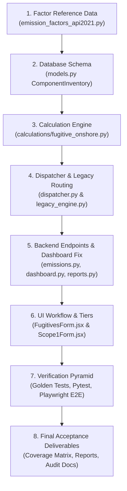

# API GHG Compendium 2021 — Chapter 7 Onshore Equipment Leaks Implementation Plan

## 1. Executive Summary & Scope
This plan details the implementation, migration, and audit of **API GHG Compendium 2021 — Chapter 7 (Equipment Leaks / Fugitive Emissions)** strictly for **ONSHORE OIL & GAS OPERATIONS** in Neocarbon.

Per user requirements, offshore operations, LNG, downstream refining/distribution, and marine operations are strictly out of scope. intentional venting (Chapter 6), flaring (Chapter 5), and combustion (Chapter 4) are completely isolated to guarantee zero double counting.

---

## 2. Agreed Architectural Decisions (Grill-Me Alignment)

| Decision Branch | Resolution |
| :--- | :--- |
| **Backend Architecture** | Create dedicated `calculations/fugitive_onshore.py` containing modular calculators for Facility, Equipment, Component, and Screening/Measurement methodologies; integrate via `dispatcher.py`. |
| **Reference Database** | Embed full versioned reference factors with rich metadata schema (`factor_id`, `api_section`, `api_table`, `service_type`, `time_basis`, etc.) in `emission_factors_api2021.py`. |
| **Data Model & Persistence** | Dual-layer: Add `ComponentInventory` and `FugitiveSurvey` models in `models.py` for granular tracking while storing aggregated emissions with full audit trace (`source_payload`) in `Emission`. |
| **Gas Speciation & Services** | Flexible dual-mode: API-aligned defaults by service type (Gas: 85% CH₄, Light Oil: 60% CH₄, Heavy Oil: 15% CH₄) with site-specific gas/liquid analysis override ($x_{\text{CH4}}$, $x_{\text{CO2}}$, MW, TOC/THC conversions). |
| **Time Basis & Duration** | Dual-mode duration: Direct operating hours (partial-year, commissioning, shutdown) plus survey interval date tracking (Annual, Semi-Annual, Quarterly, Repair dates) to prevent double annualization. |
| **UI Workflow & Tiers** | Hierarchical 3-Tier UI in `FugitivesForm.jsx` / `Scope1Form.jsx`: Tier 1 (Facility factors), Tier 2 (Equipment / Component population with dynamic cascading dropdowns), Tier 3 (Method 21 Ranges, Correlation Equations, OGI Leaker Survey, Direct Measurement). |
| **Validation & Traceability** | Strict inline frontend + backend HTTP 400 validation rejecting invalid/negative inputs, with comprehensive intermediate calculation audit trail in `source_payload`. |
| **Source Boundaries & Dashboards**| Separate Chapter 7 into dedicated top-level category `"Equipment Leaks"` in `dashboard.py` (fixing the bug aliasing `fugitive` to `venting`), Methane Explorer, and PDF reports. |
| **Verification & Deliverables** | Golden tests in `tests/test_api2021_chapter7_onshore.py`, API regression tests, real headless Playwright browser E2E tests, and 6 final reports. |

---

## 3. Methodologies & API Tables Coverage

### A. Tier 1 — Facility-Level Average Factors (Section 7.2.2)
- **Table 7-1**: Onshore Natural Gas Production Facilities (gas well pad, central gathering/processing battery).
- **Table 7-2**: Onshore Crude Oil Production Facilities (oil well pad, tank battery).
- Formula: $\text{CH}_4 (\text{tonnes/yr}) = \text{Facilities} \times \text{EF}_{\text{facility}} \times (\text{Days} / 365.25 \text{ or } \text{Hours} / 8760)$.

### B. Tier 2A — Equipment-Level Average Factors (Section 7.2.2 & 7.2.3)
- **Table 7-9**: Onshore Crude Oil Production Equipment (wellheads [heavy & light crude], separators [heavy & light], heater-treaters, headers, tank fugitives).
- **Table 7-10**: Onshore Natural Gas Production Equipment (gas wellheads, gas separators, heaters, dehydrators, meter/piping, reciprocating compressors).
- **Table 7-29**: Onshore Gathering & Boosting Equipment (gathering compressor stations, gathering pipeline segments).
- Formula: $\text{CH}_4 (\text{tonnes/yr}) = \text{Count} \times \text{EF}_{\text{equip}} \times \text{Hours} / 1000$ (with proper unit detection for kg vs tonnes vs annual).

### C. Tier 2B — Component-Level Average Factors (Section 7.2.2 & 7.2.3)
- **Table 7-11**: EPA 1995 / API Onshore Production Component Factors (Valves, Pump Seals, Connectors, Flanges, Open-Ended Lines, Others / PRVs) across Services:
  - Gas Service
  - Light Oil Service
  - Heavy Oil Service
  - Water / Oil Service
- **Table 7-30**: Gathering & Boosting Component Factors (Valves, Connectors, Flanges, Open-Ended Lines, PRVs, Compressor Seals).
- Formula: $\text{CH}_4 (\text{tonnes/yr}) = \text{Count} \times \text{EF}_{\text{TOC}} \times \frac{w_{\text{CH4}}}{w_{\text{TOC}}} \times \text{Hours} / 1000$.

### D. Tier 3 — Screening & Measurement Methodologies (Section 7.2.2 & 7.4)
1. **Method 21 Screening Ranges** (Table 7-15 / 7-16):
   - Non-pegged (< 10,000 ppmv) vs Pegged ($\ge$ 10,000 ppmv) factors by component and service.
2. **Method 21 Correlation Equations** (Table 7-17 / 7-18):
   - $\text{Leak Rate (kg TOC/hr)} = a \times (\text{Screening PPM})^b$
   - Pegged rate default applied when concentration exceeds scale limit.
3. **OGI Leaker Survey Method** (Table 7-19 / 7-20 / Table W-1E):
   - Surveyed population $N_{\text{total}}$, Detected Leakers $N_{\text{leak}}$, Non-leakers $N_{\text{non-leak}} = N_{\text{total}} - N_{\text{leak}}$.
   - $\text{Emissions} = [N_{\text{leak}} \times \text{EF}_{\text{leaker}} + N_{\text{non-leak}} \times \text{EF}_{\text{non-leaker}}] \times \text{Hours}$.
4. **Direct Measurement**:
   - Measured vent/leak rate in $\text{kg/hr}$, $\text{scf/hr}$, or $\text{m}^3\text{/hr}$ from Hi-Flow sampler, calibrated bagging, or measurement meter, scaled by gas analysis mole fraction $x_{\text{CH4}}$ and $x_{\text{CO2}}$.

---

## 4. Implementation Steps & Work Breakdown

1. **Step 1: Reference Data Update**
   - Populate API Chapter 7 onshore tables (7-1, 7-2, 7-9, 7-10, 7-11, 7-15, 7-16, 7-17, 7-19, 7-20, 7-29, 7-30) into `emission_factors_api2021.py` with full metadata.
2. **Step 2: Database Schema & Migration**
   - Add `ComponentInventory` and `FugitiveSurvey` models in `models.py`. Update SQLite schema / migration hook.
3. **Step 3: Onshore Fugitive Calculation Engine**
   - Create `new/server/calculations/fugitive_onshore.py` implementing all 4 calculator classes with unit checks, uncertainty propagation, and audit payload formatting.
4. **Step 4: Dispatcher Integration**
   - Wire `dispatcher.py` to route all fugitive process types (`fugitive`, `fugitive_facility`, `equipment_fugitive`, `wellhead_fugitive`, `separator_fugitive`, `gathering_boosting`, `fugitive_component`, `compressor_seal`, `fugitive_screening`, `fugitive_ogi`, `fugitive_measurement`) to the new engine.
5. **Step 5: Backend Endpoints & Dashboard Category Separation**
   - Update `dashboard.py` lines 567-568 to assign `fugitive` and equipment leaks to `"Equipment Leaks / Fugitives"`, separating them from `"venting"`.
   - Ensure Methane Intensity and Carbon Intensity aggregation preserve CH₄ and CO₂e without double counting.
6. **Step 6: Frontend UI Workflow**
   - Re-architect `new/client/src/components/scope1/FugitivesForm.jsx` to provide Tier 1 / Tier 2 / Tier 3 navigation, dynamic equipment/component/service cascades, survey inputs, and audit drawer.
   - Unlock Tier 3 in `Scope1Form.jsx` for fugitives.
7. **Step 7: Testing & Verification**
   - Write golden tests in `new/server/tests/test_api2021_chapter7_onshore.py`.
   - Run backend test suite.
   - Run Playwright browser E2E test verifying real UI form submission, calculations, dashboard update, and PDF export.
8. **Step 8: Final Acceptance Deliverables**
   - Produce Implementation Report, API Coverage Matrix, Reference Data Report, Calculation Validation Report, Bug Report, and Remaining Gaps.
