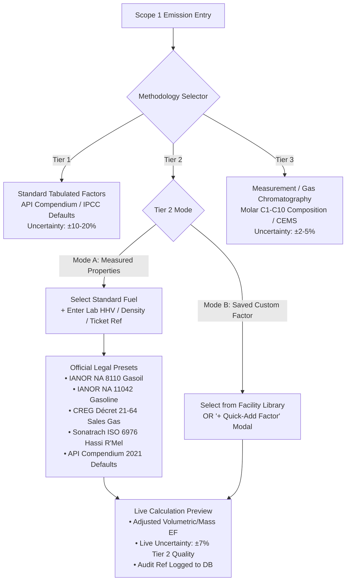

# Implementation Plan — Tier 2 UI & Fuel Quality Workflow Upgrade

Enhance the Scope 1 emissions ingestion UI to provide an intuitive, auditable, and standard-compliant **Tier 2 (Regional / Measured / Supplier)** workflow. Replace cryptic `default / custom / specific` toggles with clear **Tier 1 / Tier 2 / Tier 3** methodology selectors, provide an inline **Fuel Property Override Card** with official legal & standard presets (IANOR, CREG, Sonatrach, API Compendium), and integrate an inline modal for creating custom factors without leaving the data entry flow.

---

## User Review Required

> [!IMPORTANT]
> **Preset References Strictly Confined to Official Standards**
> Per user directive, fuel presets are strictly bound to official legal decrees, national standards (*Normes Algériennes - IANOR*), network codes (*CREG / ARH*), and published technical standards (*Sonatrach ISO 6976*, *API Compendium 2021*). Each preset displays an immutable legal citation badge.

> [!NOTE]
> **Backward Compatibility & Database Safety**
> All existing records, API payloads, and database columns (`emissions`, `custom_factors`) remain 100% backward-compatible. In the backend, `factor_source` will continue to map `default` $\rightarrow$ Tier 1, `custom` $\rightarrow$ Tier 2, and `specific` $\rightarrow$ Tier 3, while preserving audit references in `data_source_ref`.

---

## Proposed Architecture & Workflow



---

## Proposed Changes

### Frontend Components

#### [NEW] `new/client/src/constants/officialFuelPresets.js`
Create a centralized, immutable repository of verified official fuel property presets:
- **Algerian Gasoil (Diesel)**: `density: 840 kg/m³`, `hhv: 19300 Btu/lb` (`44.88 MJ/kg`), Citation: `IANOR NA 8110` / `Décret exécutif`.
- **Algerian Gasoline (Essence Sans Plomb)**: `density: 750 kg/m³`, `hhv: 125000 Btu/gal` (`46.4 MJ/kg`), Citation: `IANOR NA 11042`.
- **Algerian National Network Natural Gas**: `hhv: 1050 Btu/scf` (`39.1 MJ/Nm³`), Citation: `CREG Code de Réseau` / `Décret exécutif 21-64`.
- **Hassi R'Mel Sales Gas**: `hhv: 1085 Btu/scf` (`40.5 MJ/Nm³`), Citation: `Sonatrach Field Reference (ISO 6976)`.
- **Algerian GPL-C Autogaz (50/50)**: `density: 540 kg/m³`, `hhv: 46.1 MJ/kg`, Citation: `Naftal / APRUE Bilan Énergétique`.
- **API Compendium 2021 Reference Natural Gas**: `hhv: 1020 Btu/scf`, Citation: `API Compendium 2021 Table 5-1`.
- **API Compendium 2021 Diesel Fuel No. 2**: `density: 846 kg/m³`, `hhv: 138700 Btu/gal`, Citation: `API Compendium 2021 Table 5-2`.

#### [NEW] `new/client/src/components/QuickAddCustomFactorModal.jsx`
A lightweight, non-disruptive modal accessible directly from the fuel selector:
- Inputs: Factor Name, Process Category, $\text{CO}_2$, $\text{CH}_4$, $\text{N}_2\text{O}$ factors, unit, measured uncertainty, and reference/notes.
- Submits to `POST /api/custom-factors`.
- On success, instantly updates the parent form's custom factors list and selects the newly created factor without page reloads.

#### [MODIFY] `new/client/src/components/Scope1Form.jsx`
1. **Tier Selector Segmented Control**:
   - Replace the generic toggle with high-clarity Tier Badges:
     - `Tier 1: Standard Catalog` (API 2021 / IPCC Defaults)
     - `Tier 2: Regional / Lab Adjusted` (Supplier Ticket, Custom HHV/Density, Saved Factors)
     - `Tier 3: Engineering / Measurement` (CEMS, Gas Chromatography, Mass Balance)
2. **Tier 2 Dual-Mode Selector**:
   - Toggle between `Adjust Standard Fuel by Ticket/Lab` and `Use Saved Custom Factor`.
3. **Interactive Fuel Property Override Card (Combustion & Flaring)**:
   - When in Tier 2 Mode A:
     - Fuel selection dropdown for standard fuels.
     - Preset picker with legal badges (`IANOR NA 8110`, `CREG Décret 21-64`, etc.).
     - Editable fields for **Measured HHV** (with units `Btu/scf`, `MJ/m³`, `kcal/m³`, `Btu/lb`, `MJ/kg`) and **Measured Density** (`kg/m³`).
     - **Audit Reference Field**: `Analysis Bulletin / Delivery Slip No.` (stored in `data_source_ref`).
4. **Live Calculation Preview Box**:
   - Computes and displays the adjusted volumetric emission factor in real-time.
   - Shows the data quality uncertainty improvement: **$\pm 7.0\%$** (Tier 2 standard) vs $\pm 10.0\%$ (Tier 1 default).
5. **Standardized Tier Badges across other processes**:
   - Ensure Flaring, Venting, Fugitives, Drilling, and Midstream display consistent `Tier 1 | Tier 2 | Tier 3` headers and badges.

#### [MODIFY] `new/client/src/components/Scope1Form.css`
- Add styles for Tier badge selector, official reference badges, fuel property override cards, and live calculation preview boxes.

---

### Backend Components

#### [MODIFY] `new/server/calculations/dispatcher.py`
- Ensure that when `factor_source == "custom"` and `fuel` corresponds to a standard fuel name with custom `hhv` and/or `density`, the dispatcher passes `hhv` and `density` to `CombustionCalculator` and records `factor_source = "custom"` so that `uncertainty.py` automatically resolves `Tier.T2` ($\pm 7\%$).
- Persist `data_source_ref` from payload into the emission record.

#### [MODIFY] `new/server/routes/emissions.py`
- In `POST /api/emissions`, ensure `data_source_ref` and `calc_method` reflect `Tier 2 - Custom Fuel Property (HHV/Density)` when Tier 2 mode A is submitted.

---

## Verification Plan

### Automated Tests
1. **Frontend Lint & Build**:
   ```powershell
   cd c:\Users\samsung\Desktop\H2\new\client
   npm run build
   ```
2. **Backend Regression Test Suite**:
   ```powershell
   cd c:\Users\samsung\Desktop\H2\new\server
   pytest tests/test_tier_scope_kpi_numerical.py -v
   pytest tests/test_emission_calculations.py -v
   ```
3. **Dedicated Tier 2 Integration Test**:
   - Test natural gas combustion with `hhv = 1085 Btu/scf` (Hassi R'Mel preset) $\rightarrow$ verify exact $\text{CO}_2$ calculation, Tier 2 tag, and $\pm 7\%$ activity data uncertainty ($u_{\text{AD}} = 0.07$).
   - Test diesel combustion with `density = 840 kg/m³` (IANOR NA 8110 preset) $\rightarrow$ verify volumetric conversion and Tier 2 tag.

### Manual Verification
1. Open the Scope 1 Entry page in the browser (`http://localhost:5173`).
2. Verify the new segmented control displays: `Tier 1 (Standard API)`, `Tier 2 (Regional / Lab)`, `Tier 3 (Measurement / GC)`.
3. Select **Tier 2**:
   - Test **Mode A (Ticket / Lab Override)**:
     - Select **Natural Gas**.
     - Click preset **"Algeria - Hassi R'Mel (Sonatrach ISO 6976)"** $\rightarrow$ verify HHV pre-fills to `1085 Btu/scf` and citation badge displays `Sonatrach ISO 6976`.
     - Enter delivery slip number `NAFTAL-2026-9041`.
     - Check live preview box shows adjusted emission factor and Tier 2 uncertainty.
     - Submit $\rightarrow$ verify entry appears in table with `Tier 2` badge and reference.
   - Test **Mode B (Saved Custom Factor)**:
     - Click `+ Quick Add Factor` modal.
     - Register a test factor and save $\rightarrow$ verify modal closes and factor is selected immediately without losing entered data.
4. Navigate to `/uncertainty` $\rightarrow$ verify the new Tier 2 emission contributes to the **Tier 2 Data Quality** breakdown card.
